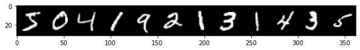

```python
import torch
import torch.nn as nn
import torch.nn.functional as F

```


```python
from torch.utils.data import DataLoader
from torchvision import datasets, transforms
import torchvision
```


```python
import numpy as np
import pandas as pd
from sklearn.metrics import confusion_matrix
import matplotlib.pyplot as plt
```

# MNIST image to Tensors

# Load Batches with Dataloader 


```python
torch.manual_seed(101)

# train_loader = DataLoader(train_data, batch_size = 100, shuffle = True)
# test_loader = DataLoader(test_data, batch_size = 500, shuffle = False)

device = "cuda" if torch.cuda.is_available() else "cpu"
kwargs = {'num_workers': 10, 'pin_memory': True} if device=='cuda' else {}

train_loader = torch.utils.data.DataLoader(
  torchvision.datasets.MNIST(root = 'PYTORCH_NOTEBOOKS/Data', train=True, download=True, transform = transforms.ToTensor()),
  batch_size=100, **kwargs)

test_loader = torch.utils.data.DataLoader(
  torchvision.datasets.MNIST(root = 'PYTORCH_NOTEBOOKS/Data', train=False, download=True, transform = transforms.ToTensor()),
  batch_size=500, **kwargs)
```


```python
for images, labels in train_loader:
    break
```


```python
from torchvision.utils import make_grid
```


```python
print('Labels: ',labels[:12].numpy())

im = make_grid(images[:12],nrow = 12)
plt.figure(figsize = (10,4))
plt.imshow(np.transpose(im.numpy(),(1,2,0))) #reorder as wh and channel
```

    Labels:  [5 0 4 1 9 2 1 3 1 4 3 5]


    <matplotlib.image.AxesImage at 0x7f4278362b90>


    

    


# Model 


```python
class MultilayerPerceptron(nn.Module):
    
    def __init__(self, in_sz = 784, out_sz = 10, layers = [120,84]):
        super().__init__()
        
        self.fc1 = nn.Linear(in_sz, layers[0])
        self.fc2 = nn.Linear(layers[0],layers[1])
        self.fc3 = nn.Linear(layers[1],out_sz)
    
    def forward(self,x):
        x = F.relu(self.fc1(x))
        x = F.relu(self.fc2(x))
        x = self.fc3(x)
        
        return F.log_softmax(x, dim = 1) # multiclass classification

```


```python
torch.manual_seed(101)
device = torch.device('cuda' if torch.cuda.is_available() else 'cpu')
model = MultilayerPerceptron().to(device)
model
```


    MultilayerPerceptron(
      (fc1): Linear(in_features=784, out_features=120, bias=True)
      (fc2): Linear(in_features=120, out_features=84, bias=True)
      (fc3): Linear(in_features=84, out_features=10, bias=True)
    )


Parameters:


```python
for param in model.parameters():
    print(param.numel()) #total 105,214
```

    94080
    120
    10080
    84
    840
    10


```python
criterion = nn.CrossEntropyLoss()
optimizer = torch.optim.Adam(model.parameters(), lr = 0.001)
```


```python
import time
start_time = time.time()

epochs = 10
train_losses = []
test_losses = []
train_correct = []
test_correct = []

for i in range(epochs):
    trn_corr = 0
    tst_corr = 0
    
    for b, (X_train, y_train) in enumerate(train_loader):
        b+=1
        x,y = X_train.to(device), y_train.to(device)
        y_pred = model(x.view(100,-1))
        loss = criterion(y_pred, y)
        predicted = torch.max(y_pred.data,1)[1]
        batch_corr = (predicted == y).sum()
        trn_corr += batch_corr
        
        optimizer.zero_grad()
        loss.backward()
        optimizer.step()
        
        if b%200 ==0:
            acc = trn_corr.item()*100/(100*b)
            print(f'Epoch {i} batch {b} loss: {loss.item()} accuracy: {acc}')

    train_losses.append(loss)
    train_correct.append(trn_corr)
    
    
    with torch.no_grad():
        
        for b, (X_test, y_test) in enumerate(test_loader):
            x_t,y_t = X_test.to(device), y_test.to(device)
            y_val = model(x_t.view(500,-1))
            predicted = torch.max(y_val.data,1)[1]
            tst_corr += (predicted==y_t).sum()
            
    loss = criterion(y_val, y_t)
    test_losses.append(loss)
    test_correct.append(tst_corr)

total_time = time.time() - start_time
print(f'Duration: {total_time/60} mins')
```

    Epoch 0 batch 200 loss: 0.005202355328947306 accuracy: 99.465
    Epoch 0 batch 400 loss: 0.0032215211540460587 accuracy: 99.3575
    Epoch 0 batch 600 loss: 0.08605336397886276 accuracy: 99.28333333333333
    Epoch 1 batch 200 loss: 0.005097399465739727 accuracy: 99.58
    Epoch 1 batch 400 loss: 0.005613741464912891 accuracy: 99.495
    Epoch 1 batch 600 loss: 0.0952170267701149 accuracy: 99.44333333333333
    Epoch 2 batch 200 loss: 0.011949144303798676 accuracy: 99.6
    Epoch 2 batch 400 loss: 0.019414015114307404 accuracy: 99.4725
    Epoch 2 batch 600 loss: 0.05391176789999008 accuracy: 99.46166666666667
    Epoch 3 batch 200 loss: 0.0034477440640330315 accuracy: 99.65
    Epoch 3 batch 400 loss: 0.009817256592214108 accuracy: 99.5375
    Epoch 3 batch 600 loss: 0.026167050004005432 accuracy: 99.55333333333333
    Epoch 4 batch 200 loss: 0.0014411021256819367 accuracy: 99.625
    Epoch 4 batch 400 loss: 0.0007520769722759724 accuracy: 99.69
    Epoch 4 batch 600 loss: 0.003781727282330394 accuracy: 99.71166666666667
    Epoch 5 batch 200 loss: 0.003890852676704526 accuracy: 99.78
    Epoch 5 batch 400 loss: 0.001330516068264842 accuracy: 99.7375
    Epoch 5 batch 600 loss: 0.015449882484972477 accuracy: 99.685
    Epoch 6 batch 200 loss: 0.005455129314213991 accuracy: 99.555
    Epoch 6 batch 400 loss: 0.0007666621240787208 accuracy: 99.5775
    Epoch 6 batch 600 loss: 0.02467120625078678 accuracy: 99.61166666666666
    Epoch 7 batch 200 loss: 0.002103719161823392 accuracy: 99.51
    Epoch 7 batch 400 loss: 0.0007025031954981387 accuracy: 99.47
    Epoch 7 batch 600 loss: 0.0022484727669507265 accuracy: 99.51833333333333
    Epoch 8 batch 200 loss: 0.03791803494095802 accuracy: 99.725
    Epoch 8 batch 400 loss: 0.0003743169945664704 accuracy: 99.7225
    Epoch 8 batch 600 loss: 0.002696746028959751 accuracy: 99.74333333333334
    Epoch 9 batch 200 loss: 0.001393977552652359 accuracy: 99.87
    Epoch 9 batch 400 loss: 0.0052767409943044186 accuracy: 99.86
    Epoch 9 batch 600 loss: 0.0344398133456707 accuracy: 99.81
    Duration: 0.3054452856381734 mins


```python

```
