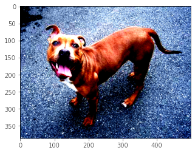

```python
import torch
import torch.nn as nn
import torch.nn.functional as F
from torch.utils.data import DataLoader
from torchvision import datasets, transforms, models
from torchvision.utils import make_grid

import numpy as np
import pandas as pd
import matplotlib.pyplot as plt

import os
from PIL import Image
from IPython.display import display
import glob

import warnings
warnings.filterwarnings('ignore')
```

Las imágenes de Gatos y Perros pueden obtenerlas del siguiente link: https://drive.google.com/file/d/1fuFurVV8rcrVTAFPjhQvzGLNdnTi1jWZ/view


```python
with Image.open('CATS_DOGS/test/CAT/10107.jpg') as im:
    display(im)
```


    

    


```python
img_names = glob.glob('*/*/*/*.jpg')
len(img_names)
```


    24994


```python
%time
img_sizes = []
rejected = []

for item in img_names:
    try:
        with Image.open(item) as img:
            img_sizes.append(img.size)
    except:
        rejected.append(item)
```

    CPU times: user 2 µs, sys: 0 ns, total: 2 µs
    Wall time: 3.58 µs


```python
print(len(img_sizes))
print(len(rejected))
```

    24994
    0


```python
img_sizes[:10]
```


    [(500, 248),
     (500, 332),
     (500, 375),
     (350, 374),
     (500, 375),
     (500, 375),
     (243, 346),
     (353, 467),
     (500, 375),
     (458, 415)]


```python
df = pd.DataFrame(img_sizes, columns = ['width','height'])
df
```


<div>
<style scoped>
    .dataframe tbody tr th:only-of-type {
        vertical-align: middle;
    }

    .dataframe tbody tr th {
        vertical-align: top;
    }

    .dataframe thead th {
        text-align: right;
    }
</style>
<table border="1" class="dataframe">
  <thead>
    <tr style="text-align: right;">
      <th></th>
      <th>width</th>
      <th>height</th>
    </tr>
  </thead>
  <tbody>
    <tr>
      <th>0</th>
      <td>500</td>
      <td>248</td>
    </tr>
    <tr>
      <th>1</th>
      <td>500</td>
      <td>332</td>
    </tr>
    <tr>
      <th>2</th>
      <td>500</td>
      <td>375</td>
    </tr>
    <tr>
      <th>3</th>
      <td>350</td>
      <td>374</td>
    </tr>
    <tr>
      <th>4</th>
      <td>500</td>
      <td>375</td>
    </tr>
    <tr>
      <th>...</th>
      <td>...</td>
      <td>...</td>
    </tr>
    <tr>
      <th>24989</th>
      <td>500</td>
      <td>333</td>
    </tr>
    <tr>
      <th>24990</th>
      <td>500</td>
      <td>423</td>
    </tr>
    <tr>
      <th>24991</th>
      <td>500</td>
      <td>449</td>
    </tr>
    <tr>
      <th>24992</th>
      <td>500</td>
      <td>375</td>
    </tr>
    <tr>
      <th>24993</th>
      <td>500</td>
      <td>375</td>
    </tr>
  </tbody>
</table>
<p>24994 rows × 2 columns</p>
</div>


```python
df.describe()
```


<div>
<style scoped>
    .dataframe tbody tr th:only-of-type {
        vertical-align: middle;
    }

    .dataframe tbody tr th {
        vertical-align: top;
    }

    .dataframe thead th {
        text-align: right;
    }
</style>
<table border="1" class="dataframe">
  <thead>
    <tr style="text-align: right;">
      <th></th>
      <th>width</th>
      <th>height</th>
    </tr>
  </thead>
  <tbody>
    <tr>
      <th>count</th>
      <td>24994.000000</td>
      <td>24994.000000</td>
    </tr>
    <tr>
      <th>mean</th>
      <td>404.493518</td>
      <td>361.037129</td>
    </tr>
    <tr>
      <th>std</th>
      <td>108.941802</td>
      <td>96.936811</td>
    </tr>
    <tr>
      <th>min</th>
      <td>42.000000</td>
      <td>33.000000</td>
    </tr>
    <tr>
      <th>25%</th>
      <td>323.000000</td>
      <td>302.000000</td>
    </tr>
    <tr>
      <th>50%</th>
      <td>448.000000</td>
      <td>375.000000</td>
    </tr>
    <tr>
      <th>75%</th>
      <td>500.000000</td>
      <td>421.000000</td>
    </tr>
    <tr>
      <th>max</th>
      <td>500.000000</td>
      <td>500.000000</td>
    </tr>
  </tbody>
</table>
</div>


```python
dog = Image.open('CATS_DOGS/train/DOG/14.jpg')
dog
```


    

    


```python
dog.getpixel((0,0)) # it shows images are using 255 scale.
```


    (90, 95, 98)


```python
transform = transforms.Compose([
    transforms.Resize((250)),
    transforms.CenterCrop(250),
    transforms.ToTensor(), #cast to tensor and normalize
    
    
])
im = transform(dog)
print(type(im))
print(im.shape)
```

    <class 'torch.Tensor'>
    torch.Size([3, 250, 250])


```python
#matplotlib, height, width and channel
plt.imshow(np.transpose(im.numpy(), (1,2,0)));
```


    

    


```python
transform = transforms.Compose([
    transforms.RandomHorizontalFlip(p = 1),
    transforms.RandomRotation(30),
    transforms.Resize(224),
    transforms.CenterCrop(224),
    transforms.ToTensor()
       
])
im = transform(dog)
print(type(im))
print(im.shape)
#matplotlib, height, width and channel
plt.imshow(np.transpose(im.numpy(), (1,2,0)));
```

    <class 'torch.Tensor'>
    torch.Size([3, 224, 224])


    

    


```python
transform = transforms.Compose([
    transforms.ToTensor(),
    transforms.Normalize(mean = [0.485,0.456,0.406], std = [0.229,0.224,0.225])
])
im = transform(dog)
print(type(im))
print(im.shape)
#matplotlib, height, width and channel
plt.imshow(np.transpose(im.numpy(), (1,2,0)))
```

    Clipping input data to the valid range for imshow with RGB data ([0..1] for floats or [0..255] for integers).


    <class 'torch.Tensor'>
    torch.Size([3, 387, 500])


    <matplotlib.image.AxesImage at 0x7fef0f71cd50>


    

    


# Modelo 


```python
train_transform = transforms.Compose([
    transforms.RandomRotation(10),
    transforms.RandomHorizontalFlip(),
    transforms.Resize(224),
    transforms.CenterCrop(224),
    transforms.ToTensor(),
    transforms.Normalize([0.485,0.456,0.406],[0.229,0.224,0.225])
    #normalización sugerida por torchvision para modelos pre-entrenados.
])

test_transform = transforms.Compose([
    transforms.Resize(224),
    transforms.CenterCrop(224),
    transforms.ToTensor(),
    transforms.Normalize([0.485,0.456,0.406],[0.229,0.224,0.225])
])
```


```python
# Utility para importar imágenes desde carpetas
train_data = datasets.ImageFolder('CATS_DOGS/train', transform = train_transform)
test_data = datasets.ImageFolder('CATS_DOGS/test', transform = test_transform)

torch.manual_seed(42)
train_loader = DataLoader(train_data, batch_size = 100, pin_memory = True, num_workers = 12, shuffle = True)
test_loader = DataLoader(test_data, batch_size = 100, pin_memory = True, num_workers = 12,  shuffle = False)

class_names = train_data.classes #obtenido directamente de las carpetas
class_names
```


    ['CAT', 'DOG']


```python
print(len(train_data))
print(len(test_data))
```

    18747
    6251


```python
for images, labels in train_loader:
    break
images.shape
```


    torch.Size([100, 3, 224, 224])


```python
im = make_grid(images, nrow=5)

inv_normalize = transforms.Normalize(mean = [-0.485/0.229, -0.456/0.224, -0.406/0.225],
                                    std = [1/0.229, 1/0.224, 1/0.225])

im_inv = inv_normalize(im)
plt.figure(figsize = (20,40))
plt.imshow(np.transpose(im_inv.numpy(),(1,2,0)))
plt.axis('off');
```


    

    


# Arquitectura


```python
class ConvolutionalNetwork(nn.Module):
    def __init__(self):
        super().__init__()
        self.conv1 = nn.Conv2d(3, 6, 3, 1)
        self.conv2 = nn.Conv2d(6, 16, 3,1)
        self.fc1 = nn.Linear(54*54*16, 120)
        self.fc2 = nn.Linear(120,84)
        self.fc3 = nn.Linear(84,2)
        
    def forward(self,x):
        
        x = F.relu(self.conv1(x))
        x = F.max_pool2d(x,2,2)
        x = F.relu(self.conv2(x))
        x = F.max_pool2d(x,2,2)
        x = x.view(-1, 54*54*16)
        x = F.relu(self.fc1(x))
        x = F.relu(self.fc2(x))
        x = self.fc3(x)
        return F.log_softmax(x,dim=1)


```


```python
torch.manual_seed(101)
device = torch.device('cuda' if torch.cuda.is_available() else 'cpu')
CNNmodel = ConvolutionalNetwork().to(device)

criterion = nn.CrossEntropyLoss()
optimizer = torch.optim.Adam(CNNmodel.parameters(), lr = 0.001)
CNNmodel
```


    ConvolutionalNetwork(
      (conv1): Conv2d(3, 6, kernel_size=(3, 3), stride=(1, 1))
      (conv2): Conv2d(6, 16, kernel_size=(3, 3), stride=(1, 1))
      (fc1): Linear(in_features=46656, out_features=120, bias=True)
      (fc2): Linear(in_features=120, out_features=84, bias=True)
      (fc3): Linear(in_features=84, out_features=2, bias=True)
    )


```python
con = 0
for p in CNNmodel.parameters():
    con += p.numel()
con
```


    5610222


# Training 


```python
import time
start_time = time.time()

epochs = 3
max_trn_batch = 800
max_tst_batch = 300
train_losses = []
test_losses = []

train_correct = []
test_correct = []

for e in range(epochs):
    trn_corr = 0
    tst_corr = 0
    
    for b, (X_train, y_train) in enumerate(train_loader):
                
        b += 1
        x,y = X_train.to(device), y_train.to(device)
        y_pred = CNNmodel(x)
        loss = criterion(y_pred, y)
        
        #arg max
        predicted = torch.max(y_pred.data,1)[1]
        
        optimizer.zero_grad()
        loss.backward()
        optimizer.step()
        
    
        
    train_losses.append(loss)
    train_correct.append(trn_corr)
    
    with torch.no_grad():
        for b, (X_test, y_test) in enumerate(test_loader):

            x_t, y_t = X_test.to(device), y_test.to(device)
            y_val = CNNmodel(x_t)
            predicted = torch.max(y_pred.data,1)[1]
    
    loss = criterion(y_val, y_t)
    test_losses.append(loss)
    test_correct.append(tst_corr)     
    
    #print(f'Epoch {e} Loss: {loss.item()}')
    print(f'Epoch {e + 1}/{epochs}, Train Loss : {train_losses[e]}, Test Loss: {test_losses[e]}')
        


total_time = time.time()-start_time
print(f'Total Time: {total_time/60} minutes')
```

    Epoch 1/3, Train Loss : 0.6994757056236267, Test Loss: 0.41201767325401306
    Epoch 2/3, Train Loss : 0.3059247136116028, Test Loss: 0.37493208050727844
    Epoch 3/3, Train Loss : 0.3059287965297699, Test Loss: 0.5692620277404785
    Total Time: 0.6383750836054484 minutes


```python
plt.plot(train_losses, label = 'training loss')
plt.plot(test_losses, label = 'validation loss')
plt.title('Loss at the end of each loss')
plt.legend()
```


```python
test_load_all = DataLoader(test_data, batch_size = len(test_data), shuffle = False)
with torch.no_grad():
    correct = 0
    for X_test, y_test in test_load_all:
        x_t, y_t = X_test.to(device), y_test.to(device)
        y_val = CNNmodel(x_t)
        predicted = torch.max(y_val, 1)[1]
        correct += (predicted == y_t).sum()
correct.item()/len(test_data)
```


    0.7859542473204287


```python
# torch.save(CNNmodel.state_dict(),'cat_dog.pt') # this saves only weights and biases
```


```python
# CNNmodel = ConvolutionalNetwork()
# CNNmodel.load_state_dict(torch.load('cat_dog.pt'))
# CNNmodel.to(device)
```


```python
from mpl_toolkits.axes_grid1 import ImageGrid

def predict(model,image):
    pic = test_transform(Image.open(image))

    model.eval()
    with torch.no_grad():
        new_prediction = model(pic.view(1,3,224,224).to(device))

    return class_names[new_prediction.argmax().item()]


def prediction_grid(model, image):
    
    fig = plt.figure(1, (20., 20.))
    grid = ImageGrid(fig, 111,
                     nrows_ncols=(4, 2),
                     axes_pad=0.4,
                     )

    for img, axes in zip(im_list,grid):

        axes.set_title(f'{img} is a {predict(model,img)}', fontdict=None, loc='center', color = "k")
        axes.axis('off')
        axes.imshow(Image.open(img))

    return plt.show()

im_list = ['kira.jpg','kira2.jpg','kira3.jpg','kira4.jpg','kira5.jpg','kira6.jpg','coqui.jpg','nalita.jpg']

prediction_grid(CNNmodel, im_list)
```


    

    


```python
# new_model.load_state_dict(torch.load('cat_dog.pt'))
# new_model.eval()
```

# Transfer Learning 


```python
AlexNetmodel = models.alexnet(pretrained=True)
AlexNetmodel
```


    AlexNet(
      (features): Sequential(
        (0): Conv2d(3, 64, kernel_size=(11, 11), stride=(4, 4), padding=(2, 2))
        (1): ReLU(inplace=True)
        (2): MaxPool2d(kernel_size=3, stride=2, padding=0, dilation=1, ceil_mode=False)
        (3): Conv2d(64, 192, kernel_size=(5, 5), stride=(1, 1), padding=(2, 2))
        (4): ReLU(inplace=True)
        (5): MaxPool2d(kernel_size=3, stride=2, padding=0, dilation=1, ceil_mode=False)
        (6): Conv2d(192, 384, kernel_size=(3, 3), stride=(1, 1), padding=(1, 1))
        (7): ReLU(inplace=True)
        (8): Conv2d(384, 256, kernel_size=(3, 3), stride=(1, 1), padding=(1, 1))
        (9): ReLU(inplace=True)
        (10): Conv2d(256, 256, kernel_size=(3, 3), stride=(1, 1), padding=(1, 1))
        (11): ReLU(inplace=True)
        (12): MaxPool2d(kernel_size=3, stride=2, padding=0, dilation=1, ceil_mode=False)
      )
      (avgpool): AdaptiveAvgPool2d(output_size=(6, 6))
      (classifier): Sequential(
        (0): Dropout(p=0.5, inplace=False)
        (1): Linear(in_features=9216, out_features=4096, bias=True)
        (2): ReLU(inplace=True)
        (3): Dropout(p=0.5, inplace=False)
        (4): Linear(in_features=4096, out_features=4096, bias=True)
        (5): ReLU(inplace=True)
        (6): Linear(in_features=4096, out_features=1000, bias=True)
      )
    )


```python
for param in AlexNetmodel.parameters():
    param.requires_grad = False
```


```python
torch.manual_seed(42)
AlexNetmodel.classifier = nn.Sequential(nn.Linear(9216, 1024),
                                 nn.ReLU(),
                                 nn.Dropout(0.4),
                                 nn.Linear(1024, 2),
                                 nn.LogSoftmax(dim=1))
AlexNetmodel
```


    AlexNet(
      (features): Sequential(
        (0): Conv2d(3, 64, kernel_size=(11, 11), stride=(4, 4), padding=(2, 2))
        (1): ReLU(inplace=True)
        (2): MaxPool2d(kernel_size=3, stride=2, padding=0, dilation=1, ceil_mode=False)
        (3): Conv2d(64, 192, kernel_size=(5, 5), stride=(1, 1), padding=(2, 2))
        (4): ReLU(inplace=True)
        (5): MaxPool2d(kernel_size=3, stride=2, padding=0, dilation=1, ceil_mode=False)
        (6): Conv2d(192, 384, kernel_size=(3, 3), stride=(1, 1), padding=(1, 1))
        (7): ReLU(inplace=True)
        (8): Conv2d(384, 256, kernel_size=(3, 3), stride=(1, 1), padding=(1, 1))
        (9): ReLU(inplace=True)
        (10): Conv2d(256, 256, kernel_size=(3, 3), stride=(1, 1), padding=(1, 1))
        (11): ReLU(inplace=True)
        (12): MaxPool2d(kernel_size=3, stride=2, padding=0, dilation=1, ceil_mode=False)
      )
      (avgpool): AdaptiveAvgPool2d(output_size=(6, 6))
      (classifier): Sequential(
        (0): Linear(in_features=9216, out_features=1024, bias=True)
        (1): ReLU()
        (2): Dropout(p=0.4, inplace=False)
        (3): Linear(in_features=1024, out_features=2, bias=True)
        (4): LogSoftmax(dim=1)
      )
    )


```python
device = torch.device('cuda' if torch.cuda.is_available() else 'cpu')
AlexNetmodel = AlexNetmodel.to(device)
```


```python
cont = 0
for param in AlexNetmodel.classifier.parameters():
    print(param.numel())
    cont += param.numel()
cont
```

    9437184
    1024
    2048
    2


    9440258


```python
criterion = nn.CrossEntropyLoss()
optimizer = torch.optim.Adam(AlexNetmodel.classifier.parameters(), lr = 0.001)

train_loader = DataLoader(train_data, batch_size = 10, pin_memory = True, shuffle = True)
test_loader = DataLoader(test_data, batch_size = 10, pin_memory = True, shuffle = False)

```


```python
import time
start_time = time.time()

epochs = 3

max_trn_batch = 800
max_tst_batch = 300

train_losses = []
test_losses = []
train_correct = []
test_correct = []

for i in range(epochs):
    trn_corr = 0
    tst_corr = 0
    
    # Run the training batches
    for b, (X_train, y_train) in enumerate(train_loader):
#         if b == max_trn_batch:
#             break
        b+=1
        
        # Apply the model
        x,y = X_train.to(device), y_train.to(device)
        y_pred = AlexNetmodel(x)
        loss = criterion(y_pred, y)
 
        # Tally the number of correct predictions
        predicted = torch.max(y_pred.data, 1)[1]
        batch_corr = (predicted == y).sum()
        trn_corr += batch_corr
        
        # Update parameters
        optimizer.zero_grad()
        loss.backward()
        optimizer.step()

        # Print interim results
        if b%200 == 0:
            print(f'epoch: {i:2}  batch: {b:4} [{10*b:6}/8000]  loss: {loss.item():10.8f}  \
accuracy: {trn_corr.item()*100/(10*b):7.3f}%')

    train_losses.append(loss)
    train_correct.append(trn_corr)

    # Run the testing batches
    with torch.no_grad():
        for b, (X_test, y_test) in enumerate(test_loader):
#             if b == max_tst_batch:
#                 break
            
            x_t, y_t = X_test.to(device), y_test.to(device)

            # Apply the model
            y_val = AlexNetmodel(x_t)

            # Tally the number of correct predictions
            predicted = torch.max(y_val.data, 1)[1] 
            tst_corr += (predicted == y_t).sum()
    
    loss = criterion(y_val, y_t)
    test_losses.append(loss)
    test_correct.append(tst_corr)

print(f'\nDuration: {time.time() - start_time:.0f} seconds') # print the time elapsed
```

    epoch:  0  batch:  200 [  2000/8000]  loss: 0.12588477  accuracy:  89.500%
    epoch:  0  batch:  400 [  4000/8000]  loss: 0.09032388  accuracy:  91.250%
    epoch:  0  batch:  600 [  6000/8000]  loss: 0.26316878  accuracy:  91.900%
    epoch:  0  batch:  800 [  8000/8000]  loss: 0.14361647  accuracy:  92.325%
    epoch:  0  batch: 1000 [ 10000/8000]  loss: 0.10198053  accuracy:  92.640%
    epoch:  0  batch: 1200 [ 12000/8000]  loss: 0.46762228  accuracy:  92.900%
    epoch:  0  batch: 1400 [ 14000/8000]  loss: 0.00291114  accuracy:  93.207%
    epoch:  0  batch: 1600 [ 16000/8000]  loss: 0.12340410  accuracy:  93.400%
    epoch:  0  batch: 1800 [ 18000/8000]  loss: 0.00000925  accuracy:  93.533%
    epoch:  1  batch:  200 [  2000/8000]  loss: 0.38755649  accuracy:  94.750%
    epoch:  1  batch:  400 [  4000/8000]  loss: 0.00076796  accuracy:  94.700%
    epoch:  1  batch:  600 [  6000/8000]  loss: 0.06538789  accuracy:  94.417%
    epoch:  1  batch:  800 [  8000/8000]  loss: 0.00010027  accuracy:  94.450%
    epoch:  1  batch: 1000 [ 10000/8000]  loss: 0.00033302  accuracy:  94.610%
    epoch:  1  batch: 1200 [ 12000/8000]  loss: 0.23096445  accuracy:  94.558%
    epoch:  1  batch: 1400 [ 14000/8000]  loss: 0.53282773  accuracy:  94.457%
    epoch:  1  batch: 1600 [ 16000/8000]  loss: 0.16338238  accuracy:  94.631%
    epoch:  1  batch: 1800 [ 18000/8000]  loss: 0.05234673  accuracy:  94.611%
    epoch:  2  batch:  200 [  2000/8000]  loss: 0.05994357  accuracy:  95.400%
    epoch:  2  batch:  400 [  4000/8000]  loss: 0.00032028  accuracy:  95.175%
    epoch:  2  batch:  600 [  6000/8000]  loss: 0.00776298  accuracy:  95.050%
    epoch:  2  batch:  800 [  8000/8000]  loss: 0.20413604  accuracy:  95.200%
    epoch:  2  batch: 1000 [ 10000/8000]  loss: 0.01127659  accuracy:  95.110%
    epoch:  2  batch: 1200 [ 12000/8000]  loss: 0.71031255  accuracy:  95.200%
    epoch:  2  batch: 1400 [ 14000/8000]  loss: 0.06394389  accuracy:  95.214%
    epoch:  2  batch: 1600 [ 16000/8000]  loss: 0.06476951  accuracy:  95.112%
    epoch:  2  batch: 1800 [ 18000/8000]  loss: 0.09471183  accuracy:  95.100%
    
    Duration: 198 seconds


```python
test_load_all = DataLoader(test_data, batch_size = len(test_data), shuffle = False)
with torch.no_grad():
    correct = 0
    for X_test, y_test in test_load_all:
        x_t, y_t = X_test.to(device), y_test.to(device)
        y_val = AlexNetmodel(x_t)
        predicted = torch.max(y_val, 1)[1]
        correct += (predicted == y_t).sum()
correct.item()/len(test_data)
```


    0.9580867061270196


```python
# torch.save(AlexNetmodel.state_dict(),'cat_dog_alex_3e.pt') # this saves only weights and biases
```


```python
from mpl_toolkits.axes_grid1 import ImageGrid

def predict(model,image):
    pic = test_transform(Image.open(image))

    model.eval()
    with torch.no_grad():
        new_prediction = model(pic.view(1,3,224,224).to(device))

    return class_names[new_prediction.argmax().item()]


def prediction_grid(model, image, r, c):
    
    fig = plt.figure(1, (20., 20.))
    grid = ImageGrid(fig, 111,
                     nrows_ncols=(r, c),
                     axes_pad=0.4,
                     )

    for img, axes in zip(im_list,grid):

        axes.set_title(f'{img} is a {predict(AlexNetmodel,img)}', fontdict=None, loc='center', color = "k")
        axes.axis('off')
        axes.imshow(Image.open(img))

    return plt.show()

im_list = ['kira.jpg','kira2.jpg','kira3.jpg','kira4.jpg','kira5.jpg','kira6.jpg',
           'coqui.jpg','nalita.jpg','stefanni.jpg','pitbull.jpg','another-cat.png','white_cat.jpg']

prediction_grid(AlexNetmodel, im_list,2,6)
```


    

    


```python

```


```python

```
