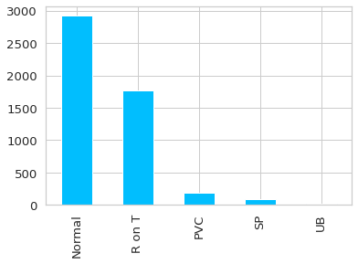
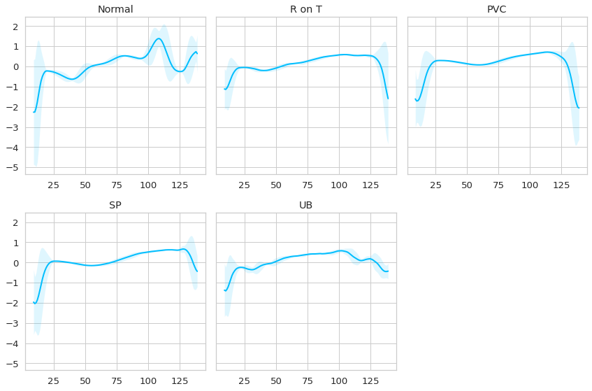
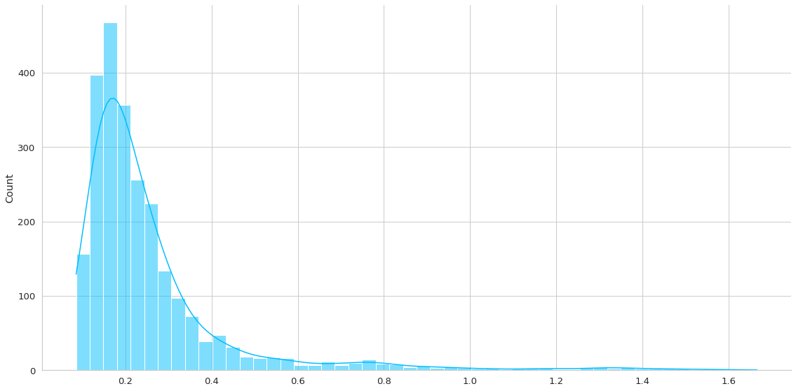
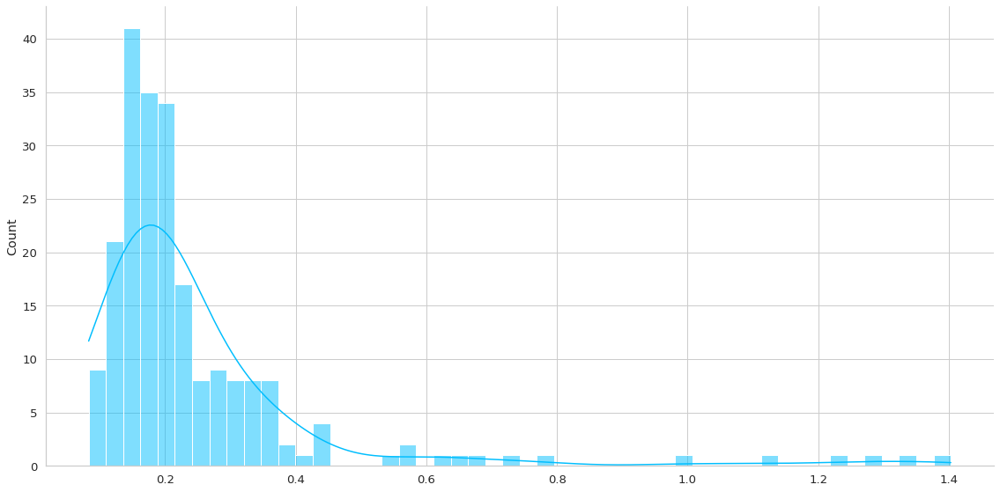
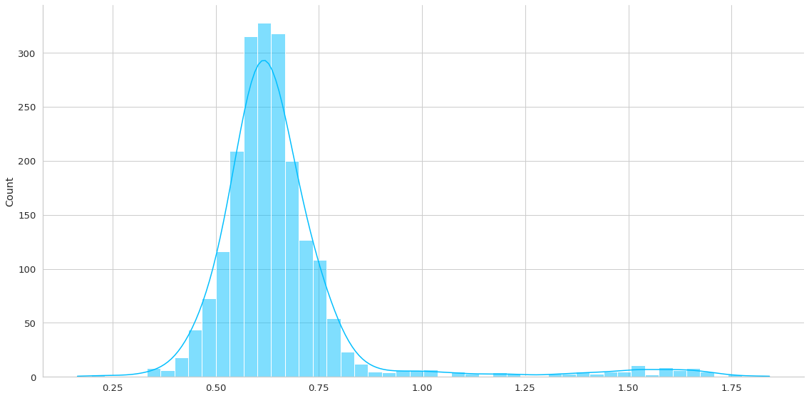

```python
import torch 
from torch.utils.data import Dataset, DataLoader
import numpy as np
import pandas as pd
import matplotlib.pyplot as plt
import seaborn as sns
from matplotlib import rc
from sklearn.model_selection import train_test_split
from multiprocessing import cpu_count
from torch import nn
import torch.nn.functional as F
from arff2pandas import a2p
import pytorch_lightning as pl
from pytorch_lightning.callbacks import ModelCheckpoint, EarlyStopping
import glob

sns.set(style = 'whitegrid', palette = 'muted', font_scale = 1.2)
HAPPY_COLORS_PALETTE = ["#01BEFE", "#FFDD00", "#FF7D00", "#FF006D", "#ADFF02", "#8F00FF"]

sns.set_palette(sns.color_palette(HAPPY_COLORS_PALETTE))

RANDOM_SEED = 42
pl.seed_everything(RANDOM_SEED)
```

    Global seed set to 42


    42


# Importando los Datos 


```python
with open('ECG5000/ECG5000_TRAIN.arff') as f:
    train = a2p.load(f)
train.head()
```


<div>
<style scoped>
    .dataframe tbody tr th:only-of-type {
        vertical-align: middle;
    }

    .dataframe tbody tr th {
        vertical-align: top;
    }

    .dataframe thead th {
        text-align: right;
    }
</style>
<table border="1" class="dataframe">
  <thead>
    <tr style="text-align: right;">
      <th></th>
      <th>att1@NUMERIC</th>
      <th>att2@NUMERIC</th>
      <th>att3@NUMERIC</th>
      <th>att4@NUMERIC</th>
      <th>att5@NUMERIC</th>
      <th>att6@NUMERIC</th>
      <th>att7@NUMERIC</th>
      <th>att8@NUMERIC</th>
      <th>att9@NUMERIC</th>
      <th>att10@NUMERIC</th>
      <th>...</th>
      <th>att132@NUMERIC</th>
      <th>att133@NUMERIC</th>
      <th>att134@NUMERIC</th>
      <th>att135@NUMERIC</th>
      <th>att136@NUMERIC</th>
      <th>att137@NUMERIC</th>
      <th>att138@NUMERIC</th>
      <th>att139@NUMERIC</th>
      <th>att140@NUMERIC</th>
      <th>target@{1,2,3,4,5}</th>
    </tr>
  </thead>
  <tbody>
    <tr>
      <th>0</th>
      <td>-0.112522</td>
      <td>-2.827204</td>
      <td>-3.773897</td>
      <td>-4.349751</td>
      <td>-4.376041</td>
      <td>-3.474986</td>
      <td>-2.181408</td>
      <td>-1.818286</td>
      <td>-1.250522</td>
      <td>-0.477492</td>
      <td>...</td>
      <td>0.792168</td>
      <td>0.933541</td>
      <td>0.796958</td>
      <td>0.578621</td>
      <td>0.257740</td>
      <td>0.228077</td>
      <td>0.123431</td>
      <td>0.925286</td>
      <td>0.193137</td>
      <td>1</td>
    </tr>
    <tr>
      <th>1</th>
      <td>-1.100878</td>
      <td>-3.996840</td>
      <td>-4.285843</td>
      <td>-4.506579</td>
      <td>-4.022377</td>
      <td>-3.234368</td>
      <td>-1.566126</td>
      <td>-0.992258</td>
      <td>-0.754680</td>
      <td>0.042321</td>
      <td>...</td>
      <td>0.538356</td>
      <td>0.656881</td>
      <td>0.787490</td>
      <td>0.724046</td>
      <td>0.555784</td>
      <td>0.476333</td>
      <td>0.773820</td>
      <td>1.119621</td>
      <td>-1.436250</td>
      <td>1</td>
    </tr>
    <tr>
      <th>2</th>
      <td>-0.567088</td>
      <td>-2.593450</td>
      <td>-3.874230</td>
      <td>-4.584095</td>
      <td>-4.187449</td>
      <td>-3.151462</td>
      <td>-1.742940</td>
      <td>-1.490659</td>
      <td>-1.183580</td>
      <td>-0.394229</td>
      <td>...</td>
      <td>0.886073</td>
      <td>0.531452</td>
      <td>0.311377</td>
      <td>-0.021919</td>
      <td>-0.713683</td>
      <td>-0.532197</td>
      <td>0.321097</td>
      <td>0.904227</td>
      <td>-0.421797</td>
      <td>1</td>
    </tr>
    <tr>
      <th>3</th>
      <td>0.490473</td>
      <td>-1.914407</td>
      <td>-3.616364</td>
      <td>-4.318823</td>
      <td>-4.268016</td>
      <td>-3.881110</td>
      <td>-2.993280</td>
      <td>-1.671131</td>
      <td>-1.333884</td>
      <td>-0.965629</td>
      <td>...</td>
      <td>0.350816</td>
      <td>0.499111</td>
      <td>0.600345</td>
      <td>0.842069</td>
      <td>0.952074</td>
      <td>0.990133</td>
      <td>1.086798</td>
      <td>1.403011</td>
      <td>-0.383564</td>
      <td>1</td>
    </tr>
    <tr>
      <th>4</th>
      <td>0.800232</td>
      <td>-0.874252</td>
      <td>-2.384761</td>
      <td>-3.973292</td>
      <td>-4.338224</td>
      <td>-3.802422</td>
      <td>-2.534510</td>
      <td>-1.783423</td>
      <td>-1.594450</td>
      <td>-0.753199</td>
      <td>...</td>
      <td>1.148884</td>
      <td>0.958434</td>
      <td>1.059025</td>
      <td>1.371682</td>
      <td>1.277392</td>
      <td>0.960304</td>
      <td>0.971020</td>
      <td>1.614392</td>
      <td>1.421456</td>
      <td>1</td>
    </tr>
  </tbody>
</table>
<p>5 rows × 141 columns</p>
</div>


```python
with open('ECG5000/ECG5000_TEST.arff') as f:
    test = a2p.load(f)
test.head()
```


<div>
<style scoped>
    .dataframe tbody tr th:only-of-type {
        vertical-align: middle;
    }

    .dataframe tbody tr th {
        vertical-align: top;
    }

    .dataframe thead th {
        text-align: right;
    }
</style>
<table border="1" class="dataframe">
  <thead>
    <tr style="text-align: right;">
      <th></th>
      <th>att1@NUMERIC</th>
      <th>att2@NUMERIC</th>
      <th>att3@NUMERIC</th>
      <th>att4@NUMERIC</th>
      <th>att5@NUMERIC</th>
      <th>att6@NUMERIC</th>
      <th>att7@NUMERIC</th>
      <th>att8@NUMERIC</th>
      <th>att9@NUMERIC</th>
      <th>att10@NUMERIC</th>
      <th>...</th>
      <th>att132@NUMERIC</th>
      <th>att133@NUMERIC</th>
      <th>att134@NUMERIC</th>
      <th>att135@NUMERIC</th>
      <th>att136@NUMERIC</th>
      <th>att137@NUMERIC</th>
      <th>att138@NUMERIC</th>
      <th>att139@NUMERIC</th>
      <th>att140@NUMERIC</th>
      <th>target@{1,2,3,4,5}</th>
    </tr>
  </thead>
  <tbody>
    <tr>
      <th>0</th>
      <td>3.690844</td>
      <td>0.711414</td>
      <td>-2.114091</td>
      <td>-4.141007</td>
      <td>-4.574472</td>
      <td>-3.431909</td>
      <td>-1.950791</td>
      <td>-1.107067</td>
      <td>-0.632322</td>
      <td>0.334577</td>
      <td>...</td>
      <td>0.022847</td>
      <td>0.188937</td>
      <td>0.480932</td>
      <td>0.629250</td>
      <td>0.577291</td>
      <td>0.665527</td>
      <td>1.035997</td>
      <td>1.492287</td>
      <td>-1.905073</td>
      <td>1</td>
    </tr>
    <tr>
      <th>1</th>
      <td>-1.348132</td>
      <td>-3.996038</td>
      <td>-4.226750</td>
      <td>-4.251187</td>
      <td>-3.477953</td>
      <td>-2.228422</td>
      <td>-1.808488</td>
      <td>-1.534242</td>
      <td>-0.779861</td>
      <td>-0.397999</td>
      <td>...</td>
      <td>1.570938</td>
      <td>1.591394</td>
      <td>1.549193</td>
      <td>1.193077</td>
      <td>0.515134</td>
      <td>0.126274</td>
      <td>0.267532</td>
      <td>1.071148</td>
      <td>-1.164009</td>
      <td>1</td>
    </tr>
    <tr>
      <th>2</th>
      <td>1.024295</td>
      <td>-0.590314</td>
      <td>-1.916949</td>
      <td>-2.806989</td>
      <td>-3.527905</td>
      <td>-3.638675</td>
      <td>-2.779767</td>
      <td>-2.019031</td>
      <td>-1.980754</td>
      <td>-1.440680</td>
      <td>...</td>
      <td>0.443502</td>
      <td>0.827582</td>
      <td>1.237007</td>
      <td>1.235121</td>
      <td>1.738103</td>
      <td>1.800767</td>
      <td>1.816301</td>
      <td>1.473963</td>
      <td>1.389767</td>
      <td>1</td>
    </tr>
    <tr>
      <th>3</th>
      <td>0.545657</td>
      <td>-1.014383</td>
      <td>-2.316698</td>
      <td>-3.634040</td>
      <td>-4.196857</td>
      <td>-3.758093</td>
      <td>-3.194444</td>
      <td>-2.221764</td>
      <td>-1.588554</td>
      <td>-1.202146</td>
      <td>...</td>
      <td>0.777530</td>
      <td>1.119240</td>
      <td>0.902984</td>
      <td>0.554098</td>
      <td>0.497053</td>
      <td>0.418116</td>
      <td>0.703108</td>
      <td>1.064602</td>
      <td>-0.044853</td>
      <td>1</td>
    </tr>
    <tr>
      <th>4</th>
      <td>0.661133</td>
      <td>-1.552471</td>
      <td>-3.124641</td>
      <td>-4.313351</td>
      <td>-4.017042</td>
      <td>-3.005993</td>
      <td>-1.832411</td>
      <td>-1.503886</td>
      <td>-1.071705</td>
      <td>-0.521316</td>
      <td>...</td>
      <td>1.280823</td>
      <td>1.494315</td>
      <td>1.618764</td>
      <td>1.447449</td>
      <td>1.238577</td>
      <td>1.749692</td>
      <td>1.986803</td>
      <td>1.422756</td>
      <td>-0.357784</td>
      <td>1</td>
    </tr>
  </tbody>
</table>
<p>5 rows × 141 columns</p>
</div>


Vamos a plantear esto como un problema de Detección de Anomalías. La detección de anomalías es un problema no supervisado, por lo tanto no depende de las etiquetas. Por lo tanto para poder tener más datos para que el modelo aprenda vamos a unir los datasets de train y test y mezclarlo.


```python
df = train.append(test)
df = df.sample(frac=1) #this is a shuffle
train.shape, test.shape, df.shape
```


    ((500, 141), (4500, 141), (5000, 141))


Haciendo mis averiguaciones (mi hermano está terminando su internado en Medicina), obtuve lo siguiente:

* El ECG mide la señal electrica del corazón (perdón si no utilizo la terminología apropiada) para detectar afecciones cardiacas.
* El ECG es uno de los exámenes más complejos de poder interpretar.
* Se requiere de médicos cardiólogos altamente especializados para poder leerlos de buena manera. E incluso a ellos les puede costar.

Un ECG se ve así (Fuente: Mi hermano)


* La data utilizada en realidad corresponde a 500 latidos extraídos de alreadedor de 20 horas de ECG. Cada uno de estos latidos fueron clasificados de la siguiente manera:

- Normal (N)
- R on T Premature Ventricular Contraction (R-on-T PVC) Extrasistole 
- Premature Ventricular Contraction (PVC) 
- Supra Ventricular Premature or Ectopic Beat (SP or EB)
- Unclassified Beat (UB)

En caso de que les interese reproducir el ejercicio, pueden obtener los datos desde [acá](http://timeseriesclassification.com/description.php?Dataset=ECG5000).

## Exploración de los Datos

Como se puede ver los nombres de las columnas son un poco extraños. Al parecer esto se debe por el tipo de dato extraño del cual estamos importando. Para facilitar la manipulación de los datos vamos a cambiar el nombre de nuestro vector de Labels:


```python
new_columns = df.columns.tolist()
new_columns[-1] = 'target'
df.columns = new_columns
df.columns
```


    Index(['att1@NUMERIC', 'att2@NUMERIC', 'att3@NUMERIC', 'att4@NUMERIC',
           'att5@NUMERIC', 'att6@NUMERIC', 'att7@NUMERIC', 'att8@NUMERIC',
           'att9@NUMERIC', 'att10@NUMERIC',
           ...
           'att132@NUMERIC', 'att133@NUMERIC', 'att134@NUMERIC', 'att135@NUMERIC',
           'att136@NUMERIC', 'att137@NUMERIC', 'att138@NUMERIC', 'att139@NUMERIC',
           'att140@NUMERIC', 'target'],
          dtype='object', length=141)


```python
CLASS_NORMAL = 1
class_names = ['Normal','R on T','PVC','SP','UB']

ax = df.target.value_counts().plot(kind = 'bar')
ax.set_xticklabels(class_names);
```


    

    


Lo primero que se puede apreciar es que las anomalías se dan en bastante menor medida que los datos normales (quizás la excepción es el R on T). Lo cual es bueno, ya que de no ser así no serían anomalías.

Adicionalmente poder ver la data de manera apropiada es importante. Por lo tanto para poder entender "en promedio" cómo se ven los distintos diagnósticos de un latido usaremos lo siguiente:


```python
def plot_time_series_class(data, class_name, ax, n_steps=10):
    time_series_df = pd.DataFrame(data)

    smooth_path = time_series_df.rolling(n_steps).mean()
    path_deviation = 2 * time_series_df.rolling(n_steps).std()

    under_line = (smooth_path - path_deviation)[0]
    over_line = (smooth_path + path_deviation)[0]

    ax.plot(smooth_path, linewidth=2)
    ax.fill_between(
    path_deviation.index,
    under_line,
    over_line,
    alpha=.125
    )
    ax.set_title(class_name)
```


```python
classes = df.target.unique()
fig, axs = plt.subplots(nrows = len(classes)// 3 + 1,
                        ncols = 3, 
                        sharey = True,
                        figsize = (12,8)
                        )

for i, cls in enumerate(classes):
    ax = axs.flat[i]
    data = df.query(f'target == "{cls}"').drop(columns = 'target').mean(axis = 0).to_numpy()
    plot_time_series_class(data, class_names[i], ax)

fig.delaxes(axs.flat[-1])
fig.tight_layout();
```


    

    


Observando los datos se puede apreciar lo siguiente:

* Los latidos normales se caracterizan por un incremento de la señal inicialmente y luego un peak y un valle al final del latido.

* Las anomalías se caracterizan porque no tienen ese peak al final, y rapidamente la señal decae, probablemente con distintas intensidades dependiendo de la anomalía. Quizás se requiere de un ojo más experto para poder diferenciar de mejor manera las distintas afecciones anomalas, pero para nuestro caso basta con que las anomalias es "no-normal".

## Data Split 

Si bien en este caso juntamos toda la data disponible para tener más muestras de entrenamiento, eso no significa que no la dividiremos. Además nuestro modelo no aprenderá utilizando Etiquetas, sino que aprenderá lo "normal" para luego detectar que algo no está dentro de lo normal.

La manera en la que separaremos los datos es la siguiente:

* **normal_df**: Contendrá toda la data clasificada como normal. Este dataset será posteriormente** dividido en train_df, val_df y test_df.
* **anomalies_df**: Contendrá toda la data que no está clasificada como normal. 


# Creación del modelo en Pytorch Lightning

Como ya sabemos de tutoriales anteriores, el modelo en Pytorch Lightning parte generando la clase `Dataset` y el `LightningDataModule`. Estos procesos transformarán la data en tensores para que puedan ser procesados por Pytorch.

La clase `ECGData` transformará cada fila de los dataframes en tensores que representan una serie de tiempo de un latido.

La clase `ECGDataModule` define varios métodos:

* `import_arff` es una utility funcion que importa un dataset del formato arff a pandas.
* `setup`: Es el el método encargado de organizar todas las fuentes de datos del modelo:
    * Importa los archivos terminados en .arff y los concatena como un sólo pandas DataFrame.
    * Se define el `normal_data` como el DataFrame que contiene sólo latidos de clase normal.
    * Se utiliza un split para separar normal_data en `train_df`, `val_df` y `test_df`.
    * Se define `anomaly_df` como todos los latidos que no contienen una clase normal.
    * Se transforman los distintos df creados en tensores utilizando la clase ECGData.
* Finalmente se crean los `DataLoaders` correspondientes para cada subset.
    * Se considera el `predict_dataloader` con la data de anomalías.


```python
class ECGData(Dataset):
    def __init__(self, data):
        self.data = data
    def __len__(self):
        return len(self.data)
    
    def __getitem__(self, idx):
        # agrega singleton dim al final. dtype debe ser float ya que es el requerido por LSTMs.
        return torch.tensor(self.data.iloc[idx], dtype = torch.float32).unsqueeze(-1) 
    
```


```python
class ECGDataModule(pl.LightningDataModule):
    def __init__(self, folder_path, normal_class, test_splits = [0.15, 0.5], batch_size = 1):
        super().__init__()
        self.folder_path = folder_path
        self.normal_class = normal_class
        self.batch_size = batch_size
        self.val_split, self.test_split = test_splits
    
    def import_arff(self, path):
        with open(path) as f:
            data = a2p.load(f)
        return data

    def setup(self, stage = None):
        file_paths = glob.glob(f'{self.folder_path}/*.arff')
        self.data = pd.concat([self.import_arff(f) for f in file_paths]).rename(columns = {'target@{1,2,3,4,5}': 'target'})
        normal_data = self.data.query(f'target == "{self.normal_class}"').drop(columns = 'target')
        self.train_df, self.val_df = train_test_split(normal_data, test_size = self.val_split, random_state=RANDOM_SEED)
        self.val_df, self.test_df = train_test_split(self.val_df, test_size = self.test_split, random_state=RANDOM_SEED)
        self.anomaly_df = self.data.query(f'target != "{self.normal_class}"').drop(columns = 'target')
        
        self.train_df = ECGData(self.train_df)
        self.val_df = ECGData(self.val_df)
        self.test_df = ECGData(self.test_df)
        self.anomaly_df = ECGData(self.anomaly_df)
    def train_dataloader(self):
        return DataLoader(self.train_df, batch_size = self.batch_size, pin_memory = True, num_workers = cpu_count(), shuffle=False)
        
    def val_dataloader(self):
        return DataLoader(self.val_df, batch_size = self.batch_size, pin_memory = True, num_workers = cpu_count(), shuffle=False)
        
    def test_dataloader(self):
        return DataLoader(self.test_df, batch_size = self.batch_size, pin_memory = True, num_workers = cpu_count(), shuffle=False)
        
    def predict_dataloader(self):
        return DataLoader(self.anomaly_df, batch_size = 1, pin_memory = True, num_workers = cpu_count(), shuffle=False)
        
```


```python
dm = ECGDataModule('ECG5000', normal_class = 1, batch_size  = 100)
dm.setup()
dm.train_df[0].shape
```


    torch.Size([140, 1])


Como podemos ver para poder ingresar la data con las dimensiones correctas se agregó un singleton al final. De esta manera se reconoce que el tensor es de largo 140 y contiene sólo una dimensión asociada a features (es univariado). Esto para cumplir los requerimientos de dimensiones de las Redes LSTM que son las que vamos a utilizar.


```python
for batch in dm.train_dataloader():
    print(batch.shape)
    break
```

    torch.Size([100, 140, 1])


Además si ejecutamos una instancia del `DataLoader` podemos ver las dimensiones del tensor resultante: 100 muestras, de tamaño 140 (largo de la secuencia) por 1 (una variable).

# El modelo propiamente tal

El modelo que utilizaremos en un LSTM AutoEncoder. La implementación está basada en la utilizada acá por [sequitur](https://github.com/shobrook/sequitur).

Partamos definiendo qué es un autoencoder. Un autoencoder es una arquitectura de Redes Neuronales que permite recrear una data de entrada. La data se intenta pasar por un embedding que actúa como cuello de botella con la intención de la red pueda extraer sólo las características esenciales. El embedding viene a ser la representación de la data en un espacio alternativo, normalmente reducido (por eso el cuello de botella).Replicar la secuencia original a partir de este espacio reducido forzará a la red a replicar sólo lo esencial de la secuencia. 

Normalmente se considera que el output de un Autoencoder es equivalente a una reducción de dimensionalidad no supervisada o un denoiser. La premisa en este tipo de modelos es que la red aprenderá a reconstruir ECG "normales". La reconstrucción de un ECG normal debiera ser muy similar al real, es decir, el error será pequeño. Pero si la red intenta reconstruir un ECG que no es normal, entonces el error será mayor. Ajustando la red a un threshold de error podemos detectar cuales son los outliers de nuestra distribución de errores, los que serán catalogados como anomalías.

Con respecto a la arquitectura a utilizar utilizaremos un LSTMAutoEncoder. Éste, tendrá el objetivo de tomar un conjunto de secuencias a las que reducirá su dimensionalidad hasta llegar al cuello de botella z(n). Este será el resultado del hidden state de la útlima LSTM usada en la parte Encoder del Modelo.

Este cuello de botella z(n) se repetirá tantas veces como el largo de secuencia inicial y se someterá a un Decoder también formado por LSTMs. A diferencia del Encoder acá el output total de las LSTMs usadas, la cual pasará por una capa fully connected para reconstruir la dimensión inicial de la secuencia.


```python
class Encoder(nn.Module):
    def __init__(self, seq_len, n_features, embedding_dim = 64):
        super().__init__()
        self.n_features = n_features
        self.embedding_dim, self.hidden_dim = embedding_dim, 2 * embedding_dim
        self.seq_len = seq_len
        
        self.rnn1 = nn.LSTM(
            input_size = n_features,
            hidden_size = self.hidden_dim,
            num_layers = 1,
            batch_first = True
        )
        
        self.rnn2 = nn.LSTM(
            input_size = self.hidden_dim,
            hidden_size = self.embedding_dim,
            num_layers = 1,
            batch_first = True
        )
    def forward(self, x):
        #x = x.unsqueeze(0) no es necesario porque ya viene con las dimensiones correctas desde el DataLoader...
        #x = x.reshape((1, 2481, self.n_features))
        #print(x.shape)
        # x, (hidden_n, cell_n) = self.rnn1(x)
        # x, (hidden_n, cell_n) = self.rnn2(x)
        
        x = x.reshape((-1, self.seq_len, self.n_features))
        x, (hidden_n, cell_n) = self.rnn1(x)
        x, (hidden_n, cell_n) = self.rnn2(x)
        
        return hidden_n.reshape((-1, self.embedding_dim)) #.squeeze(0)#

```

El Encoder entonces espera el largo de la secuencia (140), el número de features (1) y una dimensión de embedding de 64, que será la dimensión del cuello de botella. En este caso nuestro decoder tomará las 140 secuencias, las reducirá a 128 y luego a 64. Dado que usamos este orden de dimensiones debemos agregar el parámetro `batch_first = True`.


```python
class Decoder(nn.Module):
    def __init__(self, seq_len, input_dim = 64, output_dim = 1):
        super().__init__()
        self.seq_len = seq_len
        self.input_dim = input_dim
        self.output_dim = output_dim
        self.hidden_dim = 2* input_dim
        self.rnn1 = nn.LSTM(
            input_size = input_dim,
            hidden_size = input_dim,
            num_layers = 1, 
            batch_first = True
            
        )
        
        self.rnn2 = nn.LSTM(
            input_size = input_dim,
            hidden_size = self.hidden_dim,
            num_layers = 1,
            batch_first = True
        )
        
        self.dense_layers = nn.Linear(self.hidden_dim, output_dim)
        
    def forward(self, x):
        #print('dim:', x.shape)
        # x = x.repeat(1,self.seq_len, 1)#.unsqueeze(0)
        # #x = x.reshape((1, self.seq_len, self.input_dim))
        # #print('Repeat: ', x.shape)
        # x, (hidden_n, cell_n) = self.rnn1(x)
        # x, (hidden_n, cell_n) = self.rnn2(x)
        # x = x.squeeze(0)
        #print('Squeeze: ', x.shape)
        #print('Puro', x.shape)
        x = x.repeat(self.seq_len, 1) # repetition layer
        #print('Repeat', x.shape)
        x = x.reshape((-1, self.seq_len, self.input_dim)) # reshaping for batches
        #print('Reshape', x.shape)
        x, (hidden_n, cell_n) = self.rnn1(x)
        #print('RNN1', x.shape)
        x, (hidden_n, cell_n) = self.rnn2(x)
        #print('RNN2', x.shape)
        #x = x.reshape((-1,self.seq_len, self.hidden_dim))
        #print(x.shape)
        return self.dense_layers(x) 
```

En el caso del Decoder tomará un tensor proveniente del Encoder, de largo de secuencia 64, lo repetirá simulando el largo original y aumentará su dimensión hasta llegar las dimensiones originales.


```python
enc = Encoder(seq_len = 140, n_features = 1)
dec = Decoder(seq_len = 140)

for batch in dm.train_dataloader():
    print('Tamaño del Batch Inicial:', batch.shape)
    x = enc(batch)
    print('Tamaño a la Salida del Encoder:', x.shape)
    print('Tamaño a la Salida del Decoder:', dec(x).shape)
    break
```

    Tamaño del Batch Inicial: torch.Size([100, 140, 1])
    Tamaño a la Salida del Encoder: torch.Size([100, 64])
    Tamaño a la Salida del Decoder: torch.Size([100, 140, 1])


```python
class LSTMAutoEncoder(pl.LightningModule):
    def __init__(self, seq_len = 140, n_features = 1):
        super().__init__()
        self.encoder = Encoder(seq_len, n_features)
        self.decoder = Decoder(seq_len)
        self.criterion = nn.L1Loss(reduction = 'mean')
    def forward(self, x):
        x = self.encoder(x)
        x = self.decoder(x)
        return x
    def training_step(self, batch, batch_idx):
        pred_seq = self(batch)
        loss = self.criterion(pred_seq, batch)
        self.log('train_loss', loss, prog_bar = True)
        return loss
    def validation_step(self, batch, batch_idx):
        pred_seq = self(batch)
        loss = self.criterion(pred_seq, batch)
        self.log('val_loss', loss, prog_bar = True)
        
    def predict_step(self, batch, batch_idx, dataloader_idx = None):
        pred_seq = self(batch)
        loss = self.criterion(pred_seq, batch)
        return pred_seq, loss 
    
    def configure_optimizers(self):
        return torch.optim.Adam(self.parameters(), lr = 1e-3)
```

Finalmente se combinan Encoder y Decoder para crear la arquitectura final en el `LightningModule`. Se define como criterio para medir el error el L1Loss y como optimizer Adam con un learning rate de 1e-3.


```python
model = LSTMAutoEncoder()
dm = ECGDataModule('ECG5000', normal_class = 1, batch_size = 10) 
mc = ModelCheckpoint(
    dirpath = 'checkpoints',
    filename = 'best-checkpoint',
    save_top_k = 1,
    verbose = True,
    monitor = 'val_loss', 
    mode = 'min'
    )
# Instancia del Trainer
trainer = pl.Trainer(max_epochs = 150, #entrenar por 150 epochs
                    deterministic = True,
                    gpus = 1,
                    callbacks = [mc],
                    progress_bar_refresh_rate=20,
                    fast_dev_run = False)
```

    GPU available: True, used: True
    TPU available: False, using: 0 TPU cores
    IPU available: False, using: 0 IPUs


```python
trainer.fit(model, dm)
```

    LOCAL_RANK: 0 - CUDA_VISIBLE_DEVICES: [0]
    
      | Name      | Type    | Params
    --------------------------------------
    0 | encoder   | Encoder | 116 K 
    1 | decoder   | Decoder | 132 K 
    2 | criterion | L1Loss  | 0     
    --------------------------------------
    249 K     Trainable params
    0         Non-trainable params
    249 K     Total params
    0.998     Total estimated model params size (MB)


    Validation sanity check: 0it [00:00, ?it/s]


    Global seed set to 42


    Training: -1it [00:00, ?it/s]


    Validating: 0it [00:00, ?it/s]


    Epoch 0, global step 248: val_loss reached 0.52912 (best 0.52912), saving model to "/home/alfonso/Documents/ECG/checkpoints/best-checkpoint.ckpt" as top 1


    Validating: 0it [00:00, ?it/s]


    Epoch 1, global step 497: val_loss reached 0.41505 (best 0.41505), saving model to "/home/alfonso/Documents/ECG/checkpoints/best-checkpoint.ckpt" as top 1


    Validating: 0it [00:00, ?it/s]


    Epoch 2, global step 746: val_loss reached 0.39538 (best 0.39538), saving model to "/home/alfonso/Documents/ECG/checkpoints/best-checkpoint.ckpt" as top 1


    Validating: 0it [00:00, ?it/s]


    Epoch 3, global step 995: val_loss reached 0.39522 (best 0.39522), saving model to "/home/alfonso/Documents/ECG/checkpoints/best-checkpoint.ckpt" as top 1


    Validating: 0it [00:00, ?it/s]


    Epoch 4, global step 1244: val_loss reached 0.39167 (best 0.39167), saving model to "/home/alfonso/Documents/ECG/checkpoints/best-checkpoint.ckpt" as top 1


    Validating: 0it [00:00, ?it/s]


    Epoch 5, global step 1493: val_loss reached 0.39153 (best 0.39153), saving model to "/home/alfonso/Documents/ECG/checkpoints/best-checkpoint.ckpt" as top 1


    Validating: 0it [00:00, ?it/s]


    Epoch 6, global step 1742: val_loss reached 0.38999 (best 0.38999), saving model to "/home/alfonso/Documents/ECG/checkpoints/best-checkpoint.ckpt" as top 1


    Validating: 0it [00:00, ?it/s]


    Epoch 7, global step 1991: val_loss reached 0.37665 (best 0.37665), saving model to "/home/alfonso/Documents/ECG/checkpoints/best-checkpoint.ckpt" as top 1


    Validating: 0it [00:00, ?it/s]


    Epoch 8, global step 2240: val_loss reached 0.32583 (best 0.32583), saving model to "/home/alfonso/Documents/ECG/checkpoints/best-checkpoint.ckpt" as top 1


    Validating: 0it [00:00, ?it/s]


    Epoch 9, global step 2489: val_loss reached 0.30100 (best 0.30100), saving model to "/home/alfonso/Documents/ECG/checkpoints/best-checkpoint.ckpt" as top 1


    Validating: 0it [00:00, ?it/s]


    Epoch 10, global step 2738: val_loss was not in top 1


    Validating: 0it [00:00, ?it/s]


    Epoch 11, global step 2987: val_loss reached 0.29925 (best 0.29925), saving model to "/home/alfonso/Documents/ECG/checkpoints/best-checkpoint.ckpt" as top 1


    Validating: 0it [00:00, ?it/s]


    Epoch 12, global step 3236: val_loss reached 0.28878 (best 0.28878), saving model to "/home/alfonso/Documents/ECG/checkpoints/best-checkpoint.ckpt" as top 1


    Validating: 0it [00:00, ?it/s]


    Epoch 13, global step 3485: val_loss was not in top 1


    Validating: 0it [00:00, ?it/s]


    Epoch 14, global step 3734: val_loss was not in top 1


    Validating: 0it [00:00, ?it/s]


    Epoch 15, global step 3983: val_loss was not in top 1


    Validating: 0it [00:00, ?it/s]


    Epoch 16, global step 4232: val_loss was not in top 1


    Validating: 0it [00:00, ?it/s]


    Epoch 17, global step 4481: val_loss reached 0.28567 (best 0.28567), saving model to "/home/alfonso/Documents/ECG/checkpoints/best-checkpoint.ckpt" as top 1


    Validating: 0it [00:00, ?it/s]


    Epoch 18, global step 4730: val_loss reached 0.28510 (best 0.28510), saving model to "/home/alfonso/Documents/ECG/checkpoints/best-checkpoint.ckpt" as top 1


    Validating: 0it [00:00, ?it/s]


    Epoch 19, global step 4979: val_loss was not in top 1


    Validating: 0it [00:00, ?it/s]


    Epoch 20, global step 5228: val_loss reached 0.28476 (best 0.28476), saving model to "/home/alfonso/Documents/ECG/checkpoints/best-checkpoint.ckpt" as top 1


    Validating: 0it [00:00, ?it/s]


    Epoch 21, global step 5477: val_loss reached 0.28401 (best 0.28401), saving model to "/home/alfonso/Documents/ECG/checkpoints/best-checkpoint.ckpt" as top 1


    Validating: 0it [00:00, ?it/s]


    Epoch 22, global step 5726: val_loss was not in top 1


    Validating: 0it [00:00, ?it/s]


    Epoch 23, global step 5975: val_loss was not in top 1


    Validating: 0it [00:00, ?it/s]


    Epoch 24, global step 6224: val_loss was not in top 1


    Validating: 0it [00:00, ?it/s]


    Epoch 25, global step 6473: val_loss was not in top 1


    Validating: 0it [00:00, ?it/s]


    Epoch 26, global step 6722: val_loss was not in top 1


    Validating: 0it [00:00, ?it/s]


    Epoch 27, global step 6971: val_loss was not in top 1


    Validating: 0it [00:00, ?it/s]


    Epoch 28, global step 7220: val_loss was not in top 1


    Validating: 0it [00:00, ?it/s]


    Epoch 29, global step 7469: val_loss was not in top 1


    Validating: 0it [00:00, ?it/s]


    Epoch 30, global step 7718: val_loss was not in top 1


    Validating: 0it [00:00, ?it/s]


    Epoch 31, global step 7967: val_loss was not in top 1


    Validating: 0it [00:00, ?it/s]


    Epoch 32, global step 8216: val_loss was not in top 1


    Validating: 0it [00:00, ?it/s]


    Epoch 33, global step 8465: val_loss was not in top 1


    Validating: 0it [00:00, ?it/s]


    Epoch 34, global step 8714: val_loss was not in top 1


    Validating: 0it [00:00, ?it/s]


    Epoch 35, global step 8963: val_loss was not in top 1


    Validating: 0it [00:00, ?it/s]


    Epoch 36, global step 9212: val_loss was not in top 1


    Validating: 0it [00:00, ?it/s]


    Epoch 37, global step 9461: val_loss was not in top 1


    Validating: 0it [00:00, ?it/s]


    Epoch 38, global step 9710: val_loss was not in top 1


    Validating: 0it [00:00, ?it/s]


    Epoch 39, global step 9959: val_loss was not in top 1


    Validating: 0it [00:00, ?it/s]


    Epoch 40, global step 10208: val_loss was not in top 1


    Validating: 0it [00:00, ?it/s]


    Epoch 41, global step 10457: val_loss was not in top 1


    Validating: 0it [00:00, ?it/s]


    Epoch 42, global step 10706: val_loss was not in top 1


    Validating: 0it [00:00, ?it/s]


    Epoch 43, global step 10955: val_loss reached 0.28368 (best 0.28368), saving model to "/home/alfonso/Documents/ECG/checkpoints/best-checkpoint.ckpt" as top 1


    Validating: 0it [00:00, ?it/s]


    Epoch 44, global step 11204: val_loss was not in top 1


    Validating: 0it [00:00, ?it/s]


    Epoch 45, global step 11453: val_loss was not in top 1


    Validating: 0it [00:00, ?it/s]


    Epoch 46, global step 11702: val_loss was not in top 1


    Validating: 0it [00:00, ?it/s]


    Epoch 47, global step 11951: val_loss was not in top 1


    Validating: 0it [00:00, ?it/s]


    Epoch 48, global step 12200: val_loss reached 0.28261 (best 0.28261), saving model to "/home/alfonso/Documents/ECG/checkpoints/best-checkpoint.ckpt" as top 1


    Validating: 0it [00:00, ?it/s]


    Epoch 49, global step 12449: val_loss was not in top 1


    Validating: 0it [00:00, ?it/s]


    Epoch 50, global step 12698: val_loss reached 0.28210 (best 0.28210), saving model to "/home/alfonso/Documents/ECG/checkpoints/best-checkpoint.ckpt" as top 1


    Validating: 0it [00:00, ?it/s]


    Epoch 51, global step 12947: val_loss was not in top 1


    Validating: 0it [00:00, ?it/s]


    Epoch 52, global step 13196: val_loss was not in top 1


    Validating: 0it [00:00, ?it/s]


    Epoch 53, global step 13445: val_loss was not in top 1


    Validating: 0it [00:00, ?it/s]


    Epoch 54, global step 13694: val_loss was not in top 1


    Validating: 0it [00:00, ?it/s]


    Epoch 55, global step 13943: val_loss was not in top 1


    Validating: 0it [00:00, ?it/s]


    Epoch 56, global step 14192: val_loss was not in top 1


    Validating: 0it [00:00, ?it/s]


    Epoch 57, global step 14441: val_loss was not in top 1


    Validating: 0it [00:00, ?it/s]


    Epoch 58, global step 14690: val_loss was not in top 1


    Validating: 0it [00:00, ?it/s]


    Epoch 59, global step 14939: val_loss was not in top 1


    Validating: 0it [00:00, ?it/s]


    Epoch 60, global step 15188: val_loss reached 0.28164 (best 0.28164), saving model to "/home/alfonso/Documents/ECG/checkpoints/best-checkpoint.ckpt" as top 1


    Validating: 0it [00:00, ?it/s]


    Epoch 61, global step 15437: val_loss was not in top 1


    Validating: 0it [00:00, ?it/s]


    Epoch 62, global step 15686: val_loss was not in top 1


    Validating: 0it [00:00, ?it/s]


    Epoch 63, global step 15935: val_loss was not in top 1


    Validating: 0it [00:00, ?it/s]


    Epoch 64, global step 16184: val_loss was not in top 1


    Validating: 0it [00:00, ?it/s]


    Epoch 65, global step 16433: val_loss was not in top 1


    Validating: 0it [00:00, ?it/s]


    Epoch 66, global step 16682: val_loss was not in top 1


    Validating: 0it [00:00, ?it/s]


    Epoch 67, global step 16931: val_loss was not in top 1


    Validating: 0it [00:00, ?it/s]


    Epoch 68, global step 17180: val_loss was not in top 1


    Validating: 0it [00:00, ?it/s]


    Epoch 69, global step 17429: val_loss was not in top 1


    Validating: 0it [00:00, ?it/s]


    Epoch 70, global step 17678: val_loss was not in top 1


    Validating: 0it [00:00, ?it/s]


    Epoch 71, global step 17927: val_loss was not in top 1


    Validating: 0it [00:00, ?it/s]


    Epoch 72, global step 18176: val_loss was not in top 1


    Validating: 0it [00:00, ?it/s]


    Epoch 73, global step 18425: val_loss reached 0.28159 (best 0.28159), saving model to "/home/alfonso/Documents/ECG/checkpoints/best-checkpoint.ckpt" as top 1


    Validating: 0it [00:00, ?it/s]


    Epoch 74, global step 18674: val_loss was not in top 1


    Validating: 0it [00:00, ?it/s]


    Epoch 75, global step 18923: val_loss was not in top 1


    Validating: 0it [00:00, ?it/s]


    Epoch 76, global step 19172: val_loss was not in top 1


    Validating: 0it [00:00, ?it/s]


    Epoch 77, global step 19421: val_loss was not in top 1


    Validating: 0it [00:00, ?it/s]


    Epoch 78, global step 19670: val_loss was not in top 1


    Validating: 0it [00:00, ?it/s]


    Epoch 79, global step 19919: val_loss was not in top 1


    Validating: 0it [00:00, ?it/s]


    Epoch 80, global step 20168: val_loss was not in top 1


    Validating: 0it [00:00, ?it/s]


    Epoch 81, global step 20417: val_loss was not in top 1


    Validating: 0it [00:00, ?it/s]


    Epoch 82, global step 20666: val_loss was not in top 1


    Validating: 0it [00:00, ?it/s]


    Epoch 83, global step 20915: val_loss was not in top 1


    Validating: 0it [00:00, ?it/s]


    Epoch 84, global step 21164: val_loss was not in top 1


    Validating: 0it [00:00, ?it/s]


    Epoch 85, global step 21413: val_loss was not in top 1


    Validating: 0it [00:00, ?it/s]


    Epoch 86, global step 21662: val_loss was not in top 1


    Validating: 0it [00:00, ?it/s]


    Epoch 87, global step 21911: val_loss was not in top 1


    Validating: 0it [00:00, ?it/s]


    Epoch 88, global step 22160: val_loss reached 0.28093 (best 0.28093), saving model to "/home/alfonso/Documents/ECG/checkpoints/best-checkpoint.ckpt" as top 1


    Validating: 0it [00:00, ?it/s]


    Epoch 89, global step 22409: val_loss was not in top 1


    Validating: 0it [00:00, ?it/s]


    Epoch 90, global step 22658: val_loss was not in top 1


    Validating: 0it [00:00, ?it/s]


    Epoch 91, global step 22907: val_loss was not in top 1


    Validating: 0it [00:00, ?it/s]


    Epoch 92, global step 23156: val_loss was not in top 1


    Validating: 0it [00:00, ?it/s]


    Epoch 93, global step 23405: val_loss was not in top 1


    Validating: 0it [00:00, ?it/s]


    Epoch 94, global step 23654: val_loss was not in top 1


    Validating: 0it [00:00, ?it/s]


    Epoch 95, global step 23903: val_loss was not in top 1


    Validating: 0it [00:00, ?it/s]


    Epoch 96, global step 24152: val_loss was not in top 1


    Validating: 0it [00:00, ?it/s]


    Epoch 97, global step 24401: val_loss was not in top 1


    Validating: 0it [00:00, ?it/s]


    Epoch 98, global step 24650: val_loss was not in top 1


    Validating: 0it [00:00, ?it/s]


    Epoch 99, global step 24899: val_loss was not in top 1


    Validating: 0it [00:00, ?it/s]


    Epoch 100, global step 25148: val_loss was not in top 1


    Validating: 0it [00:00, ?it/s]


    Epoch 101, global step 25397: val_loss was not in top 1


    Validating: 0it [00:00, ?it/s]


    Epoch 102, global step 25646: val_loss was not in top 1


    Validating: 0it [00:00, ?it/s]


    Epoch 103, global step 25895: val_loss was not in top 1


    Validating: 0it [00:00, ?it/s]


    Epoch 104, global step 26144: val_loss was not in top 1


    Validating: 0it [00:00, ?it/s]


    Epoch 105, global step 26393: val_loss was not in top 1


    Validating: 0it [00:00, ?it/s]


    Epoch 106, global step 26642: val_loss was not in top 1


    Validating: 0it [00:00, ?it/s]


    Epoch 107, global step 26891: val_loss was not in top 1


    Validating: 0it [00:00, ?it/s]


    Epoch 108, global step 27140: val_loss was not in top 1


    Validating: 0it [00:00, ?it/s]


    Epoch 109, global step 27389: val_loss was not in top 1


    Validating: 0it [00:00, ?it/s]


    Epoch 110, global step 27638: val_loss was not in top 1


    Validating: 0it [00:00, ?it/s]


    Epoch 111, global step 27887: val_loss was not in top 1


    Validating: 0it [00:00, ?it/s]


    Epoch 112, global step 28136: val_loss was not in top 1


    Validating: 0it [00:00, ?it/s]


    Epoch 113, global step 28385: val_loss was not in top 1


    Validating: 0it [00:00, ?it/s]


    Epoch 114, global step 28634: val_loss was not in top 1


    Validating: 0it [00:00, ?it/s]


    Epoch 115, global step 28883: val_loss was not in top 1


    Validating: 0it [00:00, ?it/s]


    Epoch 116, global step 29132: val_loss was not in top 1


    Validating: 0it [00:00, ?it/s]


    Epoch 117, global step 29381: val_loss was not in top 1


    Validating: 0it [00:00, ?it/s]


    Epoch 118, global step 29630: val_loss was not in top 1


    Validating: 0it [00:00, ?it/s]


    Epoch 119, global step 29879: val_loss was not in top 1


    Validating: 0it [00:00, ?it/s]


    Epoch 120, global step 30128: val_loss was not in top 1


    Validating: 0it [00:00, ?it/s]


    Epoch 121, global step 30377: val_loss was not in top 1


    Validating: 0it [00:00, ?it/s]


    Epoch 122, global step 30626: val_loss was not in top 1


    Validating: 0it [00:00, ?it/s]


    Epoch 123, global step 30875: val_loss was not in top 1


    Validating: 0it [00:00, ?it/s]


    Epoch 124, global step 31124: val_loss was not in top 1


    Validating: 0it [00:00, ?it/s]


    Epoch 125, global step 31373: val_loss was not in top 1


    Validating: 0it [00:00, ?it/s]


    Epoch 126, global step 31622: val_loss was not in top 1


    Validating: 0it [00:00, ?it/s]


    Epoch 127, global step 31871: val_loss was not in top 1


    Validating: 0it [00:00, ?it/s]


    Epoch 128, global step 32120: val_loss was not in top 1


    Validating: 0it [00:00, ?it/s]


    Epoch 129, global step 32369: val_loss was not in top 1


    Validating: 0it [00:00, ?it/s]


    Epoch 130, global step 32618: val_loss was not in top 1


    Validating: 0it [00:00, ?it/s]


    Epoch 131, global step 32867: val_loss was not in top 1


    Validating: 0it [00:00, ?it/s]


    Epoch 132, global step 33116: val_loss was not in top 1


    Validating: 0it [00:00, ?it/s]


    Epoch 133, global step 33365: val_loss was not in top 1


    Validating: 0it [00:00, ?it/s]


    Epoch 134, global step 33614: val_loss was not in top 1


    Validating: 0it [00:00, ?it/s]


    Epoch 135, global step 33863: val_loss was not in top 1


    Validating: 0it [00:00, ?it/s]


    Epoch 136, global step 34112: val_loss was not in top 1


    Validating: 0it [00:00, ?it/s]


    Epoch 137, global step 34361: val_loss was not in top 1


    Validating: 0it [00:00, ?it/s]


    Epoch 138, global step 34610: val_loss was not in top 1


    Validating: 0it [00:00, ?it/s]


    Epoch 139, global step 34859: val_loss was not in top 1


    Validating: 0it [00:00, ?it/s]


    Epoch 140, global step 35108: val_loss was not in top 1


    Validating: 0it [00:00, ?it/s]


    Epoch 141, global step 35357: val_loss was not in top 1


    Validating: 0it [00:00, ?it/s]


    Epoch 142, global step 35606: val_loss was not in top 1


    Validating: 0it [00:00, ?it/s]


    Epoch 143, global step 35855: val_loss was not in top 1


    Validating: 0it [00:00, ?it/s]


    Epoch 144, global step 36104: val_loss was not in top 1


    Validating: 0it [00:00, ?it/s]


    Epoch 145, global step 36353: val_loss was not in top 1


    Validating: 0it [00:00, ?it/s]


    Epoch 146, global step 36602: val_loss was not in top 1


    Validating: 0it [00:00, ?it/s]


    Epoch 147, global step 36851: val_loss was not in top 1


    Validating: 0it [00:00, ?it/s]


    Epoch 148, global step 37100: val_loss was not in top 1


    Validating: 0it [00:00, ?it/s]


    Epoch 149, global step 37349: val_loss was not in top 1


```python
! cd checkpoints && ls
```

    best-checkpoint.ckpt


# Choosing a Threshold


```python
trained_model = LSTMAutoEncoder.load_from_checkpoint(
    "checkpoints/best-checkpoint.ckpt",
)
trained_model.freeze()
trained_model
```


    LSTMAutoEncoder(
      (encoder): Encoder(
        (rnn1): LSTM(1, 128, batch_first=True)
        (rnn2): LSTM(128, 64, batch_first=True)
      )
      (decoder): Decoder(
        (rnn1): LSTM(64, 64, batch_first=True)
        (rnn2): LSTM(64, 128, batch_first=True)
        (dense_layers): Linear(in_features=128, out_features=1, bias=True)
      )
      (criterion): L1Loss()
    )


```python
def plot_errors(model, data):
    dl = DataLoader(data, batch_size = 1, pin_memory = True, num_workers = cpu_count(), shuffle=False)
    preds = trainer.predict(model = model, dataloaders = dl)
    preds_losses = torch.tensor([item[1] for item in preds]).numpy()
    sns.displot(preds_losses, bins = 50, kde = True, height = 8, aspect = 2)
    return preds_losses
```

Esta función me ayudará a entender la distribución de los errores medidos como L1Loss. Por lo que generará una predicción en un dataset de interés y me generará la gráfica y almacenará el loss asociado en la predicción. 

Recordar que en este caso no me interesa la predicción propiamente tal sino que el error de reconstrucción. La premisa es que altos errores de reconstrucción implican una anomalía.


```python
normal_loss = plot_errors(trained_model, dm.train_df)
test_loss = plot_errors(trained_model, dm.test_df)
anomaly_loss = plot_errors(trained_model, dm.anomaly_df)
```

    /home/alfonso/miniconda3/envs/kaggle/lib/python3.7/site-packages/pytorch_lightning/core/datamodule.py:424: LightningDeprecationWarning: DataModule.prepare_data has already been called, so it will not be called again. In v1.6 this behavior will change to always call DataModule.prepare_data.
      f"DataModule.{name} has already been called, so it will not be called again. "
    LOCAL_RANK: 0 - CUDA_VISIBLE_DEVICES: [0]


    Predicting: 249it [00:00, ?it/s]


    /home/alfonso/miniconda3/envs/kaggle/lib/python3.7/site-packages/pytorch_lightning/core/datamodule.py:424: LightningDeprecationWarning: DataModule.prepare_data has already been called, so it will not be called again. In v1.6 this behavior will change to always call DataModule.prepare_data.
      f"DataModule.{name} has already been called, so it will not be called again. "
    /home/alfonso/miniconda3/envs/kaggle/lib/python3.7/site-packages/pytorch_lightning/core/datamodule.py:424: LightningDeprecationWarning: DataModule.setup has already been called, so it will not be called again. In v1.6 this behavior will change to always call DataModule.setup.
      f"DataModule.{name} has already been called, so it will not be called again. "
    LOCAL_RANK: 0 - CUDA_VISIBLE_DEVICES: [0]


    Predicting: 249it [00:00, ?it/s]


    /home/alfonso/miniconda3/envs/kaggle/lib/python3.7/site-packages/pytorch_lightning/core/datamodule.py:424: LightningDeprecationWarning: DataModule.teardown has already been called, so it will not be called again. In v1.6 this behavior will change to always call DataModule.teardown.
      f"DataModule.{name} has already been called, so it will not be called again. "
    /home/alfonso/miniconda3/envs/kaggle/lib/python3.7/site-packages/pytorch_lightning/core/datamodule.py:424: LightningDeprecationWarning: DataModule.prepare_data has already been called, so it will not be called again. In v1.6 this behavior will change to always call DataModule.prepare_data.
      f"DataModule.{name} has already been called, so it will not be called again. "
    /home/alfonso/miniconda3/envs/kaggle/lib/python3.7/site-packages/pytorch_lightning/core/datamodule.py:424: LightningDeprecationWarning: DataModule.setup has already been called, so it will not be called again. In v1.6 this behavior will change to always call DataModule.setup.
      f"DataModule.{name} has already been called, so it will not be called again. "
    LOCAL_RANK: 0 - CUDA_VISIBLE_DEVICES: [0]


    Predicting: 249it [00:00, ?it/s]


    /home/alfonso/miniconda3/envs/kaggle/lib/python3.7/site-packages/pytorch_lightning/core/datamodule.py:424: LightningDeprecationWarning: DataModule.teardown has already been called, so it will not be called again. In v1.6 this behavior will change to always call DataModule.teardown.
      f"DataModule.{name} has already been called, so it will not be called again. "


    

    


    

    


    

    


```python
THRESHOLD = 0.5
```


```python
def check_correct(loss, treshold):
    correct = sum(l <= THRESHOLD for l in loss)
    print(f'Correct Normal predictions: {correct}/{len(loss)}, {correct/len(loss)*100:.2f}%')
```


```python
check_correct(normal_loss, THRESHOLD)
check_correct(test_loss, THRESHOLD)
check_correct(anomaly_loss, THRESHOLD)
```

    Correct Normal predictions: 2298/2481, 92.62%
    Correct Normal predictions: 205/219, 93.61%
    Correct Normal predictions: 153/2081, 7.35%


Se puede apreciar aproximadamente un error del 7%.


```python

```
