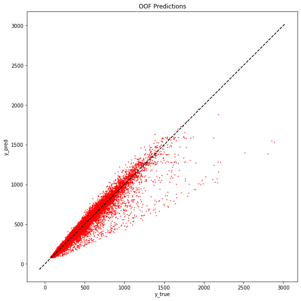
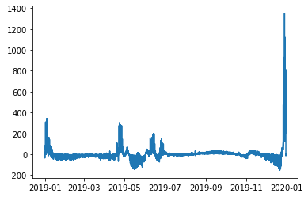
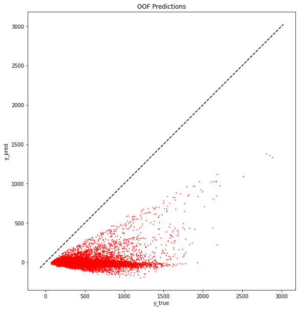
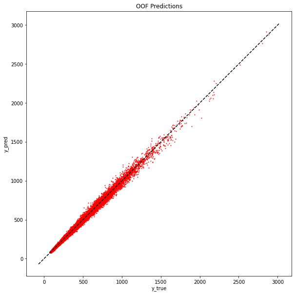
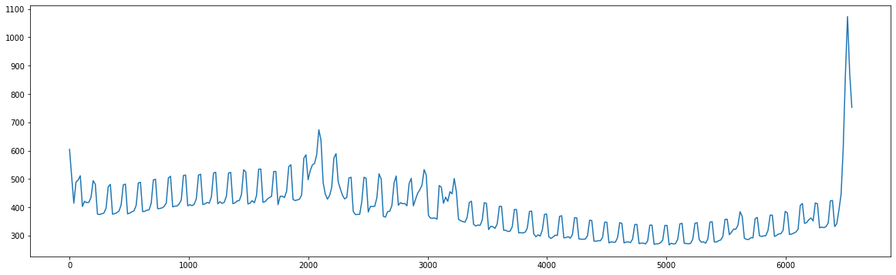

```python
import pandas as pd
import numpy as np
import matplotlib.pyplot as plt
import dateutil.easter as easter
import holidays
```


```python
# Extract Holidays
easter_dict = {}
for year in range(2015,2020):
    easter_dict[year] = easter.easter(year)

moms_day = {2015: pd.Timestamp(('2015-5-31')),
            2016: pd.Timestamp(('2016-5-29')),
            2017: pd.Timestamp(('2017-5-28')),
            2018: pd.Timestamp(('2018-5-27')),
            2019: pd.Timestamp(('2019-5-26'))}

wed_june = {2015: pd.Timestamp(('2015-06-24')),
            2016: pd.Timestamp(('2016-06-29')),
            2017: pd.Timestamp(('2017-06-28')),
            2018: pd.Timestamp(('2018-06-27')),
            2019: pd.Timestamp(('2019-06-26'))}

sun_nov = {2015: pd.Timestamp(('2015-11-1')),
        2016: pd.Timestamp(('2016-11-6')),
        2017: pd.Timestamp(('2017-11-5')),
        2018: pd.Timestamp(('2018-11-4')),
        2019: pd.Timestamp(('2019-11-3'))}


```


```python
class Preprocess:
    def __init__(self, gdp_path, easter_dict):
        self.gdp_path = gdp_path     
        self.easter_dict = easter_dict   
    
    def import_data(self, path):
        self.df = pd.read_csv(path, parse_dates=['date'], index_col=0)
        self.index = self.df.index
        
    def get_gdp(self, path):
        gdp = pd.read_csv(path)
        gdp.columns = gdp.columns.str.title().str.replace('Gdp_','')
        gdp = gdp.set_index('Year').stack(0).reset_index()
        gdp.columns = ['year','country','gdp']
        return gdp

    def create_date_features(self, df):
        df['day_of_year'] = df.date.dt.day_of_year
        df['day_of_month'] = df.date.dt.day
        df['day_of_week'] = df.date.dt.weekday
        # df['month'] = df.date.dt.month
        # df['quarter'] = df.date.dt.quarter
        df['year'] = df.date.dt.year
        # df['period'] = df.date.dt.to_period('M')
        return df
    
    def add_country_holidays(self, df):
        years = [2015, 2016, 2017, 2018, 2019]
        finland = pd.DataFrame([dict(date = date, 
                                    finland_holiday = event, 
                                    country= 'Finland') for date, event in holidays.Finland(years=years).items()])

        norway = pd.DataFrame([dict(date = date, 
                                norway_holiday = event, 
                                country= 'Norway') for date, event in holidays.Norway(years=years).items()])

        sweden = pd.DataFrame([dict(date = date, 
                                    sweden_holiday = event.replace(", Söndag", ""), 
                                    country= 'Sweden') for date, event in holidays.Sweden(years=years).items() if event != 'Söndag'])
        finland['date'] = finland['date'].astype("datetime64")
        norway['date'] = norway['date'].astype("datetime64")
        sweden['date'] = sweden['date'].astype("datetime64")
        
        return (df.merge(finland, on = ['date', 'country'], how = 'left')
                        .merge(norway, on = ['date', 'country'], how = 'left')
                        .merge(sweden, on = ['date', 'country'], how = 'left'))

    def get_specific_dates_features(self, df, easter_dict):
        return (df.assign(easter = lambda x: x.year.map(easter_dict).astype('datetime64'),
                            moms_day = lambda x: x.year.map(moms_day).astype('datetime64'),
                            wed_jun = lambda x: x.year.map(wed_june).astype('datetime64'),
                            sun_nov = lambda x: x.year.map(sun_nov).astype('datetime64'),
                            
                            days_from_easter = lambda x: (x.date - x.easter).dt.days.clip(-5, 65),
                            days_from_mom = lambda x: (x.date - x.moms_day).dt.days.clip(-1, 9),
                            days_from_wed = lambda x: (x.date - x.wed_jun).dt.days.clip(-5, 5),
                            days_from_sun = lambda x: (x.date - x.sun_nov).dt.days.clip(-1, 9),
            )).drop(columns = ['easter','moms_day','wed_jun','sun_nov'])
        
    def join_gdp(self, df):
        return df.merge(self.gdp, on = ['country','year'], how = 'left')

    def feature_engineering(self, df):
        df['log_gdp'] = np.log(df.gdp)
        days_cats = [df.day_of_week < 4, df.day_of_week == 4, df.day_of_week > 4]
        days = ['week','friday','weekends']
        df['week'] = np.select(days_cats, days)
        return df
    
    def __call__(self, path, name = 'Train'):
        self.import_data(path)
        self.gdp = self.get_gdp(self.gdp_path).set_index('year')
        out = (self.df.pipe(self.create_date_features)
                    .pipe(self.join_gdp)
                    .pipe(self.feature_engineering)
                    .pipe(self.add_country_holidays)
                    .pipe(self.get_specific_dates_features, self.easter_dict))
        out.index = self.index
        print(f'{name} Set created with {out.shape[1]} features')
        return out


GDP_PATH = '../inputs/GDP_data_2015_to_2019_Finland_Norway_Sweden.csv'
TRAIN_PATH = '../inputs/train.csv'
TEST_PATH = '../inputs/test.csv'
feature_engineer = Preprocess(GDP_PATH, easter_dict)
df_train = feature_engineer(TRAIN_PATH)
df_test = feature_engineer(TEST_PATH, name = 'Test')
```

    Train Set created with 19 features
    Test Set created with 18 features


```python
df_train
```


<div>
<style scoped>
    .dataframe tbody tr th:only-of-type {
        vertical-align: middle;
    }

    .dataframe tbody tr th {
        vertical-align: top;
    }

    .dataframe thead th {
        text-align: right;
    }
</style>
<table border="1" class="dataframe">
  <thead>
    <tr style="text-align: right;">
      <th></th>
      <th>date</th>
      <th>country</th>
      <th>store</th>
      <th>product</th>
      <th>num_sold</th>
      <th>day_of_year</th>
      <th>day_of_month</th>
      <th>day_of_week</th>
      <th>year</th>
      <th>gdp</th>
      <th>log_gdp</th>
      <th>week</th>
      <th>finland_holiday</th>
      <th>norway_holiday</th>
      <th>sweden_holiday</th>
      <th>days_from_easter</th>
      <th>days_from_mom</th>
      <th>days_from_wed</th>
      <th>days_from_sun</th>
    </tr>
    <tr>
      <th>row_id</th>
      <th></th>
      <th></th>
      <th></th>
      <th></th>
      <th></th>
      <th></th>
      <th></th>
      <th></th>
      <th></th>
      <th></th>
      <th></th>
      <th></th>
      <th></th>
      <th></th>
      <th></th>
      <th></th>
      <th></th>
      <th></th>
      <th></th>
    </tr>
  </thead>
  <tbody>
    <tr>
      <th>0</th>
      <td>2015-01-01</td>
      <td>Finland</td>
      <td>KaggleMart</td>
      <td>Kaggle Mug</td>
      <td>329</td>
      <td>1</td>
      <td>1</td>
      <td>3</td>
      <td>2015</td>
      <td>234.440</td>
      <td>5.457200</td>
      <td>week</td>
      <td>Uudenvuodenpäivä</td>
      <td>NaN</td>
      <td>NaN</td>
      <td>-5</td>
      <td>-1</td>
      <td>-5</td>
      <td>-1</td>
    </tr>
    <tr>
      <th>1</th>
      <td>2015-01-01</td>
      <td>Finland</td>
      <td>KaggleMart</td>
      <td>Kaggle Hat</td>
      <td>520</td>
      <td>1</td>
      <td>1</td>
      <td>3</td>
      <td>2015</td>
      <td>234.440</td>
      <td>5.457200</td>
      <td>week</td>
      <td>Uudenvuodenpäivä</td>
      <td>NaN</td>
      <td>NaN</td>
      <td>-5</td>
      <td>-1</td>
      <td>-5</td>
      <td>-1</td>
    </tr>
    <tr>
      <th>2</th>
      <td>2015-01-01</td>
      <td>Finland</td>
      <td>KaggleMart</td>
      <td>Kaggle Sticker</td>
      <td>146</td>
      <td>1</td>
      <td>1</td>
      <td>3</td>
      <td>2015</td>
      <td>234.440</td>
      <td>5.457200</td>
      <td>week</td>
      <td>Uudenvuodenpäivä</td>
      <td>NaN</td>
      <td>NaN</td>
      <td>-5</td>
      <td>-1</td>
      <td>-5</td>
      <td>-1</td>
    </tr>
    <tr>
      <th>3</th>
      <td>2015-01-01</td>
      <td>Finland</td>
      <td>KaggleRama</td>
      <td>Kaggle Mug</td>
      <td>572</td>
      <td>1</td>
      <td>1</td>
      <td>3</td>
      <td>2015</td>
      <td>234.440</td>
      <td>5.457200</td>
      <td>week</td>
      <td>Uudenvuodenpäivä</td>
      <td>NaN</td>
      <td>NaN</td>
      <td>-5</td>
      <td>-1</td>
      <td>-5</td>
      <td>-1</td>
    </tr>
    <tr>
      <th>4</th>
      <td>2015-01-01</td>
      <td>Finland</td>
      <td>KaggleRama</td>
      <td>Kaggle Hat</td>
      <td>911</td>
      <td>1</td>
      <td>1</td>
      <td>3</td>
      <td>2015</td>
      <td>234.440</td>
      <td>5.457200</td>
      <td>week</td>
      <td>Uudenvuodenpäivä</td>
      <td>NaN</td>
      <td>NaN</td>
      <td>-5</td>
      <td>-1</td>
      <td>-5</td>
      <td>-1</td>
    </tr>
    <tr>
      <th>...</th>
      <td>...</td>
      <td>...</td>
      <td>...</td>
      <td>...</td>
      <td>...</td>
      <td>...</td>
      <td>...</td>
      <td>...</td>
      <td>...</td>
      <td>...</td>
      <td>...</td>
      <td>...</td>
      <td>...</td>
      <td>...</td>
      <td>...</td>
      <td>...</td>
      <td>...</td>
      <td>...</td>
      <td>...</td>
    </tr>
    <tr>
      <th>26293</th>
      <td>2018-12-31</td>
      <td>Sweden</td>
      <td>KaggleMart</td>
      <td>Kaggle Hat</td>
      <td>823</td>
      <td>365</td>
      <td>31</td>
      <td>0</td>
      <td>2018</td>
      <td>555.455</td>
      <td>6.319788</td>
      <td>week</td>
      <td>NaN</td>
      <td>NaN</td>
      <td>Nyårsafton</td>
      <td>65</td>
      <td>9</td>
      <td>5</td>
      <td>9</td>
    </tr>
    <tr>
      <th>26294</th>
      <td>2018-12-31</td>
      <td>Sweden</td>
      <td>KaggleMart</td>
      <td>Kaggle Sticker</td>
      <td>250</td>
      <td>365</td>
      <td>31</td>
      <td>0</td>
      <td>2018</td>
      <td>555.455</td>
      <td>6.319788</td>
      <td>week</td>
      <td>NaN</td>
      <td>NaN</td>
      <td>Nyårsafton</td>
      <td>65</td>
      <td>9</td>
      <td>5</td>
      <td>9</td>
    </tr>
    <tr>
      <th>26295</th>
      <td>2018-12-31</td>
      <td>Sweden</td>
      <td>KaggleRama</td>
      <td>Kaggle Mug</td>
      <td>1004</td>
      <td>365</td>
      <td>31</td>
      <td>0</td>
      <td>2018</td>
      <td>555.455</td>
      <td>6.319788</td>
      <td>week</td>
      <td>NaN</td>
      <td>NaN</td>
      <td>Nyårsafton</td>
      <td>65</td>
      <td>9</td>
      <td>5</td>
      <td>9</td>
    </tr>
    <tr>
      <th>26296</th>
      <td>2018-12-31</td>
      <td>Sweden</td>
      <td>KaggleRama</td>
      <td>Kaggle Hat</td>
      <td>1441</td>
      <td>365</td>
      <td>31</td>
      <td>0</td>
      <td>2018</td>
      <td>555.455</td>
      <td>6.319788</td>
      <td>week</td>
      <td>NaN</td>
      <td>NaN</td>
      <td>Nyårsafton</td>
      <td>65</td>
      <td>9</td>
      <td>5</td>
      <td>9</td>
    </tr>
    <tr>
      <th>26297</th>
      <td>2018-12-31</td>
      <td>Sweden</td>
      <td>KaggleRama</td>
      <td>Kaggle Sticker</td>
      <td>388</td>
      <td>365</td>
      <td>31</td>
      <td>0</td>
      <td>2018</td>
      <td>555.455</td>
      <td>6.319788</td>
      <td>week</td>
      <td>NaN</td>
      <td>NaN</td>
      <td>Nyårsafton</td>
      <td>65</td>
      <td>9</td>
      <td>5</td>
      <td>9</td>
    </tr>
  </tbody>
</table>
<p>26298 rows × 19 columns</p>
</div>


# Training Simple Model


```python
X = df_train.drop(columns = ['gdp','date','num_sold'])
y = df_train.num_sold

X_test = df_test.drop(columns = ['gdp','date'])
```


```python
from feature_engine.creation import CyclicalTransformer

# New class allowing to add a suffix to differentiate different n values.
class CyclicalTransformerV2(CyclicalTransformer):
    def __init__(self, suffix = None, **kwargs):
            super().__init__(**kwargs)
            self.suffix = suffix
        
    def transform(self, X):
        X = super().transform(X)
        if self.suffix is not None:
            transformed_names = X.filter(regex = r'sin$|cos$').columns
            new_names = {name: name + self.suffix for name in transformed_names}
            X.rename(columns=new_names, inplace=True)
        return X
```


```python
from sklearn.pipeline import Pipeline
from feature_engine.encoding import OneHotEncoder, OrdinalEncoder
from feature_engine.creation import CyclicalTransformer, CombineWithReferenceFeature
from sklearn.preprocessing import StandardScaler
from sklearn.linear_model import Ridge
from feature_engine.selection import DropFeatures
from feature_engine.wrappers import SklearnTransformerWrapper
from feature_engine.imputation import CategoricalImputer
scaler = SklearnTransformerWrapper(StandardScaler())

cyc_1 = CyclicalTransformerV2(variables = ['day_of_year'], 
                            max_values = {'day_of_year':365}, 
                            suffix = '_1')
cyc_2 = CyclicalTransformerV2(variables = ['day_of_year'], 
                            max_values = {'day_of_year':365/2,}, 
                            suffix = '_2')
linear_prep = Pipeline(steps = [
    ('cat_imp', CategoricalImputer()),
    ('ohe', OneHotEncoder(drop_last=True)),
    ('cyc1', cyc_1),
    ('cyc2', cyc_2),
    ('combo', CombineWithReferenceFeature(variables_to_combine=['day_of_year_sin_1', 'day_of_year_cos_1',
                                                                'day_of_year_sin_2', 'day_of_year_cos_2'], 
                                        reference_variables=['product_Kaggle Mug', 'product_Kaggle Hat'],
                                        operations = ['mul'])),
    ('drop', DropFeatures(features_to_drop=['year'],#'day_of_year','day_of_week','day_of_month',,]
                                            # 'store_KaggleMart','product_Kaggle Sticker', 'week_week','country_Sweden']
    )),
    ('sc', scaler)

    ])

log_y = np.log(y)
linear_prep.fit_transform(X)

```


<div>
<style scoped>
    .dataframe tbody tr th:only-of-type {
        vertical-align: middle;
    }

    .dataframe tbody tr th {
        vertical-align: top;
    }

    .dataframe thead th {
        text-align: right;
    }
</style>
<table border="1" class="dataframe">
  <thead>
    <tr style="text-align: right;">
      <th></th>
      <th>day_of_year</th>
      <th>day_of_month</th>
      <th>day_of_week</th>
      <th>log_gdp</th>
      <th>days_from_easter</th>
      <th>days_from_mom</th>
      <th>days_from_wed</th>
      <th>days_from_sun</th>
      <th>country_Finland</th>
      <th>country_Norway</th>
      <th>...</th>
      <th>day_of_year_sin_2</th>
      <th>day_of_year_cos_2</th>
      <th>day_of_year_sin_1_mul_product_Kaggle Mug</th>
      <th>day_of_year_cos_1_mul_product_Kaggle Mug</th>
      <th>day_of_year_sin_2_mul_product_Kaggle Mug</th>
      <th>day_of_year_cos_2_mul_product_Kaggle Mug</th>
      <th>day_of_year_sin_1_mul_product_Kaggle Hat</th>
      <th>day_of_year_cos_1_mul_product_Kaggle Hat</th>
      <th>day_of_year_sin_2_mul_product_Kaggle Hat</th>
      <th>day_of_year_cos_2_mul_product_Kaggle Hat</th>
    </tr>
    <tr>
      <th>row_id</th>
      <th></th>
      <th></th>
      <th></th>
      <th></th>
      <th></th>
      <th></th>
      <th></th>
      <th></th>
      <th></th>
      <th></th>
      <th></th>
      <th></th>
      <th></th>
      <th></th>
      <th></th>
      <th></th>
      <th></th>
      <th></th>
      <th></th>
      <th></th>
      <th></th>
    </tr>
  </thead>
  <tbody>
    <tr>
      <th>0</th>
      <td>-1.727310</td>
      <td>-1.673805</td>
      <td>-0.001026</td>
      <td>-1.503796</td>
      <td>-1.503789</td>
      <td>-1.192261</td>
      <td>-1.036474</td>
      <td>-0.421954</td>
      <td>1.414214</td>
      <td>-0.707107</td>
      <td>...</td>
      <td>0.048663</td>
      <td>1.411927</td>
      <td>0.042169</td>
      <td>2.447731</td>
      <td>0.084325</td>
      <td>2.446645</td>
      <td>-0.000010</td>
      <td>-0.000559</td>
      <td>-0.000019</td>
      <td>-0.000558</td>
    </tr>
    <tr>
      <th>1</th>
      <td>-1.727310</td>
      <td>-1.673805</td>
      <td>-0.001026</td>
      <td>-1.503796</td>
      <td>-1.503789</td>
      <td>-1.192261</td>
      <td>-1.036474</td>
      <td>-0.421954</td>
      <td>1.414214</td>
      <td>-0.707107</td>
      <td>...</td>
      <td>0.048663</td>
      <td>1.411927</td>
      <td>-0.000010</td>
      <td>-0.000559</td>
      <td>-0.000019</td>
      <td>-0.000558</td>
      <td>0.042169</td>
      <td>2.447731</td>
      <td>0.084325</td>
      <td>2.446645</td>
    </tr>
    <tr>
      <th>2</th>
      <td>-1.727310</td>
      <td>-1.673805</td>
      <td>-0.001026</td>
      <td>-1.503796</td>
      <td>-1.503789</td>
      <td>-1.192261</td>
      <td>-1.036474</td>
      <td>-0.421954</td>
      <td>1.414214</td>
      <td>-0.707107</td>
      <td>...</td>
      <td>0.048663</td>
      <td>1.411927</td>
      <td>-0.000010</td>
      <td>-0.000559</td>
      <td>-0.000019</td>
      <td>-0.000558</td>
      <td>-0.000010</td>
      <td>-0.000559</td>
      <td>-0.000019</td>
      <td>-0.000558</td>
    </tr>
    <tr>
      <th>3</th>
      <td>-1.727310</td>
      <td>-1.673805</td>
      <td>-0.001026</td>
      <td>-1.503796</td>
      <td>-1.503789</td>
      <td>-1.192261</td>
      <td>-1.036474</td>
      <td>-0.421954</td>
      <td>1.414214</td>
      <td>-0.707107</td>
      <td>...</td>
      <td>0.048663</td>
      <td>1.411927</td>
      <td>0.042169</td>
      <td>2.447731</td>
      <td>0.084325</td>
      <td>2.446645</td>
      <td>-0.000010</td>
      <td>-0.000559</td>
      <td>-0.000019</td>
      <td>-0.000558</td>
    </tr>
    <tr>
      <th>4</th>
      <td>-1.727310</td>
      <td>-1.673805</td>
      <td>-0.001026</td>
      <td>-1.503796</td>
      <td>-1.503789</td>
      <td>-1.192261</td>
      <td>-1.036474</td>
      <td>-0.421954</td>
      <td>1.414214</td>
      <td>-0.707107</td>
      <td>...</td>
      <td>0.048663</td>
      <td>1.411927</td>
      <td>-0.000010</td>
      <td>-0.000559</td>
      <td>-0.000019</td>
      <td>-0.000558</td>
      <td>0.042169</td>
      <td>2.447731</td>
      <td>0.084325</td>
      <td>2.446645</td>
    </tr>
    <tr>
      <th>...</th>
      <td>...</td>
      <td>...</td>
      <td>...</td>
      <td>...</td>
      <td>...</td>
      <td>...</td>
      <td>...</td>
      <td>...</td>
      <td>...</td>
      <td>...</td>
      <td>...</td>
      <td>...</td>
      <td>...</td>
      <td>...</td>
      <td>...</td>
      <td>...</td>
      <td>...</td>
      <td>...</td>
      <td>...</td>
      <td>...</td>
      <td>...</td>
    </tr>
    <tr>
      <th>26293</th>
      <td>1.724934</td>
      <td>1.735250</td>
      <td>-1.500642</td>
      <td>1.260881</td>
      <td>0.775294</td>
      <td>0.854617</td>
      <td>0.982577</td>
      <td>2.458770</td>
      <td>-0.707107</td>
      <td>-0.707107</td>
      <td>...</td>
      <td>-0.000033</td>
      <td>1.412765</td>
      <td>-0.000010</td>
      <td>-0.000559</td>
      <td>-0.000019</td>
      <td>-0.000558</td>
      <td>-0.000010</td>
      <td>2.448094</td>
      <td>-0.000019</td>
      <td>2.448096</td>
    </tr>
    <tr>
      <th>26294</th>
      <td>1.724934</td>
      <td>1.735250</td>
      <td>-1.500642</td>
      <td>1.260881</td>
      <td>0.775294</td>
      <td>0.854617</td>
      <td>0.982577</td>
      <td>2.458770</td>
      <td>-0.707107</td>
      <td>-0.707107</td>
      <td>...</td>
      <td>-0.000033</td>
      <td>1.412765</td>
      <td>-0.000010</td>
      <td>-0.000559</td>
      <td>-0.000019</td>
      <td>-0.000558</td>
      <td>-0.000010</td>
      <td>-0.000559</td>
      <td>-0.000019</td>
      <td>-0.000558</td>
    </tr>
    <tr>
      <th>26295</th>
      <td>1.724934</td>
      <td>1.735250</td>
      <td>-1.500642</td>
      <td>1.260881</td>
      <td>0.775294</td>
      <td>0.854617</td>
      <td>0.982577</td>
      <td>2.458770</td>
      <td>-0.707107</td>
      <td>-0.707107</td>
      <td>...</td>
      <td>-0.000033</td>
      <td>1.412765</td>
      <td>-0.000010</td>
      <td>2.448094</td>
      <td>-0.000019</td>
      <td>2.448096</td>
      <td>-0.000010</td>
      <td>-0.000559</td>
      <td>-0.000019</td>
      <td>-0.000558</td>
    </tr>
    <tr>
      <th>26296</th>
      <td>1.724934</td>
      <td>1.735250</td>
      <td>-1.500642</td>
      <td>1.260881</td>
      <td>0.775294</td>
      <td>0.854617</td>
      <td>0.982577</td>
      <td>2.458770</td>
      <td>-0.707107</td>
      <td>-0.707107</td>
      <td>...</td>
      <td>-0.000033</td>
      <td>1.412765</td>
      <td>-0.000010</td>
      <td>-0.000559</td>
      <td>-0.000019</td>
      <td>-0.000558</td>
      <td>-0.000010</td>
      <td>2.448094</td>
      <td>-0.000019</td>
      <td>2.448096</td>
    </tr>
    <tr>
      <th>26297</th>
      <td>1.724934</td>
      <td>1.735250</td>
      <td>-1.500642</td>
      <td>1.260881</td>
      <td>0.775294</td>
      <td>0.854617</td>
      <td>0.982577</td>
      <td>2.458770</td>
      <td>-0.707107</td>
      <td>-0.707107</td>
      <td>...</td>
      <td>-0.000033</td>
      <td>1.412765</td>
      <td>-0.000010</td>
      <td>-0.000559</td>
      <td>-0.000019</td>
      <td>-0.000558</td>
      <td>-0.000010</td>
      <td>-0.000559</td>
      <td>-0.000019</td>
      <td>-0.000558</td>
    </tr>
  </tbody>
</table>
<p>26298 rows × 70 columns</p>
</div>


```python
linear_pipe = Pipeline(steps = [
    ('prep', linear_prep), 
    ('model', Ridge())
])

linear_pipe.fit(X, log_y)
linear_pipe[0].transform(X_test)

```


<div>
<style scoped>
    .dataframe tbody tr th:only-of-type {
        vertical-align: middle;
    }

    .dataframe tbody tr th {
        vertical-align: top;
    }

    .dataframe thead th {
        text-align: right;
    }
</style>
<table border="1" class="dataframe">
  <thead>
    <tr style="text-align: right;">
      <th></th>
      <th>day_of_year</th>
      <th>day_of_month</th>
      <th>day_of_week</th>
      <th>log_gdp</th>
      <th>days_from_easter</th>
      <th>days_from_mom</th>
      <th>days_from_wed</th>
      <th>days_from_sun</th>
      <th>country_Finland</th>
      <th>country_Norway</th>
      <th>...</th>
      <th>day_of_year_sin_2</th>
      <th>day_of_year_cos_2</th>
      <th>day_of_year_sin_1_mul_product_Kaggle Mug</th>
      <th>day_of_year_cos_1_mul_product_Kaggle Mug</th>
      <th>day_of_year_sin_2_mul_product_Kaggle Mug</th>
      <th>day_of_year_cos_2_mul_product_Kaggle Mug</th>
      <th>day_of_year_sin_1_mul_product_Kaggle Hat</th>
      <th>day_of_year_cos_1_mul_product_Kaggle Hat</th>
      <th>day_of_year_sin_2_mul_product_Kaggle Hat</th>
      <th>day_of_year_cos_2_mul_product_Kaggle Hat</th>
    </tr>
    <tr>
      <th>row_id</th>
      <th></th>
      <th></th>
      <th></th>
      <th></th>
      <th></th>
      <th></th>
      <th></th>
      <th></th>
      <th></th>
      <th></th>
      <th></th>
      <th></th>
      <th></th>
      <th></th>
      <th></th>
      <th></th>
      <th></th>
      <th></th>
      <th></th>
      <th></th>
      <th></th>
    </tr>
  </thead>
  <tbody>
    <tr>
      <th>26298</th>
      <td>-1.727310</td>
      <td>-1.673805</td>
      <td>-1.00077</td>
      <td>-1.065656</td>
      <td>-1.503789</td>
      <td>-1.192261</td>
      <td>-1.036474</td>
      <td>-0.421954</td>
      <td>1.414214</td>
      <td>-0.707107</td>
      <td>...</td>
      <td>0.048663</td>
      <td>1.411927</td>
      <td>0.042169</td>
      <td>2.447731</td>
      <td>0.084325</td>
      <td>2.446645</td>
      <td>-0.000010</td>
      <td>-0.000559</td>
      <td>-0.000019</td>
      <td>-0.000558</td>
    </tr>
    <tr>
      <th>26299</th>
      <td>-1.727310</td>
      <td>-1.673805</td>
      <td>-1.00077</td>
      <td>-1.065656</td>
      <td>-1.503789</td>
      <td>-1.192261</td>
      <td>-1.036474</td>
      <td>-0.421954</td>
      <td>1.414214</td>
      <td>-0.707107</td>
      <td>...</td>
      <td>0.048663</td>
      <td>1.411927</td>
      <td>-0.000010</td>
      <td>-0.000559</td>
      <td>-0.000019</td>
      <td>-0.000558</td>
      <td>0.042169</td>
      <td>2.447731</td>
      <td>0.084325</td>
      <td>2.446645</td>
    </tr>
    <tr>
      <th>26300</th>
      <td>-1.727310</td>
      <td>-1.673805</td>
      <td>-1.00077</td>
      <td>-1.065656</td>
      <td>-1.503789</td>
      <td>-1.192261</td>
      <td>-1.036474</td>
      <td>-0.421954</td>
      <td>1.414214</td>
      <td>-0.707107</td>
      <td>...</td>
      <td>0.048663</td>
      <td>1.411927</td>
      <td>-0.000010</td>
      <td>-0.000559</td>
      <td>-0.000019</td>
      <td>-0.000558</td>
      <td>-0.000010</td>
      <td>-0.000559</td>
      <td>-0.000019</td>
      <td>-0.000558</td>
    </tr>
    <tr>
      <th>26301</th>
      <td>-1.727310</td>
      <td>-1.673805</td>
      <td>-1.00077</td>
      <td>-1.065656</td>
      <td>-1.503789</td>
      <td>-1.192261</td>
      <td>-1.036474</td>
      <td>-0.421954</td>
      <td>1.414214</td>
      <td>-0.707107</td>
      <td>...</td>
      <td>0.048663</td>
      <td>1.411927</td>
      <td>0.042169</td>
      <td>2.447731</td>
      <td>0.084325</td>
      <td>2.446645</td>
      <td>-0.000010</td>
      <td>-0.000559</td>
      <td>-0.000019</td>
      <td>-0.000558</td>
    </tr>
    <tr>
      <th>26302</th>
      <td>-1.727310</td>
      <td>-1.673805</td>
      <td>-1.00077</td>
      <td>-1.065656</td>
      <td>-1.503789</td>
      <td>-1.192261</td>
      <td>-1.036474</td>
      <td>-0.421954</td>
      <td>1.414214</td>
      <td>-0.707107</td>
      <td>...</td>
      <td>0.048663</td>
      <td>1.411927</td>
      <td>-0.000010</td>
      <td>-0.000559</td>
      <td>-0.000019</td>
      <td>-0.000558</td>
      <td>0.042169</td>
      <td>2.447731</td>
      <td>0.084325</td>
      <td>2.446645</td>
    </tr>
    <tr>
      <th>...</th>
      <td>...</td>
      <td>...</td>
      <td>...</td>
      <td>...</td>
      <td>...</td>
      <td>...</td>
      <td>...</td>
      <td>...</td>
      <td>...</td>
      <td>...</td>
      <td>...</td>
      <td>...</td>
      <td>...</td>
      <td>...</td>
      <td>...</td>
      <td>...</td>
      <td>...</td>
      <td>...</td>
      <td>...</td>
      <td>...</td>
      <td>...</td>
    </tr>
    <tr>
      <th>32863</th>
      <td>1.724934</td>
      <td>1.735250</td>
      <td>-1.00077</td>
      <td>1.133907</td>
      <td>0.775294</td>
      <td>0.854617</td>
      <td>0.982577</td>
      <td>2.458770</td>
      <td>-0.707107</td>
      <td>-0.707107</td>
      <td>...</td>
      <td>-0.000033</td>
      <td>1.412765</td>
      <td>-0.000010</td>
      <td>-0.000559</td>
      <td>-0.000019</td>
      <td>-0.000558</td>
      <td>-0.000010</td>
      <td>2.448094</td>
      <td>-0.000019</td>
      <td>2.448096</td>
    </tr>
    <tr>
      <th>32864</th>
      <td>1.724934</td>
      <td>1.735250</td>
      <td>-1.00077</td>
      <td>1.133907</td>
      <td>0.775294</td>
      <td>0.854617</td>
      <td>0.982577</td>
      <td>2.458770</td>
      <td>-0.707107</td>
      <td>-0.707107</td>
      <td>...</td>
      <td>-0.000033</td>
      <td>1.412765</td>
      <td>-0.000010</td>
      <td>-0.000559</td>
      <td>-0.000019</td>
      <td>-0.000558</td>
      <td>-0.000010</td>
      <td>-0.000559</td>
      <td>-0.000019</td>
      <td>-0.000558</td>
    </tr>
    <tr>
      <th>32865</th>
      <td>1.724934</td>
      <td>1.735250</td>
      <td>-1.00077</td>
      <td>1.133907</td>
      <td>0.775294</td>
      <td>0.854617</td>
      <td>0.982577</td>
      <td>2.458770</td>
      <td>-0.707107</td>
      <td>-0.707107</td>
      <td>...</td>
      <td>-0.000033</td>
      <td>1.412765</td>
      <td>-0.000010</td>
      <td>2.448094</td>
      <td>-0.000019</td>
      <td>2.448096</td>
      <td>-0.000010</td>
      <td>-0.000559</td>
      <td>-0.000019</td>
      <td>-0.000558</td>
    </tr>
    <tr>
      <th>32866</th>
      <td>1.724934</td>
      <td>1.735250</td>
      <td>-1.00077</td>
      <td>1.133907</td>
      <td>0.775294</td>
      <td>0.854617</td>
      <td>0.982577</td>
      <td>2.458770</td>
      <td>-0.707107</td>
      <td>-0.707107</td>
      <td>...</td>
      <td>-0.000033</td>
      <td>1.412765</td>
      <td>-0.000010</td>
      <td>-0.000559</td>
      <td>-0.000019</td>
      <td>-0.000558</td>
      <td>-0.000010</td>
      <td>2.448094</td>
      <td>-0.000019</td>
      <td>2.448096</td>
    </tr>
    <tr>
      <th>32867</th>
      <td>1.724934</td>
      <td>1.735250</td>
      <td>-1.00077</td>
      <td>1.133907</td>
      <td>0.775294</td>
      <td>0.854617</td>
      <td>0.982577</td>
      <td>2.458770</td>
      <td>-0.707107</td>
      <td>-0.707107</td>
      <td>...</td>
      <td>-0.000033</td>
      <td>1.412765</td>
      <td>-0.000010</td>
      <td>-0.000559</td>
      <td>-0.000019</td>
      <td>-0.000558</td>
      <td>-0.000010</td>
      <td>-0.000559</td>
      <td>-0.000019</td>
      <td>-0.000558</td>
    </tr>
  </tbody>
</table>
<p>6570 rows × 70 columns</p>
</div>


```python

linear_pred_train = np.exp(linear_pipe.predict(X))
linear_pred_test = np.exp(linear_pipe.predict(X_test))
```


```python
def plot_oof(y, y_pred):
    plt.figure(figsize=(10, 10))
    plt.scatter(y, y_pred, s=1, color='r')
    #plt.scatter(np.log(y_va), np.log(y_va_pred), s=1, color='g')
    plt.plot([plt.xlim()[0], plt.xlim()[1]], [plt.xlim()[0], plt.xlim()[1]], '--', color='k')
    plt.gca().set_aspect('equal')
    plt.xlabel('y_true')
    plt.ylabel('y_pred')
    plt.title('OOF Predictions')
    plt.show()
    
plot_oof(y, linear_pred_train)
```


    

    


```python
def plot_data(df, y_pred, country = 'Norway', store = 'KaggleMart', product = 'Kaggle Hat', figsize = (20,6)):
    plot_data = df.query(f'country == "{country}" and store == "{store}" and product == "{product}"')
    idx = plot_data.index

    plt.figure(figsize=figsize)
    plt.plot(plot_data.date, y_pred[idx], label='prediction')
    plt.scatter(plot_data.date, plot_data.num_sold, label='true', alpha=0.5, color='red', s=3)
    plt.legend()

plot_data(df_train, linear_pred_train)
```


    

    


```python
df_train['pred'] = linear_pred_train 
by_date = df_train.groupby('date')

residuals = by_date.pred.mean() - by_date.num_sold.mean()

plt.figure(figsize = (20, 8))
plt.plot(df_train.date, df_train.num_sold, alpha = 0.2, c = 'r')
plt.scatter(df_train.date.unique(), residuals, s = 3)
```


    <matplotlib.collections.PathCollection at 0x7effcc508d10>


    

    


```python
y_resid = df_train.num_sold - linear_pred_train
y_resid
```


    row_id
    0         1.600911
    1        12.788551
    2         1.253354
    3         1.103563
    4        26.558905
               ...    
    26293   -21.426569
    26294     8.077731
    26295    49.874044
    26296   -31.454064
    26297   -33.847726
    Name: num_sold, Length: 26298, dtype: float64


```python
boosting_prep = Pipeline(steps = [
    ('cat_imp', CategoricalImputer()),
    ('OrdinalEncoding', OrdinalEncoder(encoding_method='ordered')),
    ('cyc1', cyc_1),
    ('cyc2', cyc_2),
    # ('combo', CombineWithReferenceFeature(variables_to_combine=['day_of_year_sin_1', 'day_of_year_cos_1',
    #                                                             'day_of_year_sin_2', 'day_of_year_cos_2'], 
    #                                     reference_variables=['product_Kaggle Mug', 'product_Kaggle Hat'],
    #                                     operations = ['mul'])),
    ('drop', DropFeatures(features_to_drop=['day_of_year','day_of_week','day_of_month','year',]
                                            # 'store_KaggleMart','product_Kaggle Sticker', 'week_week','country_Sweden']
    )),
])

boosting_prep.fit_transform(X,y)
```


<div>
<style scoped>
    .dataframe tbody tr th:only-of-type {
        vertical-align: middle;
    }

    .dataframe tbody tr th {
        vertical-align: top;
    }

    .dataframe thead th {
        text-align: right;
    }
</style>
<table border="1" class="dataframe">
  <thead>
    <tr style="text-align: right;">
      <th></th>
      <th>country</th>
      <th>store</th>
      <th>product</th>
      <th>log_gdp</th>
      <th>week</th>
      <th>finland_holiday</th>
      <th>norway_holiday</th>
      <th>sweden_holiday</th>
      <th>days_from_easter</th>
      <th>days_from_mom</th>
      <th>days_from_wed</th>
      <th>days_from_sun</th>
      <th>day_of_year_sin_1</th>
      <th>day_of_year_cos_1</th>
      <th>day_of_year_sin_2</th>
      <th>day_of_year_cos_2</th>
    </tr>
    <tr>
      <th>row_id</th>
      <th></th>
      <th></th>
      <th></th>
      <th></th>
      <th></th>
      <th></th>
      <th></th>
      <th></th>
      <th></th>
      <th></th>
      <th></th>
      <th></th>
      <th></th>
      <th></th>
      <th></th>
      <th></th>
    </tr>
  </thead>
  <tbody>
    <tr>
      <th>0</th>
      <td>0</td>
      <td>0</td>
      <td>1</td>
      <td>5.457200</td>
      <td>0</td>
      <td>15</td>
      <td>0</td>
      <td>7</td>
      <td>-5</td>
      <td>-1</td>
      <td>-5</td>
      <td>-1</td>
      <td>1.721336e-02</td>
      <td>0.999852</td>
      <td>3.442161e-02</td>
      <td>0.999407</td>
    </tr>
    <tr>
      <th>1</th>
      <td>0</td>
      <td>0</td>
      <td>2</td>
      <td>5.457200</td>
      <td>0</td>
      <td>15</td>
      <td>0</td>
      <td>7</td>
      <td>-5</td>
      <td>-1</td>
      <td>-5</td>
      <td>-1</td>
      <td>1.721336e-02</td>
      <td>0.999852</td>
      <td>3.442161e-02</td>
      <td>0.999407</td>
    </tr>
    <tr>
      <th>2</th>
      <td>0</td>
      <td>0</td>
      <td>0</td>
      <td>5.457200</td>
      <td>0</td>
      <td>15</td>
      <td>0</td>
      <td>7</td>
      <td>-5</td>
      <td>-1</td>
      <td>-5</td>
      <td>-1</td>
      <td>1.721336e-02</td>
      <td>0.999852</td>
      <td>3.442161e-02</td>
      <td>0.999407</td>
    </tr>
    <tr>
      <th>3</th>
      <td>0</td>
      <td>1</td>
      <td>1</td>
      <td>5.457200</td>
      <td>0</td>
      <td>15</td>
      <td>0</td>
      <td>7</td>
      <td>-5</td>
      <td>-1</td>
      <td>-5</td>
      <td>-1</td>
      <td>1.721336e-02</td>
      <td>0.999852</td>
      <td>3.442161e-02</td>
      <td>0.999407</td>
    </tr>
    <tr>
      <th>4</th>
      <td>0</td>
      <td>1</td>
      <td>2</td>
      <td>5.457200</td>
      <td>0</td>
      <td>15</td>
      <td>0</td>
      <td>7</td>
      <td>-5</td>
      <td>-1</td>
      <td>-5</td>
      <td>-1</td>
      <td>1.721336e-02</td>
      <td>0.999852</td>
      <td>3.442161e-02</td>
      <td>0.999407</td>
    </tr>
    <tr>
      <th>...</th>
      <td>...</td>
      <td>...</td>
      <td>...</td>
      <td>...</td>
      <td>...</td>
      <td>...</td>
      <td>...</td>
      <td>...</td>
      <td>...</td>
      <td>...</td>
      <td>...</td>
      <td>...</td>
      <td>...</td>
      <td>...</td>
      <td>...</td>
      <td>...</td>
    </tr>
    <tr>
      <th>26293</th>
      <td>1</td>
      <td>0</td>
      <td>2</td>
      <td>6.319788</td>
      <td>0</td>
      <td>12</td>
      <td>0</td>
      <td>16</td>
      <td>65</td>
      <td>9</td>
      <td>5</td>
      <td>9</td>
      <td>-2.449294e-16</td>
      <td>1.000000</td>
      <td>-4.898587e-16</td>
      <td>1.000000</td>
    </tr>
    <tr>
      <th>26294</th>
      <td>1</td>
      <td>0</td>
      <td>0</td>
      <td>6.319788</td>
      <td>0</td>
      <td>12</td>
      <td>0</td>
      <td>16</td>
      <td>65</td>
      <td>9</td>
      <td>5</td>
      <td>9</td>
      <td>-2.449294e-16</td>
      <td>1.000000</td>
      <td>-4.898587e-16</td>
      <td>1.000000</td>
    </tr>
    <tr>
      <th>26295</th>
      <td>1</td>
      <td>1</td>
      <td>1</td>
      <td>6.319788</td>
      <td>0</td>
      <td>12</td>
      <td>0</td>
      <td>16</td>
      <td>65</td>
      <td>9</td>
      <td>5</td>
      <td>9</td>
      <td>-2.449294e-16</td>
      <td>1.000000</td>
      <td>-4.898587e-16</td>
      <td>1.000000</td>
    </tr>
    <tr>
      <th>26296</th>
      <td>1</td>
      <td>1</td>
      <td>2</td>
      <td>6.319788</td>
      <td>0</td>
      <td>12</td>
      <td>0</td>
      <td>16</td>
      <td>65</td>
      <td>9</td>
      <td>5</td>
      <td>9</td>
      <td>-2.449294e-16</td>
      <td>1.000000</td>
      <td>-4.898587e-16</td>
      <td>1.000000</td>
    </tr>
    <tr>
      <th>26297</th>
      <td>1</td>
      <td>1</td>
      <td>0</td>
      <td>6.319788</td>
      <td>0</td>
      <td>12</td>
      <td>0</td>
      <td>16</td>
      <td>65</td>
      <td>9</td>
      <td>5</td>
      <td>9</td>
      <td>-2.449294e-16</td>
      <td>1.000000</td>
      <td>-4.898587e-16</td>
      <td>1.000000</td>
    </tr>
  </tbody>
</table>
<p>26298 rows × 16 columns</p>
</div>


```python
from xgboost import XGBRegressor
boosting_pipe = Pipeline(steps = [
    ('prep', boosting_prep), 
    ('model', XGBRegressor())
])

boosting_pipe.fit(X, y_resid)

boosting_pred_train = boosting_pipe.predict(X)
boosting_pred_test = boosting_pipe.predict(X_test)

plot_data(df_train, boosting_pred_train)
```


    

    


```python
plt.plot(df_test.date, boosting_pred_test)
```


    [<matplotlib.lines.Line2D at 0x7effcc06fed0>]


    

    


```python
plot_oof(y, boosting_pred_train)
```


    

    


```python
y_pred_train = linear_pred_train + boosting_pred_train
y_pred_test = linear_pred_test + boosting_pred_test
plot_oof(y, y_pred_train)
```


    

    


```python
plot_data(df_train, y_pred_train, country = 'Finland', store = 'KaggleRama', product = 'Kaggle Hat')
```


    

    


```python
def plot_test(df, y_pred, country = 'Finland', store = 'KaggleMart', product = 'Kaggle Hat', figsize = (20,6)):
    plot_data = df.reset_index(drop = True)
    
    plot_data = plot_data.query(f'country == "{country}" and store == "{store}" and product == "{product}"')
    idx = plot_data.index

    y_pred = pd.Series(y_pred)
    y_pred.iloc[idx].plot(figsize = figsize)

plot_test(df_test, y_pred_test)
```


    

    


```python
y_pred_test = pd.Series(y_pred_test)
y_pred_test.index = df_test.index
y_pred_test.index.name = 'row_id'
y_pred_test.name = 'num_sold'
```


```python
y_pred_test.to_csv('submission_hybrid_v2.csv')
```


```python
y_pred_train
```


    array([ 333.2296468 ,  520.56556714,  152.48215013, ...,  978.08642442,
           1464.8970567 ,  409.52754557])


```python
y_pred_test
```


    row_id
    26298     384.855167
    26299     604.195058
    26300     172.140650
    26301     682.554481
    26302    1029.610388
                ...     
    32863     794.426730
    32864     228.970733
    32865     934.668146
    32866    1392.851176
    32867     409.546574
    Name: num_sold, Length: 6570, dtype: float64


```python
from sklearn.linear_model import Ridge
from xgboost import XGBRegressor

import data as d
from models import HybridModel
from preprocessing import preprocess_dict
from utils import Preprocess

GDP_PATH = '../inputs/GDP_data_2015_to_2019_Finland_Norway_Sweden.csv'
TRAIN_PATH = '../inputs/train.csv'
TEST_PATH = '../inputs/test.csv'
feature_engineer = Preprocess(GDP_PATH, d.EASTER_DICT, d.SPECIAL_DAYS_DICT, d.COUNTRY_HOLIDAYS_DICT, )
train_df = feature_engineer(TRAIN_PATH)
test_df = feature_engineer(TEST_PATH, name = 'Test')

print(train_df)

X = train_df.drop(columns = ['gdp','date','num_sold'])
y = train_df.num_sold

X_test = test_df.drop(columns = ['gdp','date'])


linear_prep = preprocess_dict['linear_v1']
boosting_prep = preprocess_dict['boosting_v1']

X_l = linear_prep.fit_transform(X, y)
X_l = linear_prep.transform(X_test, y)

X_b = boosting_prep.fit_transform(X, y)

model = HybridModel(Ridge(), XGBRegressor())

model.fit(X_l, X_b, y)
print(X_l)
print(X_b)
print(model.predict(X_l, X_b))
print(model.predict(X_l, X_b))

```

    Train Set created with 19 features
    Test Set created with 18 features
                 date  country       store         product  num_sold  day_of_year  \
    row_id                                                                          
    0      2015-01-01  Finland  KaggleMart      Kaggle Mug       329            1   
    1      2015-01-01  Finland  KaggleMart      Kaggle Hat       520            1   
    2      2015-01-01  Finland  KaggleMart  Kaggle Sticker       146            1   
    3      2015-01-01  Finland  KaggleRama      Kaggle Mug       572            1   
    4      2015-01-01  Finland  KaggleRama      Kaggle Hat       911            1   
    ...           ...      ...         ...             ...       ...          ...   
    26293  2018-12-31   Sweden  KaggleMart      Kaggle Hat       823          365   
    26294  2018-12-31   Sweden  KaggleMart  Kaggle Sticker       250          365   
    26295  2018-12-31   Sweden  KaggleRama      Kaggle Mug      1004          365   
    26296  2018-12-31   Sweden  KaggleRama      Kaggle Hat      1441          365   
    26297  2018-12-31   Sweden  KaggleRama  Kaggle Sticker       388          365   
    
            day_of_month  day_of_week  year      gdp   log_gdp  week  \
    row_id                                                             
    0                  1            3  2015  234.440  5.457200  week   
    1                  1            3  2015  234.440  5.457200  week   
    2                  1            3  2015  234.440  5.457200  week   
    3                  1            3  2015  234.440  5.457200  week   
    4                  1            3  2015  234.440  5.457200  week   
    ...              ...          ...   ...      ...       ...   ...   
    26293             31            0  2018  555.455  6.319788  week   
    26294             31            0  2018  555.455  6.319788  week   
    26295             31            0  2018  555.455  6.319788  week   
    26296             31            0  2018  555.455  6.319788  week   
    26297             31            0  2018  555.455  6.319788  week   
    
             finland_holiday norway_holiday sweden_holiday  days_from_easter  \
    row_id                                                                     
    0       Uudenvuodenpäivä            NaN            NaN                -5   
    1       Uudenvuodenpäivä            NaN            NaN                -5   
    2       Uudenvuodenpäivä            NaN            NaN                -5   
    3       Uudenvuodenpäivä            NaN            NaN                -5   
    4       Uudenvuodenpäivä            NaN            NaN                -5   
    ...                  ...            ...            ...               ...   
    26293                NaN            NaN     Nyårsafton                65   
    26294                NaN            NaN     Nyårsafton                65   
    26295                NaN            NaN     Nyårsafton                65   
    26296                NaN            NaN     Nyårsafton                65   
    26297                NaN            NaN     Nyårsafton                65   
    
            days_from_mom  days_from_wed  days_from_sun  
    row_id                                               
    0                  -1             -5             -1  
    1                  -1             -5             -1  
    2                  -1             -5             -1  
    3                  -1             -5             -1  
    4                  -1             -5             -1  
    ...               ...            ...            ...  
    26293               9              5              9  
    26294               9              5              9  
    26295               9              5              9  
    26296               9              5              9  
    26297               9              5              9  
    
    [26298 rows x 19 columns]
    y_resid: [  1.60091054  12.78855121   1.25335354 ...  49.87404387 -31.45406353
     -33.84772551]
            day_of_year  day_of_month  day_of_week   log_gdp  days_from_easter  \
    row_id                                                                       
    0         -1.727310     -1.673805    -0.001026 -1.503796         -1.503789   
    1         -1.727310     -1.673805    -0.001026 -1.503796         -1.503789   
    2         -1.727310     -1.673805    -0.001026 -1.503796         -1.503789   
    3         -1.727310     -1.673805    -0.001026 -1.503796         -1.503789   
    4         -1.727310     -1.673805    -0.001026 -1.503796         -1.503789   
    ...             ...           ...          ...       ...               ...   
    26293      1.724934      1.735250    -1.500642  1.260881          0.775294   
    26294      1.724934      1.735250    -1.500642  1.260881          0.775294   
    26295      1.724934      1.735250    -1.500642  1.260881          0.775294   
    26296      1.724934      1.735250    -1.500642  1.260881          0.775294   
    26297      1.724934      1.735250    -1.500642  1.260881          0.775294   
    
            days_from_mom  days_from_wed  days_from_sun  country_Finland  \
    row_id                                                                 
    0           -1.192261      -1.036474      -0.421954         1.414214   
    1           -1.192261      -1.036474      -0.421954         1.414214   
    2           -1.192261      -1.036474      -0.421954         1.414214   
    3           -1.192261      -1.036474      -0.421954         1.414214   
    4           -1.192261      -1.036474      -0.421954         1.414214   
    ...               ...            ...            ...              ...   
    26293        0.854617       0.982577       2.458770        -0.707107   
    26294        0.854617       0.982577       2.458770        -0.707107   
    26295        0.854617       0.982577       2.458770        -0.707107   
    26296        0.854617       0.982577       2.458770        -0.707107   
    26297        0.854617       0.982577       2.458770        -0.707107   
    
            country_Norway  ...  day_of_year_sin_2  day_of_year_cos_2  \
    row_id                  ...                                         
    0            -0.707107  ...           0.048663           1.411927   
    1            -0.707107  ...           0.048663           1.411927   
    2            -0.707107  ...           0.048663           1.411927   
    3            -0.707107  ...           0.048663           1.411927   
    4            -0.707107  ...           0.048663           1.411927   
    ...                ...  ...                ...                ...   
    26293        -0.707107  ...          -0.000033           1.412765   
    26294        -0.707107  ...          -0.000033           1.412765   
    26295        -0.707107  ...          -0.000033           1.412765   
    26296        -0.707107  ...          -0.000033           1.412765   
    26297        -0.707107  ...          -0.000033           1.412765   
    
            day_of_year_sin_1_mul_product_Kaggle Mug  \
    row_id                                             
    0                                       0.042169   
    1                                      -0.000010   
    2                                      -0.000010   
    3                                       0.042169   
    4                                      -0.000010   
    ...                                          ...   
    26293                                  -0.000010   
    26294                                  -0.000010   
    26295                                  -0.000010   
    26296                                  -0.000010   
    26297                                  -0.000010   
    
            day_of_year_cos_1_mul_product_Kaggle Mug  \
    row_id                                             
    0                                       2.447731   
    1                                      -0.000559   
    2                                      -0.000559   
    3                                       2.447731   
    4                                      -0.000559   
    ...                                          ...   
    26293                                  -0.000559   
    26294                                  -0.000559   
    26295                                   2.448094   
    26296                                  -0.000559   
    26297                                  -0.000559   
    
            day_of_year_sin_2_mul_product_Kaggle Mug  \
    row_id                                             
    0                                       0.084325   
    1                                      -0.000019   
    2                                      -0.000019   
    3                                       0.084325   
    4                                      -0.000019   
    ...                                          ...   
    26293                                  -0.000019   
    26294                                  -0.000019   
    26295                                  -0.000019   
    26296                                  -0.000019   
    26297                                  -0.000019   
    
            day_of_year_cos_2_mul_product_Kaggle Mug  \
    row_id                                             
    0                                       2.446645   
    1                                      -0.000558   
    2                                      -0.000558   
    3                                       2.446645   
    4                                      -0.000558   
    ...                                          ...   
    26293                                  -0.000558   
    26294                                  -0.000558   
    26295                                   2.448096   
    26296                                  -0.000558   
    26297                                  -0.000558   
    
            day_of_year_sin_1_mul_product_Kaggle Hat  \
    row_id                                             
    0                                      -0.000010   
    1                                       0.042169   
    2                                      -0.000010   
    3                                      -0.000010   
    4                                       0.042169   
    ...                                          ...   
    26293                                  -0.000010   
    26294                                  -0.000010   
    26295                                  -0.000010   
    26296                                  -0.000010   
    26297                                  -0.000010   
    
            day_of_year_cos_1_mul_product_Kaggle Hat  \
    row_id                                             
    0                                      -0.000559   
    1                                       2.447731   
    2                                      -0.000559   
    3                                      -0.000559   
    4                                       2.447731   
    ...                                          ...   
    26293                                   2.448094   
    26294                                  -0.000559   
    26295                                  -0.000559   
    26296                                   2.448094   
    26297                                  -0.000559   
    
            day_of_year_sin_2_mul_product_Kaggle Hat  \
    row_id                                             
    0                                      -0.000019   
    1                                       0.084325   
    2                                      -0.000019   
    3                                      -0.000019   
    4                                       0.084325   
    ...                                          ...   
    26293                                  -0.000019   
    26294                                  -0.000019   
    26295                                  -0.000019   
    26296                                  -0.000019   
    26297                                  -0.000019   
    
            day_of_year_cos_2_mul_product_Kaggle Hat  
    row_id                                            
    0                                      -0.000558  
    1                                       2.446645  
    2                                      -0.000558  
    3                                      -0.000558  
    4                                       2.446645  
    ...                                          ...  
    26293                                   2.448096  
    26294                                  -0.000558  
    26295                                  -0.000558  
    26296                                   2.448096  
    26297                                  -0.000558  
    
    [26298 rows x 70 columns]
            country  store  product   log_gdp  week  finland_holiday  \
    row_id                                                             
    0             0      0        1  5.457200     0               15   
    1             0      0        2  5.457200     0               15   
    2             0      0        0  5.457200     0               15   
    3             0      1        1  5.457200     0               15   
    4             0      1        2  5.457200     0               15   
    ...         ...    ...      ...       ...   ...              ...   
    26293         1      0        2  6.319788     0               12   
    26294         1      0        0  6.319788     0               12   
    26295         1      1        1  6.319788     0               12   
    26296         1      1        2  6.319788     0               12   
    26297         1      1        0  6.319788     0               12   
    
            norway_holiday  sweden_holiday  days_from_easter  days_from_mom  \
    row_id                                                                    
    0                    0               7                -5             -1   
    1                    0               7                -5             -1   
    2                    0               7                -5             -1   
    3                    0               7                -5             -1   
    4                    0               7                -5             -1   
    ...                ...             ...               ...            ...   
    26293                0              16                65              9   
    26294                0              16                65              9   
    26295                0              16                65              9   
    26296                0              16                65              9   
    26297                0              16                65              9   
    
            days_from_wed  days_from_sun  day_of_year_sin_1  day_of_year_cos_1  \
    row_id                                                                       
    0                  -5             -1       1.721336e-02           0.999852   
    1                  -5             -1       1.721336e-02           0.999852   
    2                  -5             -1       1.721336e-02           0.999852   
    3                  -5             -1       1.721336e-02           0.999852   
    4                  -5             -1       1.721336e-02           0.999852   
    ...               ...            ...                ...                ...   
    26293               5              9      -2.449294e-16           1.000000   
    26294               5              9      -2.449294e-16           1.000000   
    26295               5              9      -2.449294e-16           1.000000   
    26296               5              9      -2.449294e-16           1.000000   
    26297               5              9      -2.449294e-16           1.000000   
    
            day_of_year_sin_2  day_of_year_cos_2  
    row_id                                        
    0            3.442161e-02           0.999407  
    1            3.442161e-02           0.999407  
    2            3.442161e-02           0.999407  
    3            3.442161e-02           0.999407  
    4            3.442161e-02           0.999407  
    ...                   ...                ...  
    26293       -4.898587e-16           1.000000  
    26294       -4.898587e-16           1.000000  
    26295       -4.898587e-16           1.000000  
    26296       -4.898587e-16           1.000000  
    26297       -4.898587e-16           1.000000  
    
    [26298 rows x 16 columns]
    [ 331.63600218  509.84360564  150.36060196 ...  988.92224748 1462.16449559
      413.80443633]
    [ 331.63600218  509.84360564  150.36060196 ...  988.92224748 1462.16449559
      413.80443633]


```python
boosting_prep
```


    Pipeline(steps=[('cat_imp', CategoricalImputer()), ('oe', OrdinalEncoder()),
                    ('cyc1', CyclicalTransformerV2(suffix='_1')),
                    ('cyc2', CyclicalTransformerV2(suffix='_2')),
                    ('drop',
                     DropFeatures(features_to_drop=['day_of_year', 'day_of_week',
                                                    'day_of_month', 'year']))])


```python
df = pd.DataFrame()
```


```python
df.loc[2, 'KFold'] = 1
df.loc[1, 'KFold'] = 0
df.loc[3:6, 'KFold'] = 3
df
```


<div>
<style scoped>
    .dataframe tbody tr th:only-of-type {
        vertical-align: middle;
    }

    .dataframe tbody tr th {
        vertical-align: top;
    }

    .dataframe thead th {
        text-align: right;
    }
</style>
<table border="1" class="dataframe">
  <thead>
    <tr style="text-align: right;">
      <th></th>
      <th>KFold</th>
    </tr>
  </thead>
  <tbody>
    <tr>
      <th>2</th>
      <td>1.0</td>
    </tr>
    <tr>
      <th>1</th>
      <td>0.0</td>
    </tr>
  </tbody>
</table>
</div>


```python

```


```python
import pandas as pd
import numpy as np
pd.DataFrame(np.nan, index = range(5), columns = ['fold','num_sold'])
```


<div>
<style scoped>
    .dataframe tbody tr th:only-of-type {
        vertical-align: middle;
    }

    .dataframe tbody tr th {
        vertical-align: top;
    }

    .dataframe thead th {
        text-align: right;
    }
</style>
<table border="1" class="dataframe">
  <thead>
    <tr style="text-align: right;">
      <th></th>
      <th>fold</th>
      <th>num_sold</th>
    </tr>
  </thead>
  <tbody>
    <tr>
      <th>0</th>
      <td>NaN</td>
      <td>NaN</td>
    </tr>
    <tr>
      <th>1</th>
      <td>NaN</td>
      <td>NaN</td>
    </tr>
    <tr>
      <th>2</th>
      <td>NaN</td>
      <td>NaN</td>
    </tr>
    <tr>
      <th>3</th>
      <td>NaN</td>
      <td>NaN</td>
    </tr>
    <tr>
      <th>4</th>
      <td>NaN</td>
      <td>NaN</td>
    </tr>
  </tbody>
</table>
</div>


```python

```
