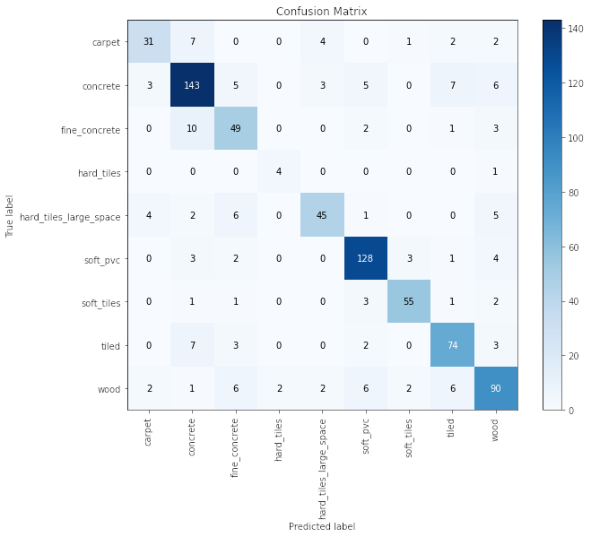

```python
import pandas as pd
import numpy as np
from tqdm.notebook import tqdm

import torch
import torch.autograd as autograd
import torch.nn as nn
import torch.nn.functional as F
from torch.utils.data import Dataset, DataLoader

import pytorch_lightning as pl
import seaborn as sns
import matplotlib.pyplot as plt
from matplotlib import rc
from matplotlib.ticker import MaxNLocator

from sklearn.model_selection import train_test_split
from sklearn.preprocessing import LabelEncoder
from pylab import rcParams

from multiprocessing import cpu_count
from pytorch_lightning.callbacks import ModelCheckpoint, EarlyStopping

from pytorch_lightning.loggers import TensorBoardLogger
from torchmetrics.functional import accuracy
from sklearn.metrics import classification_report, confusion_matrix

pl.__version__
```


    '1.4.2'


```python
pl.seed_everything(42)
```

    Global seed set to 42


    42


```python
X_train = pd.read_csv('career-con-2019/career-con-2019/X_train.csv')
y_train = pd.read_csv('career-con-2019/career-con-2019/y_train.csv')
X_train.head()
```


<div>
<style scoped>
    .dataframe tbody tr th:only-of-type {
        vertical-align: middle;
    }

    .dataframe tbody tr th {
        vertical-align: top;
    }

    .dataframe thead th {
        text-align: right;
    }
</style>
<table border="1" class="dataframe">
  <thead>
    <tr style="text-align: right;">
      <th></th>
      <th>row_id</th>
      <th>series_id</th>
      <th>measurement_number</th>
      <th>orientation_X</th>
      <th>orientation_Y</th>
      <th>orientation_Z</th>
      <th>orientation_W</th>
      <th>angular_velocity_X</th>
      <th>angular_velocity_Y</th>
      <th>angular_velocity_Z</th>
      <th>linear_acceleration_X</th>
      <th>linear_acceleration_Y</th>
      <th>linear_acceleration_Z</th>
    </tr>
  </thead>
  <tbody>
    <tr>
      <th>0</th>
      <td>0_0</td>
      <td>0</td>
      <td>0</td>
      <td>-0.75853</td>
      <td>-0.63435</td>
      <td>-0.10488</td>
      <td>-0.10597</td>
      <td>0.107650</td>
      <td>0.017561</td>
      <td>0.000767</td>
      <td>-0.74857</td>
      <td>2.1030</td>
      <td>-9.7532</td>
    </tr>
    <tr>
      <th>1</th>
      <td>0_1</td>
      <td>0</td>
      <td>1</td>
      <td>-0.75853</td>
      <td>-0.63434</td>
      <td>-0.10490</td>
      <td>-0.10600</td>
      <td>0.067851</td>
      <td>0.029939</td>
      <td>0.003386</td>
      <td>0.33995</td>
      <td>1.5064</td>
      <td>-9.4128</td>
    </tr>
    <tr>
      <th>2</th>
      <td>0_2</td>
      <td>0</td>
      <td>2</td>
      <td>-0.75853</td>
      <td>-0.63435</td>
      <td>-0.10492</td>
      <td>-0.10597</td>
      <td>0.007275</td>
      <td>0.028934</td>
      <td>-0.005978</td>
      <td>-0.26429</td>
      <td>1.5922</td>
      <td>-8.7267</td>
    </tr>
    <tr>
      <th>3</th>
      <td>0_3</td>
      <td>0</td>
      <td>3</td>
      <td>-0.75852</td>
      <td>-0.63436</td>
      <td>-0.10495</td>
      <td>-0.10597</td>
      <td>-0.013053</td>
      <td>0.019448</td>
      <td>-0.008974</td>
      <td>0.42684</td>
      <td>1.0993</td>
      <td>-10.0960</td>
    </tr>
    <tr>
      <th>4</th>
      <td>0_4</td>
      <td>0</td>
      <td>4</td>
      <td>-0.75852</td>
      <td>-0.63435</td>
      <td>-0.10495</td>
      <td>-0.10596</td>
      <td>0.005135</td>
      <td>0.007652</td>
      <td>0.005245</td>
      <td>-0.50969</td>
      <td>1.4689</td>
      <td>-10.4410</td>
    </tr>
  </tbody>
</table>
</div>


```python
y_train.head()
```


<div>
<style scoped>
    .dataframe tbody tr th:only-of-type {
        vertical-align: middle;
    }

    .dataframe tbody tr th {
        vertical-align: top;
    }

    .dataframe thead th {
        text-align: right;
    }
</style>
<table border="1" class="dataframe">
  <thead>
    <tr style="text-align: right;">
      <th></th>
      <th>series_id</th>
      <th>group_id</th>
      <th>surface</th>
    </tr>
  </thead>
  <tbody>
    <tr>
      <th>0</th>
      <td>0</td>
      <td>13</td>
      <td>fine_concrete</td>
    </tr>
    <tr>
      <th>1</th>
      <td>1</td>
      <td>31</td>
      <td>concrete</td>
    </tr>
    <tr>
      <th>2</th>
      <td>2</td>
      <td>20</td>
      <td>concrete</td>
    </tr>
    <tr>
      <th>3</th>
      <td>3</td>
      <td>31</td>
      <td>concrete</td>
    </tr>
    <tr>
      <th>4</th>
      <td>4</td>
      <td>22</td>
      <td>soft_tiles</td>
    </tr>
  </tbody>
</table>
</div>


# Preprocessing


```python
label_encoder = LabelEncoder()
encoded_labels = label_encoder.fit_transform(y_train.surface)
encoded_labels[:5]
```


    array([2, 1, 1, 1, 6])


```python
label_encoder.classes_
```


    array(['carpet', 'concrete', 'fine_concrete', 'hard_tiles',
           'hard_tiles_large_space', 'soft_pvc', 'soft_tiles', 'tiled',
           'wood'], dtype=object)


```python
y_train['label'] = encoded_labels
y_train.head()
```


<div>
<style scoped>
    .dataframe tbody tr th:only-of-type {
        vertical-align: middle;
    }

    .dataframe tbody tr th {
        vertical-align: top;
    }

    .dataframe thead th {
        text-align: right;
    }
</style>
<table border="1" class="dataframe">
  <thead>
    <tr style="text-align: right;">
      <th></th>
      <th>series_id</th>
      <th>group_id</th>
      <th>surface</th>
      <th>label</th>
    </tr>
  </thead>
  <tbody>
    <tr>
      <th>0</th>
      <td>0</td>
      <td>13</td>
      <td>fine_concrete</td>
      <td>2</td>
    </tr>
    <tr>
      <th>1</th>
      <td>1</td>
      <td>31</td>
      <td>concrete</td>
      <td>1</td>
    </tr>
    <tr>
      <th>2</th>
      <td>2</td>
      <td>20</td>
      <td>concrete</td>
      <td>1</td>
    </tr>
    <tr>
      <th>3</th>
      <td>3</td>
      <td>31</td>
      <td>concrete</td>
      <td>1</td>
    </tr>
    <tr>
      <th>4</th>
      <td>4</td>
      <td>22</td>
      <td>soft_tiles</td>
      <td>6</td>
    </tr>
  </tbody>
</table>
</div>


```python
FEATURE_COLUMNS = X_train.columns.tolist()[3:]
FEATURE_COLUMNS
```


    ['orientation_X',
     'orientation_Y',
     'orientation_Z',
     'orientation_W',
     'angular_velocity_X',
     'angular_velocity_Y',
     'angular_velocity_Z',
     'linear_acceleration_X',
     'linear_acceleration_Y',
     'linear_acceleration_Z']


```python
sequences = []
for series_id, group in tqdm(X_train.groupby('series_id')):
    sequence_features = group[FEATURE_COLUMNS]
    label = y_train.query(f'series_id == {series_id}').iloc[0].label
    sequences.append((sequence_features, label))
```


      0%|          | 0/3810 [00:00<?, ?it/s]


```python
train_sequences, test_sequences = train_test_split(sequences, test_size = 0.2)
len(train_sequences), len(test_sequences)
```


    (3048, 762)


# Create Dataset


```python
class SurfaceDataset(Dataset):
    def __init__(self, sequences):
        self.sequences = sequences
    def __len__(self):
        return len(self.sequences)
    def __getitem__(self, idx):
        sequence, label = self.sequences[idx]
        
        return dict(
            sequence = torch.tensor(sequence.to_numpy(), dtype = torch.float32),
            label = torch.tensor(label).long()
        )
```


```python
class SurfaceDataModule(pl.LightningDataModule):
    def __init__(self, train_sequences, test_sequences, batch_size):
        super().__init__()
        self.train_sequences = train_sequences
        self.test_sequences = test_sequences
        self.batch_size = batch_size
        
    def setup(self, stage = None):
        self.train_dataset = SurfaceDataset(self.train_sequences)
        self.test_dataset = SurfaceDataset(self.test_sequences)
        
    def train_dataloader(self):
        return DataLoader(
            self.train_dataset, 
            batch_size = self.batch_size, 
            pin_memory = True, 
            num_workers = cpu_count(), 
            shuffle = True)
    def val_dataloader(self):
        return DataLoader(
            self.test_dataset, 
            batch_size = self.batch_size, 
            pin_memory = True, 
            num_workers = cpu_count(), 
            shuffle = False)
    def predict_dataloader(self):
        return DataLoader(
            self.test_dataset, 
            batch_size = 1, 
            pin_memory = True, 
            num_workers = cpu_count(), 
            shuffle = False)
```

# Model


```python
class SequenceModel(nn.Module):
    def __init__(self, n_features, n_classes, n_hidden = 256, n_layers = 3):
        super().__init__()

        self.lstm = nn.LSTM(
            input_size = n_features,
            hidden_size = n_hidden, # number of neurons for each layer...
            num_layers = n_layers,
            batch_first = True,
            dropout = 0.75
        )
        self.classifier = nn.Linear(n_hidden, n_classes)
    def forward(self, x):
        #self.lstm.flatten_parameters() # it seems I need to do this for multi GPU...
        _, (hidden, _) = self.lstm(x)
        out = hidden[-1] # get the last cell state
        return self.classifier(out)
```


```python
class SurfacePredictor(pl.LightningModule):
    def __init__(self, n_features: int, n_classes: int):
        super().__init__()
        self.model = SequenceModel(n_features, n_classes)
        self.criterion = nn.CrossEntropyLoss()
    
    def forward(self, x, labels = None):
        output = self.model(x)
        loss = 0
        if labels is not None:
            loss = self.criterion(output, labels)
        return loss, output
    
    def training_step(self, batch, batch_idx):
        sequences = batch['sequence']
        labels = batch['label']
        loss, outputs = self(sequences, labels)
        predictions = torch.argmax(outputs, dim = 1)
        step_accuracy = accuracy(predictions, labels)
        self.log('train_loss', loss, prog_bar = True, logger = True)
        self.log('train_accuracy', step_accuracy, prog_bar = True, logger = False)
        return {'loss': loss, 'accuracy': step_accuracy}
    
    def validation_step(self, batch, batch_idx):
        sequences = batch['sequence']
        labels = batch['label']
        loss, outputs = self(sequences, labels)
        predictions = torch.argmax(outputs, dim = 1)
        step_accuracy = accuracy(predictions, labels)
        self.log('val_loss', loss, prog_bar = True, logger = True)
        self.log('val_accuracy', step_accuracy, prog_bar = True, logger = False)
        return {'loss': loss, 'accuracy': step_accuracy}
    
    def predict_step(self, batch, batch_idx, dataloader_idx=None): # dataloader_idx: not needed
        sequences = batch['sequence']
        labels = batch['label']
        loss, outputs = self(sequences, labels)
        predictions = torch.argmax(outputs, dim = 1)
        return labels, predictions
    
    def configure_optimizers(self):
        return torch.optim.Adam(self.parameters(), lr = 0.0001)
```


```python
N_EPOCHS = 250
BATCH_SIZE = 64

data_module = SurfaceDataModule(train_sequences, test_sequences, BATCH_SIZE)
model = SurfacePredictor(n_features=len(FEATURE_COLUMNS), n_classes = len(label_encoder.classes_))
checkpoint_callback = ModelCheckpoint(
    dirpath = 'checkpoints',
    filename = 'best-checkpoint',
    save_top_k = 1,
    verbose = True,
    monitor = 'val_loss', 
    mode = 'min'
    )

trainer = pl.Trainer(callbacks = [checkpoint_callback], 
                    max_epochs = N_EPOCHS,
                    gpus = 1, 
                    progress_bar_refresh_rate = 30,
                    deterministic=True,
                    fast_dev_run=False)
```

    /home/alfonso/miniconda3/envs/kaggle/lib/python3.7/site-packages/pytorch_lightning/callbacks/model_checkpoint.py:446: UserWarning: Checkpoint directory checkpoints exists and is not empty.
      rank_zero_warn(f"Checkpoint directory {dirpath} exists and is not empty.")
    GPU available: True, used: True
    TPU available: False, using: 0 TPU cores
    IPU available: False, using: 0 IPUs


```python
#trainer.fit(model, data_module)
```


```python
trained_model = SurfacePredictor.load_from_checkpoint(
    "checkpoints/best-checkpoint-v1.ckpt",
    n_features = len(FEATURE_COLUMNS),
    n_classes = len(label_encoder.classes_)
)
```


```python
trained_model.freeze()
trained_model
```


    SurfacePredictor(
      (model): SequenceModel(
        (lstm): LSTM(10, 256, num_layers=3, batch_first=True, dropout=0.75)
        (classifier): Linear(in_features=256, out_features=9, bias=True)
      )
      (criterion): CrossEntropyLoss()
    )


```python
data_module.setup()
preds = trainer.predict(model = trained_model, datamodule = data_module)
```

    LOCAL_RANK: 0 - CUDA_VISIBLE_DEVICES: [0]


    Predicting: 0it [00:00, ?it/s]


```python
trainer.validate(model = trained_model)
```

    /home/alfonso/miniconda3/envs/kaggle/lib/python3.7/site-packages/pytorch_lightning/core/datamodule.py:424: LightningDeprecationWarning: DataModule.prepare_data has already been called, so it will not be called again. In v1.6 this behavior will change to always call DataModule.prepare_data.
      f"DataModule.{name} has already been called, so it will not be called again. "
    /home/alfonso/miniconda3/envs/kaggle/lib/python3.7/site-packages/pytorch_lightning/core/datamodule.py:424: LightningDeprecationWarning: DataModule.setup has already been called, so it will not be called again. In v1.6 this behavior will change to always call DataModule.setup.
      f"DataModule.{name} has already been called, so it will not be called again. "
    LOCAL_RANK: 0 - CUDA_VISIBLE_DEVICES: [0]


    Validating: 0it [00:00, ?it/s]


    --------------------------------------------------------------------------------
    DATALOADER:0 VALIDATE RESULTS
    {'val_accuracy': 0.8123359680175781, 'val_loss': 0.5650554299354553}
    --------------------------------------------------------------------------------


    [{'val_loss': 0.5650554299354553, 'val_accuracy': 0.8123359680175781}]


```python
labels = torch.tensor(preds)[:,0].numpy()
predictions = torch.tensor(preds)[:,1].numpy()
```


```python
from scikitplot.metrics import plot_confusion_matrix
ax = plot_confusion_matrix(labels, predictions, figsize = (10,8))
ax.set_xticklabels(label_encoder.classes_, rotation = 90, fontsize = 10)
ax.set_yticklabels(label_encoder.classes_, fontsize = 10);
```


    

    


```python

```
