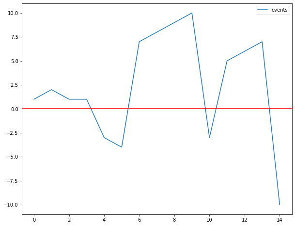
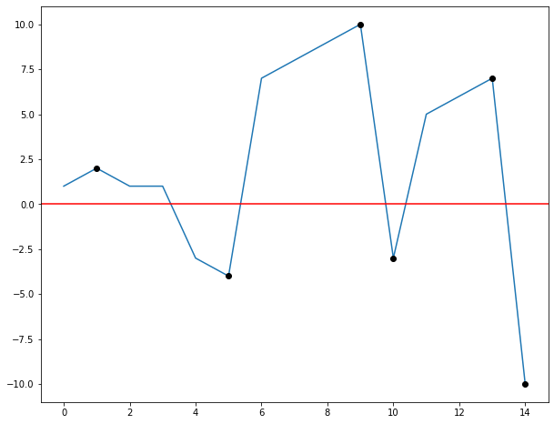

```python
import pandas as pd
import numpy as np
import matplotlib.pyplot as plt


df = pd.DataFrame({"events": [1,2,1,1,-3,-4,7,8,9,10,-3,5,6,7,-10]})
df.plot(figsize = (10,8))
plt.axhline(y = 0, c = 'r')
plt.show()
```


    

    


```python
df["sign"]=np.sign(df.events)
df['diff_sign'] = df.sign.diff()
df["change"]=np.cumsum(df.sign.diff() != 0)
df
```


<div>
<style scoped>
    .dataframe tbody tr th:only-of-type {
        vertical-align: middle;
    }

    .dataframe tbody tr th {
        vertical-align: top;
    }

    .dataframe thead th {
        text-align: right;
    }
</style>
<table border="1" class="dataframe">
  <thead>
    <tr style="text-align: right;">
      <th></th>
      <th>events</th>
      <th>sign</th>
      <th>diff_sign</th>
      <th>change</th>
    </tr>
  </thead>
  <tbody>
    <tr>
      <th>0</th>
      <td>1</td>
      <td>1</td>
      <td>NaN</td>
      <td>1</td>
    </tr>
    <tr>
      <th>1</th>
      <td>2</td>
      <td>1</td>
      <td>0.0</td>
      <td>1</td>
    </tr>
    <tr>
      <th>2</th>
      <td>1</td>
      <td>1</td>
      <td>0.0</td>
      <td>1</td>
    </tr>
    <tr>
      <th>3</th>
      <td>1</td>
      <td>1</td>
      <td>0.0</td>
      <td>1</td>
    </tr>
    <tr>
      <th>4</th>
      <td>-3</td>
      <td>-1</td>
      <td>-2.0</td>
      <td>2</td>
    </tr>
    <tr>
      <th>5</th>
      <td>-4</td>
      <td>-1</td>
      <td>0.0</td>
      <td>2</td>
    </tr>
    <tr>
      <th>6</th>
      <td>7</td>
      <td>1</td>
      <td>2.0</td>
      <td>3</td>
    </tr>
    <tr>
      <th>7</th>
      <td>8</td>
      <td>1</td>
      <td>0.0</td>
      <td>3</td>
    </tr>
    <tr>
      <th>8</th>
      <td>9</td>
      <td>1</td>
      <td>0.0</td>
      <td>3</td>
    </tr>
    <tr>
      <th>9</th>
      <td>10</td>
      <td>1</td>
      <td>0.0</td>
      <td>3</td>
    </tr>
    <tr>
      <th>10</th>
      <td>-3</td>
      <td>-1</td>
      <td>-2.0</td>
      <td>4</td>
    </tr>
    <tr>
      <th>11</th>
      <td>5</td>
      <td>1</td>
      <td>2.0</td>
      <td>5</td>
    </tr>
    <tr>
      <th>12</th>
      <td>6</td>
      <td>1</td>
      <td>0.0</td>
      <td>5</td>
    </tr>
    <tr>
      <th>13</th>
      <td>7</td>
      <td>1</td>
      <td>0.0</td>
      <td>5</td>
    </tr>
    <tr>
      <th>14</th>
      <td>-10</td>
      <td>-1</td>
      <td>-2.0</td>
      <td>6</td>
    </tr>
  </tbody>
</table>
</div>


```python
df["change"]=np.cumsum(df.sign.diff() != 0)
valores = df.groupby("change").events.transform(lambda x: x.abs().max())*df.sign
valores
```


    0      2
    1      2
    2      2
    3      2
    4     -4
    5     -4
    6     10
    7     10
    8     10
    9     10
    10    -3
    11     7
    12     7
    13     7
    14   -10
    dtype: int64


```python
mask = (df.events == valores).mask(lambda x: x == 0, np.nan)
df.events*mask
```


    0      NaN
    1      2.0
    2      NaN
    3      NaN
    4      NaN
    5     -4.0
    6      NaN
    7      NaN
    8      NaN
    9     10.0
    10    -3.0
    11     NaN
    12     NaN
    13     7.0
    14   -10.0
    dtype: float64


```python
df.events.plot(figsize = (10,8))
plt.axhline(y = 0, c = 'r')
plt.plot(df.events*mask, 'o', c = 'k')
plt.show()
```


    

    


```python

```
