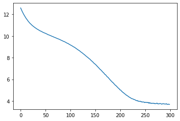

```python
import torch
import torch.nn as nn
import numpy as np
import pandas as pd
import matplotlib.pyplot as plt


```


```python
print(torch.cuda.is_available())
torch.cuda.get_device_name(0)
```

    True


    'GeForce RTX 2070 with Max-Q Design'


```python
torch.cuda.memory_allocated()
```


    0


```python
torch.cuda.memory_reserved()
```


    0


```python
df = pd.read_csv('PYTORCH_NOTEBOOKS/Data/NYCTaxiFares.csv')
```


```python
df.head()
```


<div>
<style scoped>
    .dataframe tbody tr th:only-of-type {
        vertical-align: middle;
    }

    .dataframe tbody tr th {
        vertical-align: top;
    }

    .dataframe thead th {
        text-align: right;
    }
</style>
<table border="1" class="dataframe">
  <thead>
    <tr style="text-align: right;">
      <th></th>
      <th>pickup_datetime</th>
      <th>fare_amount</th>
      <th>fare_class</th>
      <th>pickup_longitude</th>
      <th>pickup_latitude</th>
      <th>dropoff_longitude</th>
      <th>dropoff_latitude</th>
      <th>passenger_count</th>
    </tr>
  </thead>
  <tbody>
    <tr>
      <th>0</th>
      <td>2010-04-19 08:17:56 UTC</td>
      <td>6.5</td>
      <td>0</td>
      <td>-73.992365</td>
      <td>40.730521</td>
      <td>-73.975499</td>
      <td>40.744746</td>
      <td>1</td>
    </tr>
    <tr>
      <th>1</th>
      <td>2010-04-17 15:43:53 UTC</td>
      <td>6.9</td>
      <td>0</td>
      <td>-73.990078</td>
      <td>40.740558</td>
      <td>-73.974232</td>
      <td>40.744114</td>
      <td>1</td>
    </tr>
    <tr>
      <th>2</th>
      <td>2010-04-17 11:23:26 UTC</td>
      <td>10.1</td>
      <td>1</td>
      <td>-73.994149</td>
      <td>40.751118</td>
      <td>-73.960064</td>
      <td>40.766235</td>
      <td>2</td>
    </tr>
    <tr>
      <th>3</th>
      <td>2010-04-11 21:25:03 UTC</td>
      <td>8.9</td>
      <td>0</td>
      <td>-73.990485</td>
      <td>40.756422</td>
      <td>-73.971205</td>
      <td>40.748192</td>
      <td>1</td>
    </tr>
    <tr>
      <th>4</th>
      <td>2010-04-17 02:19:01 UTC</td>
      <td>19.7</td>
      <td>1</td>
      <td>-73.990976</td>
      <td>40.734202</td>
      <td>-73.905956</td>
      <td>40.743115</td>
      <td>1</td>
    </tr>
  </tbody>
</table>
</div>


```python
df.fare_amount.describe()
```


    count    120000.000000
    mean         10.040326
    std           7.500134
    min           2.500000
    25%           5.700000
    50%           7.700000
    75%          11.300000
    max          49.900000
    Name: fare_amount, dtype: float64


```python
def haversine_distance(df, lat1, long1, lat2, long2):
    """
    Calculates the haversine distance between 2 sets of GPS coordinates in df
    """
    r = 6371  # average radius of Earth in kilometers
       
    phi1 = np.radians(df[lat1])
    phi2 = np.radians(df[lat2])
    
    delta_phi = np.radians(df[lat2]-df[lat1])
    delta_lambda = np.radians(df[long2]-df[long1])
     
    a = np.sin(delta_phi/2)**2 + np.cos(phi1) * np.cos(phi2) * np.sin(delta_lambda/2)**2
    c = 2 * np.arctan2(np.sqrt(a), np.sqrt(1-a))
    d = (r * c) # in kilometers

    return d
```


```python
df['dist_km'] = haversine_distance(df, 'pickup_latitude', 'pickup_longitude','dropoff_latitude','dropoff_longitude')
```


```python
df.info()
```

    <class 'pandas.core.frame.DataFrame'>
    RangeIndex: 120000 entries, 0 to 119999
    Data columns (total 9 columns):
     #   Column             Non-Null Count   Dtype  
    ---  ------             --------------   -----  
     0   pickup_datetime    120000 non-null  object 
     1   fare_amount        120000 non-null  float64
     2   fare_class         120000 non-null  int64  
     3   pickup_longitude   120000 non-null  float64
     4   pickup_latitude    120000 non-null  float64
     5   dropoff_longitude  120000 non-null  float64
     6   dropoff_latitude   120000 non-null  float64
     7   passenger_count    120000 non-null  int64  
     8   dist_km            120000 non-null  float64
    dtypes: float64(6), int64(2), object(1)
    memory usage: 8.2+ MB


```python
df['pickup_datetime'] = df['pickup_datetime'].astype('datetime64')
```


```python
df['EDTdate'] = df.pickup_datetime - pd.Timedelta(hours = 4)
```


```python
df['Hour'] = df.EDTdate.dt.hour
df['AMorPM'] = np.where(df.Hour>=12, 'PM','AM')
```


```python
df['Weekday'] = df['EDTdate'].dt.strftime('%a') # day of the week
```


```python
cat_cols = ['Hour','AMorPM','Weekday']
cont_cols = ['pickup_longitude',
       'pickup_latitude', 'dropoff_longitude', 'dropoff_latitude',
       'passenger_count', 'dist_km']

```


```python
y_col = ['fare_amount']

```


```python
df[cat_cols] = df[cat_cols].astype('category')
```


```python
cats = df.select_dtypes('category').apply(lambda x: x.cat.codes).values
cont = df[cont_cols].values
cont
```


    array([[-73.992365  ,  40.730521  , -73.975499  ,  40.744746  ,
              1.        ,   2.12631159],
           [-73.990078  ,  40.740558  , -73.974232  ,  40.744114  ,
              1.        ,   1.39230687],
           [-73.994149  ,  40.751118  , -73.960064  ,  40.766235  ,
              2.        ,   3.32676344],
           ...,
           [-73.988574  ,  40.749772  , -74.011541  ,  40.707799  ,
              3.        ,   5.05252282],
           [-74.004449  ,  40.724529  , -73.992697  ,  40.730765  ,
              1.        ,   1.20892296],
           [-73.955415  ,  40.77192   , -73.967623  ,  40.763015  ,
              3.        ,   1.42739869]])


```python
cats = torch.tensor(cats, dtype = torch.int64)
cont = torch.tensor(cont, dtype = torch.float)
```


```python
y = torch.tensor(df[y_col].values,dtype = torch.float)
```


```python
print(cats.shape)
print(cont.shape)
print(y.shape)
```

    torch.Size([120000, 3])
    torch.Size([120000, 6])
    torch.Size([120000, 1])


```python
cat_size = [len(df[col].cat.categories) for col in cat_cols]
cat_size
```


    [24, 2, 7]


```python
emb_size = [(size, min(50,size+1)//2) for size in cat_size]
emb_size # corresponde al numero de categorías y el número al que se va a reducir
```


    [(24, 12), (2, 1), (7, 4)]


```python
selfembeds = nn.ModuleList([nn.Embedding(ni,nf) for ni,nf in emb_size])
selfembeds
```


    ModuleList(
      (0): Embedding(24, 12)
      (1): Embedding(2, 1)
      (2): Embedding(7, 4)
    )


# Create a Model with Pytorch 


```python
class TabularModel(nn.Module):
    def __init__(self,emb_szs, n_cont, out_sz, layers, p=0.5):
        #layers = [200,100,50] unidades en cada capa
        super().__init__()
        self.embeds = nn.ModuleList([nn.Embedding(ni,nf) for ni,nf in emb_size])
        self.emb_drop = nn.Dropout(p)
        self.bn_cont = nn.BatchNorm1d(n_cont)
        
        layerlist = []
        n_emb = sum([nf for ni,nf in emb_szs])
        n_in = n_emb + n_cont
        
        for i in layers:
            layerlist.append(nn.Linear(n_in,i))
            layerlist.append(nn.ReLU(inplace = True))
            layerlist.append(nn.BatchNorm1d(i))
            layerlist.append(nn.Dropout(p))
            n_in = i
        
        layerlist.append(nn.Linear(layers[-1],out_sz))
        
        self.layers = nn.Sequential(*layerlist)
    def forward(self, x_cat, x_cont):
        embeddings = []
        
        for i,e in enumerate(self.embeds):
            embeddings.append(e(x_cat[:,i]))
        
        x = torch.cat(embeddings,1)
        x = self.emb_drop(x)
        x_cont = self.bn_cont(x_cont)
        x = torch.cat([x,x_cont],1)
        x = self.layers(x)
        return x
    
      
```


```python
torch.manual_seed(33)
model = TabularModel(emb_size, n_cont = cont.shape[1],out_sz = 1,layers = [200,100],p = 0.4)
model
```


    TabularModel(
      (embeds): ModuleList(
        (0): Embedding(24, 12)
        (1): Embedding(2, 1)
        (2): Embedding(7, 4)
      )
      (emb_drop): Dropout(p=0.4, inplace=False)
      (bn_cont): BatchNorm1d(6, eps=1e-05, momentum=0.1, affine=True, track_running_stats=True)
      (layers): Sequential(
        (0): Linear(in_features=23, out_features=200, bias=True)
        (1): ReLU(inplace=True)
        (2): BatchNorm1d(200, eps=1e-05, momentum=0.1, affine=True, track_running_stats=True)
        (3): Dropout(p=0.4, inplace=False)
        (4): Linear(in_features=200, out_features=100, bias=True)
        (5): ReLU(inplace=True)
        (6): BatchNorm1d(100, eps=1e-05, momentum=0.1, affine=True, track_running_stats=True)
        (7): Dropout(p=0.4, inplace=False)
        (8): Linear(in_features=100, out_features=1, bias=True)
      )
    )


```python
device = torch.device('cuda' if torch.cuda.is_available() else 'cpu')
```


```python
gpumodel = model.to(device)
```


```python
torch.cuda.memory_allocated()
```


    113664


```python
criterion = nn.MSELoss()
optimizer = torch.optim.Adam(model.parameters(), lr = 0.001)

```


```python
batch_size = 60000
test_size = int(0.2*batch_size)
```


```python
cat_train = cats[:batch_size-test_size].to(device)
cat_test = cats[batch_size-test_size:batch_size].to(device)
con_train = cont[:batch_size-test_size].to(device)
con_test = cont[batch_size-test_size:batch_size].to(device)
```


```python
y_train = y[:batch_size-test_size].to(device)
y_test = y[batch_size-test_size:batch_size].to(device)
```

> In case of dataloaders it is necessary to use pin_memory = True


```python
import time
start_time = time.time()
epochs = 300
losses = []

for i in range(epochs):
    i +=1
    y_pred = gpumodel(cat_train, con_train)
    loss = torch.sqrt(criterion(y_pred, y_train))
    losses.append(loss)
    
    if i%10 == 1:
        print(f'epoch {i} loss is {loss}')
        
    optimizer.zero_grad()
    loss.backward()
    optimizer.step()

duration = time.time()- start_time
print(f'Training took {duration/60} minutes')
```

    epoch 1 loss is 12.587084770202637
    epoch 11 loss is 11.69309139251709
    epoch 21 loss is 11.1138916015625
    epoch 31 loss is 10.734790802001953
    epoch 41 loss is 10.451098442077637
    epoch 51 loss is 10.237157821655273
    epoch 61 loss is 10.035311698913574
    epoch 71 loss is 9.84143352508545
    epoch 81 loss is 9.63839340209961
    epoch 91 loss is 9.419390678405762
    epoch 101 loss is 9.1663236618042
    epoch 111 loss is 8.891218185424805
    epoch 121 loss is 8.560619354248047
    epoch 131 loss is 8.195821762084961
    epoch 141 loss is 7.809577465057373
    epoch 151 loss is 7.38553524017334
    epoch 161 loss is 6.914741039276123
    epoch 171 loss is 6.437981605529785
    epoch 181 loss is 5.9363908767700195
    epoch 191 loss is 5.460470676422119
    epoch 201 loss is 5.024928092956543
    epoch 211 loss is 4.634278774261475
    epoch 221 loss is 4.312768459320068
    epoch 231 loss is 4.097682952880859
    epoch 241 loss is 3.9745259284973145
    epoch 251 loss is 3.886169910430908
    epoch 261 loss is 3.8304736614227295
    epoch 271 loss is 3.7707228660583496
    epoch 281 loss is 3.7662222385406494
    epoch 291 loss is 3.7160017490386963
    Training took 0.21212895711263022 minutes


```python
plt.plot(range(epochs), losses)
```


    [<matplotlib.lines.Line2D at 0x7f6ebabd3990>]


    

    


```python
model.eval()
with torch.no_grad():
    y_val = model(cat_test, con_test)
    loss = torch.sqrt(criterion(y_val, y_test))

loss
```


    tensor(2.9336, device='cuda:0')


```python
for i in range(10):
    print(f'{i+1}.) PREDICTED: {y_val[i].item():8.2f} TRUE: {y_test[i].item():.2f}')
```

    1.) PREDICTED:     3.84 TRUE: 2.90
    2.) PREDICTED:    22.68 TRUE: 5.70
    3.) PREDICTED:     6.32 TRUE: 7.70
    4.) PREDICTED:    13.50 TRUE: 12.50
    5.) PREDICTED:     5.09 TRUE: 4.10
    6.) PREDICTED:     5.37 TRUE: 5.30
    7.) PREDICTED:     4.80 TRUE: 3.70
    8.) PREDICTED:    17.40 TRUE: 14.50
    9.) PREDICTED:     5.49 TRUE: 5.70
    10.) PREDICTED:    11.72 TRUE: 10.10


```python
torch.save(model.state_dict(),'TaxiModel.pt')
```


```python

```
