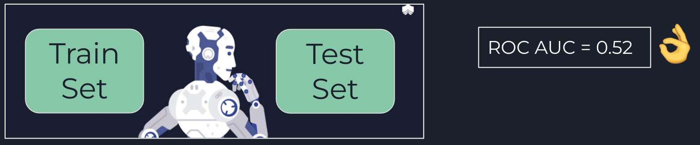

<!-- ...and learn more at the same time. You can message me at the [contact page]({{ site.baseurl }}/contact/). -->

 Including the two pictures is a hack, because there's no way use the Foundation Grid (needs a container with row) 
{: .left .show-for-large-up .hide-for-print width="500"}
{: .center .hide-for-large-up width="500"}

## TL;DR

Y gané una segunda competencia. No saben la sorpresa que me llevé al enterarme de que obtuve un primer lugar de nuevo. Esta vez en una competencia completamente distinta, `NLP`. Bueno, les quiero contar qué significó este nuevo logro para mí, totalmente inesperado en un área en el que en verdad no soy muy experto.

Primero que todo, ¿Qué es la Datathon USM 2022? La Datathon fue una competencia abierta a estudiantes de Pregrado y Postgrado en universidades Chilenas. El objetivo de la competencia fue determinar si existe Odio y además si es que se hace referencia a comunidades vulnerables, en este caso las comunidades a detectar corresponden a: Mujeres, Comunidad LGBTQ+, Comunidades Migrantes y Pueblos Originarios, una tarea conocida como ***Hate Speech*** (Más detalles de la competencia se pueden leer [acá](https://www.inf.utfsm.cl/noticias/627-ganadores-primera-dataton-usm)). Para ello se nos hizo entrega de un dataset de cerca de 5000 Tweets: alrededor de 2200 datos etiquetados para entrenar y 2900 para envíar al portal de la competencia para evaluación, los cuales no estaban etiquetados. Adicionalmente el puntaje en el Leaderboard no era el único aspecto importante. En este caso los 3 mejores puntajes tenían que presentar frente a un grupo de jueces los cuales dictaminarían el podio final. Creo que el gran atractivo de esta competencia es que los Tweets estaban en su gran mayoría en Español Chileno, es decir, contaban con mucho doble sentido, modismos muy chilenos, y mucha pero mucha grosería asociada al lenguaje coloquial. De hecho habían tweets muy pero muy ordinarios.



Bueno, nuevamente, me enteré de la competencia por un tercero. Uno de mis profesores guías (y Coordinador del MSDS), [Sebastian Moreno](https://www.linkedin.com/in/sebastian-moreno-araya/) envió un comunicado a todos los estudiantes del Magíster precisamente invitando a participar en esta competencia. Si bien el premio en dinero, no era tan sabroso como en el [Desafío Itaú-Binario]({{ site.baseurl }}/concurso/), creo que el problema era muchísimo más interesante. Me llamó principalmente la atención porque era la oportunidad de poner en práctica uno de los temas que me tiene muy entusiasmado, los famosos Transformers. 

Los Transformers, y quizás los modelos de difusión y el Reinforcement Learning (como Stable Diffusion y ChatGPT), suelen ser los temas más comentados en el mundo del Deep Learning y la inteligencia artificial. Obviamente hace mucho tiempo que quería poner esto en práctica y de hecho quería probar un modelo que hace mucho tiempo me tenía intrigado, el [Beto](https://github.com/dccuchile/beto). Beto es un modelo BERT preentrenado en lenguaje español por la Universidad de Chile. Es un tremendo modelo que ha dado muy buenos resutados en distintas tareas de lenguaje Natural y claramente era la oportunidad de poner en práctica varias técnicas avanzadas de Deep Learning. Pero antes de entrar en los detalles de la solución vamos al problema a resolver.

## El Problema

Como ya mecioné, el problema contaba con 2256 Tweets de entrenamiento, los cuales contenían 9 columnas: un `tweet_id`, `author_id`, `conversation_id`, `text`, y 5 clases asociadas a si hasta 3 anotadores determinaban la presencia de Odio, y/o referencias hacia las comunidades de Mujeres, LGBTQ+, Migrantes o Pueblos Originarios. Creo que el primer punto a destacar acá es que este dataset fue construido especialmente para la competencia y es fruto del trabajo de tesis de Domingo Benoit (alumno de Pregrado de Informática de la USM) y varios colaboradores, a los cuales me encantaría poder dar el crédito que corresponde. 

El problema estaba diseñado como una clasificación Multilabel. Es decir, cada clase podía tomar un valor 0 o 1 de manera independiente. Al menos el test set se evaluaría de esa manera. Y bueno la primera complejidad del problema es que Tweet no tenía valores 0 o 1, sino de 0 a 3, que correspondía al número de Anotadores que indicó una cierta clase.

{: .center}

Por ejemplo para un Tweet dado, se indicaba qué etiquetas tenían anotadores que indicaron alguna de las clases. Y si se dan cuenta, hay una componente bien subjetiva en la anotación. En el caso de la imagen, el tweet mencionado es considerado Odio sólo por dos anotadores. Y sólo uno considera una alusión a la Comunidad LGTBQ+. Lo cuál si es que esto es difícil para humanos mucho más para un modelo.



Como se puede ver, esto ya podría ser una fuente de sesgo, y la primera decisión importante a tomar era como generaríamos etiquetas para el entrenamiento del modelo. Con respecto a las otras variables como `tweet_id`, `author_id`, `conversation_id`, yo no las utilicé. `tweet_id`, `author_id` eran sólo identificadores, mientras que `conversation_id` permitía unir el tweet a una conversación, el cuál era un set complementario que se nos entregó. Supuestamente esto permitía que el modelo tuviera un contexto más amplio, pero en mi caso no le encontré utilidad debido a que:

* Muy pocos tweets tenían un hilo de conversación asociado. 
* Existían tweets de contexto, que venían en idiomas distintos, por ejemplo, inglés. 
* Luego de inspeccionarlos de manera manual, pude notar que no entregaban información relevante para identificar alguna de las clases. 
* Adicionalmente, pensé que esta información se podía utilizar para aumentar el dataset de entrenamiento que era algo permitido en la competencia. Pero la verdad es que era tan complejo el criterio de etiquetado, que no era sencillo aumentar el dataset.



Finalmente yo consideré que si al menos un anotador lo consideró Odio, entonces el tweet era Odio. Y si al menos un anotador lo consideró perteneciente a alguna de las comunidades vulnerables, entonces el tweet era de esa clase. Esto me permitió reducir el problema a un problema de multi-clasificación binaria.



## Sobre la evaluación

El modelo se evaluaba en una métrica bien extraña a la que llamaron `F1 Custom`. Consistía en un F1 calculado como el 50% de un Binary F1 Score para la clase Odio, y un 50% del Macro F1 Score para la comunidades vulnerables. Esto inmediatamente nos indicaba que la clase más importante a predecir era el Odio, ya que ponderaba mucho más que cada una de las otras 4. Interesantemente luego de conversar con los organizadores en la premiación, me contaban que la razón de esta métrica fue más por limitaciones de la plataforma. Aún así terminó siendo una métrica bien interesante, y que costaba mucho subir.

## Mi problema

Yo la verdad entré a la competencia pensando que tendría tiempo suficiente para poder competir bien, pero lamentablemente las instancias finales me toparon con la peor parte de mi semestre. He estado distante del blog, y de Linkedin, y de la vida en general, porque la verdad es que el segundo semestre del MSDS estuvo muy intenso. A eso, sumarle una competencia, no era una buena idea. Por lo tanto, tenía que utilizar cada segundo de mi tiempo de manera precisa para poder rendir en todas las cosas que estoy haciendo. Es por eso que una de las primeras cosas que hice, fue mirar las lecciones aprendidas del desafío [Itaú-Binario]({{ site.baseurl }}/concurso/) y en el [Tabular Playground]({{ site.baseurl }}/kaggle-tps/), tratando de no repetir los mismos errores.

## Planteamiento del problema

Primero que todo, en este caso traté de utilizar buenas prácticas de código, y ser lo más ordenado posible. Me funcionó medianamente. El tener que iterar tan rápido, hace que cueste mucho programar de manera ordenada. Por lo que si bien traté que mis notebooks fueran ordenados, no pude seguir una lógica de scripts como sí hago en proyectos reales. La razón de esto es, principalmente, que para mí es más rápido debuggear en notebooks que en Scripts. Otro aspecto que hizo esto bien complicado, es que tuve que estar mucho fuera de mi casa sólo usando mi Laptop. Al tener poco tiempo y no estar lo más cómodo igual hubo experimentos que los tuve que hacer muy a la rápida. 

Lo segundo, que fue una lección aprendida es siempre confiar en tu CV. Y en este caso, esto fue lo primero que hice. Definí que mi esquema de validación iba a ser K-Fold. Y una de las cosas novedosas de mi solución, para chequear que efectivamente mi validación era confiable, fue utilizar Adversarial Validation.

{% include alert alert='Acá me la jugué. Uno de los problemas del dataset es que estaba desbalanceado. Existían muchas más anotaciones para Odio que para las otras clases. Y Scikit-Learn no tiene StratifiedKFold para problemas MultiLabel. Por lo que cerré los ojos, y terminó funcionando bastante bien. La validación de mi Local CV estuvo sumamente correlacionada con el Leaderboard excepto cuando intenté utilizar Pseudolabeling. Este año 2023 empecé a leer el Kaggle Book, y hay unos trucazos de Kaggle Grandmasters que no tenía idea, en especial de cómo aplicar validación luego de un Pseudolabeling, pero bueno, sigo aprendiendo.' %}

{: .center width="500"}

*"Adversarial Validation"* es una metodología sumamente simple introducida por Uber el 2020 para poder determinar si hay *Concept Drift*. El *Concept Drift* es cuando la distribución de los datos cambia en el tiempo. En el caso de una competencia, nosotros necesitamos chequear si el Train y Test set son i.i.d (independent and identically distributed). Esto nos permite confiar de que la data usada para entrenar tendrá una distribución similar que la de test. Si esto ocurre, entonces nosotros podemos confiar en nuestro esquema de validación (que principalmente utiliza datos de train, porque el test no está etiquetado) es un buen proxy de la generalización de nuestro modelo. 

{% include alert tip='Nuevamente una lección aprendida del Kaggle Book es que algunos Kagglers tienen más de un esquema de validación. Y esto sí que no lo sabía. Utilizan uno para poder determinar los mejores Hiperparámetros del Modelo, cuyo fin es rankear por la métrica que Hiperparámetros funcionan mejor. Pero también tienen otro que es lo más parecido al Private Leaderboard que busca estimar de la manera más precisa cuánto es lo que el Leaderboard entregará. Otra cosa que también descubrí es el uso de una variante de Nested Cross Validation, que sirve para poder encontrar el número de iteraciones o epochs óptimo y poder ver su generalización. Si bien había oído del Nested CV nunca lo había visto aplicado en la forma del libro. Definitivamente hay cosas que no se enseñan en ninguna parte y que sólo se aprenden en estos libros de trucos.' %}


En simple Adversarial validation, entrena un modelo etiquetado como 1 si la observación proviene del train set y 0 si viene del test set (o puede ser al revés). Si luego de entrenar el modelo, métricas como el ROC AUC dan valores cercanos a 0.5, quiere decir que el modelo no es capaz de diferenciar de donde proviene la observación. Esto es un indicador que la distribución de train y test son muy parecidas/idénticas.



El poder contar con una validación de este tipo me permitió envíar sólo 12 submisiones en la competencia. Debido a que mi puntaje de CV Local estaba correlacionado con el Leaderboard (y esta garantía me la entregó este método). Eso me permitió experimentar muchísimo sin estar restringido a las 2 submisiones diarias permitidas en la competencia y afemás permitió tener escondidos los mejores modelos hasta las semanas finales, lo que dio harta más emoción a la competencia. 

{% include alert warning='Al menos a lo largo de la competencia mi esquema de validación, estuvo bastante bien, excepto cuando probé pseudolabeling. Al probar esta metodología, el leaderboard me mostró que sobreajusté (hice overfitting). Obtuve mi mejor puntaje en mi CV Local, pero esto no se tradujo en mi mejor puntaje en el Leaderboard. Ahora la diferencia fue poca, esperaba un valor cercano al 0.82 y obtuve sólo un 0.81. Durante las presentaciones finales nos dijeron que el leaderboard evaluaba sobre un 70% de los datos de test. Pero ese 70% iba cambiando. Esto no es una práctica común en las competencias, pero probablemente afectó en nuestra experimentación, y nos impidió obtener aún mejores resultados ya que modelos casi buenos terminaron siendo deshechados.' %}

## Sobre la solución

Bueno, mi primer intento fue obvio, lo que está de moda y que venía como anillo al dedo a la competencia: Un transformer. En mi caso tenía dos opciones: Beto, un BERT preentrenado en datos en español por la Universidad de Chile. De hecho hace mucho tiempo que quería probar este modelo, y de hecho los otros dos equipos: `LonelyWolf` y `MoccaOverflow` lo utilizaron. Pero obvio, no lo probé, porque me incliné por [Robertuito](https://arxiv.org/abs/2111.09453). Todo indicaba que un transformer como este era el más indicado:

* RoBERTa: Se supone que una versión más robusta que BERT. Es el mismo modelo pero entrenado en más datos de una manera más robusta.
* Entrenado en Tweets en Español: Robertuito es un modelo pre-entrenado en 500 millones de Tweets en español. Además el modelo viene equipado con un preprocesamiento especial para Tweets, en el cual se genera un tratamiento a los handles (@), hashtags (#), URLs y emojis. Esto lo encontré particularmente interesante, porque permitía transformar los emojis en descripciones en lenguaje natural, que en este caso podría haber sido de mucho utilidad.

{: .center}

Robertuito fue entrenado en varias tareas, una de ellas, Hate Speech Recognition. Que resultaba ser la tarea en cuestión. 

Yo de inmediato pensé que con esto, el problema estaba resuelto. De hecho voy a publicar un tutorial de cómo utilizar este modelo, porque su implementación es bien interesante. Pero lamentablemente no funcionó. O al menos no funcionó a nivel de competencia.

El puntaje de CV local fue bien variado, desde 0.49 para la clasificación Multilabel (recordar que Robertuito estaba pre-entrenado sólo en detección de Odio, pero no de Comunidades) hasta 0.73 cuando le apliqué Fine-Tuning en sólo la clase Odio.

<q>Entonces, ¿Por qué un modelo tan sofisticado como un Transformer no funcionó?</q> 

Tengo varias teorías.

1. El Robertuito tenía cerca de 84 Millones de Parámetros, y nosotros teníamos poco más de 2000 tweets con etiquetas para hacer fine-tuning. Probablemente no le hicimos ni cosquillas a los parámetros, ya que era muy poca data.
2. La otra razón, yo creo que tiene que ver netamente con la tokenización. Por favor muéstrenme cómo se tokeniza algo así:

{: .center}

Si son Chilenos, sabrán que esto es terriblemente grosero. Y utiliza una combinación de garabatos/groserías, modismos, y palabras muy propias del chileno, que creo que es imposible para un modelo pre-entrenado entender. Principalmente porque los modelos pre-entrenados usan datos de español global/neutro. Y realmente el Chileno es casi un idioma en sí.

De hecho, al ponerme a buscar en internet al respecto, me encontré con un [artículo](https://www.elmundo.es/cultura/2021/11/30/61a4a36321efa013518b4571.html) del Diario el Mundo, que precisamente hacía alusión a este tipo de *"problemas"* del Chileno.

Entonces, ¿cómo afrontar un problema donde tu mejor arma, no da resultado? Podría haber intentado con el BETO, como los hicieron los otros chicos, pero un poco tenía miedo de que terminar con los pobres resultados de Robertuito. Entonces, cuando lo complejo no funciona, hay que volver a lo simple. Y aquí es donde decidí implementar un clásico **Bag of Words**. 

{% include alert todo='Debido a la competencia, seguí investigando sobre el tema, y la verdad es a pesar de que los Transformers la llevan cuando se trata de NLP, el Bag of Words (BOW) todavía tiene algo que decir. En especial en formas textuales que no cuentan con el nivel de investigación que tiene el inglés, usar este tipo de técnicas vale completamente la pena. Es más, existen formas de extraer, palabras, frases y frases claves utilizando transformers para luego alimentar modelos más simples de BOW que obviamente aprendí después de la competencia.' %}

Bueno, yo sabía que especialmente habiendo una fase de presentación frente a jueces, un Bag of Words podría ser un arma de doble filo. Obviamente es un modelo que puede ser demasiado sencillo, pero que increíblemente entregó buenos resultados, quizás por cómo funciona el chileno. En especial, el odio, se caracteriza por su alto nivel de garabatos, y palabras ofensivas. Al igual que como ocurre con el SPAM, pensé que quizás bastaba con encontrar palabras claves, y que eso sería suficiente para determinar odio y las comunidades vulnerables.

# Mi solución

Buena la solución que yo propuse fue utilizar modelos simples de Machine Learning basados en Bag-of-Words, pero combinados en un gran ensamble, un Stacking. `El Stacking` es una técnica de ensamble bastante vieja propuesta en 1992 pero popularizada en competencias de Kaggle por KazAnova (pero ahora practicamente todo el mundo lo usa). Es más, casi todas las competencias en Kaggle tienen algún nivel de ensamble. En este caso lo que se hace es entrenar varios modelos ojalá lo más distintos entre sí. La lógica detrás de eso es que modelos distintos aprenderán patrones distintos y luego al ensamblarlos trabajarán de manera sinérgica, supliendo sus deficiencias. 

En mi caso yo entrené los siguientes modelos:

* Logistic Regression
* Naive Bayes
* Random Forest
* Extra Trees
* LightGBM
* XGBoost
* CatBoost 
* MLP

Luego de varias pruebas, revisando los resultados individuales y combinados de mis modelos llegué a lo siguiente:

* El Extra Trees fue mi mejor modelo individual con un F1 Custom de 0.75. 
* Por alguna razón los Gradient Boosting no dieron tan buenos resultados. Mi modelo favorito el LightGBM (con quien gané el Itaú-Binnario) dio un pobre F1 Custom de 0.65.
* XGBoost y CatBoost dieron un F1 Custom de 0.73 y 0.72 respectivamente.
* Preprocesamientos más elaborados como el uso de Lemmatization, Stemming, o incluso crear las features usando TF-idf no mejoraron los resultados.
* Variando mi vector objetivo o utilizando n-grams tampoco dio resultados. 

De partida como parte de la competencia es también presentar había que hacerlo entretenido. Como el problema es difícil, estamos detectando odio, y estoy utilizando un stacking, decidí llamar al modelo HateStack, porque resolver el problema es como encontrar <q>The needle in the HATE-Stack</q>. El modelo contenía las siguientes partes:

#### Preprocesamiento

El procesamiento es bastante simple, básicamente una limpieza tokenizando palabras, removiendo stopwords y caracteres especiales y convirtiendo las palabras en features mediante `CountVectorizer` de Scikit-Learn. Simple, pero efectivo. 

Luego de este preprocesamiento, obtuve 2256 registros para entrenar, y 2291 de test, cada uno con 12121 features (palabras). Hay que recordar que se deben utilizar sólo palabras del train set para no inducir data leakage. 



Luego implementé el Stacking utilizando `StackingClassifier` de Scikit-Learn. Si bien existen otras implementaciones utilicé esta ya que me parece un poco más estable. Ahora, debido a que la naturaleza del problema es Multi-Label tuve que hacer una combinación usando Stacking con `MultiOutputClassifier`. El pipeline final de entrenamiento quedó algo como:

```python
from sklearn.pipeline import Pipeline
from sklearn.feature_extraction.text import CountVectorizer
from sklearn.multioutput import MultiOutputClassifier

pipe = Pipeline(steps = 
        [('cv', CountVectorizer(stop_words=list(stopwords), lowercase=True, ngram_range=(1, 1))),
        ('clf', MultiOutputClassifier(model))]
)
```

Donde `model` es el Stacking con variadas combinaciones de modelos que fui probando a lo largo de la competencia. Luego de probar combinaciones de todos los modelos entrenados, los modelos finales que entraron al Stacking fueron los siguientes:

* ExtraTrees: Este fue el modelo que me entregó mejor performance por sí sólo. En general tuvo un comportamiento de F1 Custom de 0.75-0.77. Utilizado con `n_estimators=500`. 
* XGBoost: Extrañamente no fue el mejor modelo y tuvo una performance del orden de 0.73. Lo bueno es que las predicciones entregadas eran bien distintaas a las del ExtraTrees por lo que combinados funcionaban bastante bien. Utilizado con `n_estimators=500`.
* Catboost: Este entregó una performance muy parecida a la de XGBoost con O.72. También utilicé en este caso `Iterations=500`.
* LightGBM: No sé por qué agregué este modelo. Si bien su performance fue bien baja, de alguna manera contribuía al ensamble final.
  
El ensamble original contenía sólo estos 4 modelos utilizando como Meta Estimator una Regresión Logística. El cual me entregó la respetable performance de 0.80. Esto en general era un puntaje bastante bueno, ya que me permitió romper la barrera sicológica del 0.80. 



Al comenzar a mirar los modelos detenidamente, me dí cuenta que tenían bastante problema detectando en partícular la clase Odio, que según lo conversado era la clase que más importaba en la métrica. Por lo que decidí hacer modelos independientes para cada clase. Es decir, entrené cada clase como un modelo binario pensando que esto entregaría mejores resultados, pero increíblemente esto no fue así. 



La buena noticia de este approach es que me permitió darme cuenta que el mejor modelo para detectar Odio era la nunca bien ponderada `Regresión Logística`, la cual era parte del Stacking pero sólo como Meta Estimador. Debido a esto, lo agregué al Stacking obteniendo un muy respetable 0.81 y fracción. Gracias a este puntaje obtuve inmediatamente el primer lugar en el LeaderBoard y con bastante tranquilidad a 2 semanas de terminar la competencia. 



A menos de una semana para terminar la competencia me encontraba en segundo lugar y sin muchas ideas. Justo esa semana tuvimos que entregar nuestra primera tarea del ramo de *"Neural Networks"* en la U. La tarea consistía en aplicar un MLP en datos tabulares, que no siempre funciona, pero supongo que era porque era la primera tarea. Por alguna razón obtuve un puntaje bastante bueno y se me ocurrió agregarlo al stack, pensando que podría entregar algo que los Boosting no lograban detectar. Justo durante el entrenamiento (una noche de Jueves tipo 2 AM), mi cuñado tuvo una crisis alérgica y tuvimos que llevarlo a la clínica, y mi modelo quedó ahí entrenando. Cuando volví tipo 4 AM, por alguna razón, no pude mandar los puntajes. La plataforma se cayó y luego de casi un día, me entregó mi puntaje final 0.8231 con la cual obtuve el primer lugar para el viernes, 2 días antes del cierre de la competencia.



La solución final fue un ensamble de 5 modelos como se ve en el siguiente esquema:

{: .center}

Pero, dada la caída de la plataforma se dió una semana más de plazo. Algo con lo que no estuve muy de acuerdo, porque era mi semana de pruebas y no iba a poder darle ni un sólo minuto de dedicación. Pero no fue problema, el siguiente domingo vi la plataforma a las 00.00 y seguía en primer lugar con mi 0.8231. 



## Primera Lección: No cantar victoria antes de tiempo

Creo que es importante entender que crear un modelo robusto toma tiempo, y yo no tuve el tiempo suficiente. Por lo que en vez de dejar mucho tiempo en pocos días es mejor dejar menos tiempo pero repartidos. En especial creo que esto es importante porque este tipo de competencia es muy desgastante y frustrante en especial cuando las ideas no dan los resultados esperados (a mí al menos me trae problemas para dormir, y concentrarme en mis cosas). Y siempre, pero siempre se me olvida que cuando estoy trabado lo mejor es salir a darse una vuelta en vez de seguir tratando. 

Bueno, la segunda parte de la competencia era también bien importante, porque había que defender el modelo. Y ahí es donde yo tenía un poco de miedo porque no estaba utilizando Deep Learning. Las presentaciones de todos fueron públicas, es decir, todos tuvimos la oportunidad de ver los approaches de todos. Y para mi sorpresa me topé que efectivamente ambos chicos utilizaron BETO. El modelo que yo no quise usar porque RoberTUITO me dio malos resultados.

## Segunda Lección: Ser coherente y hacer las cosas bien

Debido al caracter académico que tenía esta competencia, era sumamente importante entender bien lo que uno hacía y saber explicar el por qué se hizo lo que se hizo. El jurado de la competencia era bien técnico la verdad. La mayoría académicos y dos personas de Scotiabank que eran los patrocinadores de la competencia:

* Héctor Allende-Cid, Pontificia Universidad Católica de Valparaíso.
* Aymé Arango, Universidad de Chile.
* Roberto Asín, Universidad de Concepción.
* Margarita Bugueño, University of Potsdam.
* Felipe Cornejo, Scotiabank.
* José Gleiser, Scotiabank.
* Marcelo Mendoza, Pontificia Universidad Católica de Chile.
* Raquel Pezoa, Universidad de Valparaíso.
* Carolina Saavedra, Universidad de Valparaíso.

Y ahí creo que tuve suerte de tener experiencia previa en competencias. Si bien `LonelyWolf` obtuvo el mejor puntaje, en su presentación dijo algo como *"...no sé por qué obtuve el primer lugar, cuando entrené mi modelo mi puntaje de validación fue súper malo y al subirlo a la plataforma me dió que era el mejor..."*. El problema de aseveraciones de ese tipo es que dejó en evidencia que no tenía un esquema de validación confiable. Y en cierto sentido tuvo suerte. Probablemente esta suerte hubiera sido suficiente en cualquier otra competencia pero no en esta, donde los académicos al escuchar eso, lo bombardearon a preguntas y conversando al final él me decía que entendía haber fallado en esa parte. 

En mi caso, fui super responsable al tener un CV estable que estuvo full correlacionado con el LB en todo momento. Cada vez que mi CV aumentaba, también aumentaba el LB. Creo que les gustó ver cosas poco comunes como usar Bag of Words en un problema que es practicamente ganado por modelos de Deep Learning y también encontraron interesante que la manera en que lo expliqué fue hasta chistosa. Los que me han visto presentar saben que uso muchos memes y cosas por el estilo. Si quieren ver mi presentación les dejo el video en Youtube. Esta presentación no es la competitiva sino una que se hizo para mostrar las soluciones dadas en la semana de Puertas Abiertas de la USM una semana después (pero tuvimos que hacer esta presentación sin saber aún quien ganaba).

<div class='embed-youtube'>

</div>

## Sobre los otros participantes

Bueno la verdad es que en el día de Puertas Abiertas pude conversar harto con `LonelyWolf`. Él es estudiante de la Universidad Austral de 3er año y si bien cometió pequeños errores que le costaron el podio, su solución era bien sofisticada. Utilizó BETO implementado en Pytorch + Transformers. E interesantemente logró conectar los tweets adicionales con los de Odio utilizando el Token especial [SEP] de BERT. No sé cómo lo hizo pero creo que tiene un tremendo futuro, ya que sabe muchísimo más de lo que yo sabía a su edad. Probablemente yo ni programar bien sabía. Con los chicos de `MoccaOverflow` no pude conversar mucho pero su solución si bien estaba basada en BETO también su approach fue mucho más enfocado en la limpieza de los datos. Los datos estaban muy sucios, y habían muchas cosas como los *taldos*, o abreviaciones como *k* para decir *"que"* que no dejaban a los modelos interpretar bien el texto. Ellos dedicaron mucho tiempo limpiando los datos y obtuvieron un puntaje cercano al 0.81 también. La competencia fue sumamente cerrada y se definió practicamente por la presentación.



## Conclusiones

Me gustó mucho esta competencia, aprendí bastante sobre NLP, que no es un tema del cuál sepa demasiado. De nuevo creo que es super importante mencionar lo importante de comunicar bien y mostrar lo que uno sabe. Hoy es muy fácil hacer modelos, ya que hay librerías que hacen casi toda la pega, pero realmente entender lo que uno hace no es algo que todos sepan. Y mucho menos aterrizar conceptos difíciles. Creo que por ahí van mis fortalezas. 

Todavía creo que hay muchas cosas que no sé, entender mejor el funcionamiento de los Transformers es una de las que quiero profundizar y me encantaría tener tiempo para poder aprender más de los cursos de HuggingFace para entender mejor Transformers, Stable Difussion o lo último en Reinforcement Learning. 

Sobre lo que sigue en el blog. Pretendo tener más tiempo, les voy a contar en qué estoy, pero además publicar algunas de las soluciones que se pueden compartir de esta competencia. No puedo publicar todo ahora (pero prometo hacerlo), porque estamos trabajando en un paper al respecto, el cuál espero sea el primero de lo que espero sea el primero de mi doctorado. Sí, aprovecho de contarles que me aceptaron en el programa de Doctorado de Data Science de la UAI. Un poco esto viene a confirmar que en verdad quiero dedicarme de manera mucho más produnda al modelamiento en Machine y Deep Learning. 

Espero que les haya gustado y sea de utilidad, 

Nos vemos a la próxima. 

[**Alfonso**]({{ site.baseurl }}/contact/)